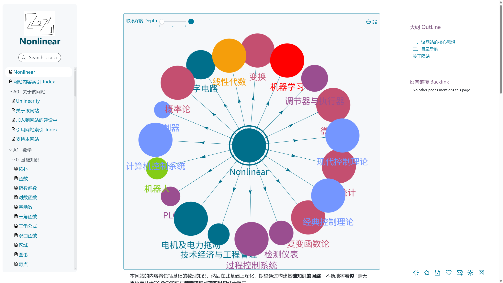
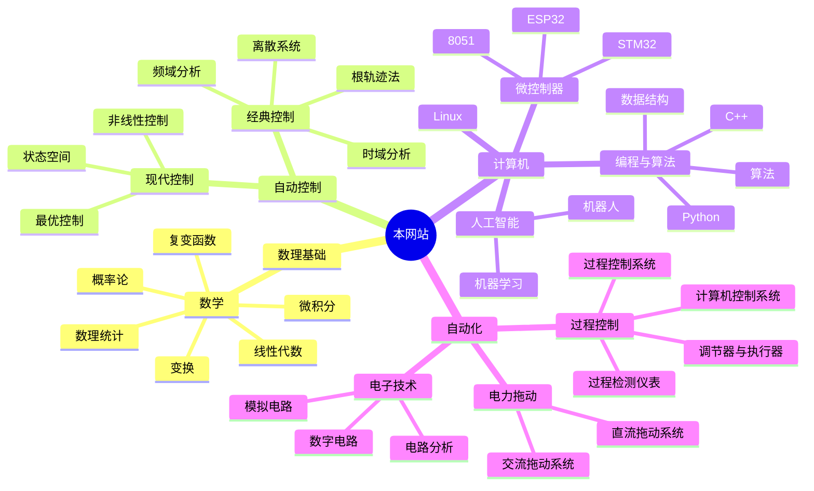

# Atlas-of-Control-and-Al!

<p align='center'></p>

  <div  align="center" >
    <a href="https://github.com/UNLINEARITY/Atlas-of-Control-and-AI/stargazers">
      
    </a>
    <a href="https://github.com/UNLINEARITY/Atlas-of-Control-and-AI/network/members">
      
    </a>
    <a href="https://github.com/UNLINEARITY/Atlas-of-Control-and-AI/issues">
      
    </a> <a href="https://github.com/UNLINEARITY/Atlas-of-Control-and-AI/pulls">
      
    </a>
 </div>

<div align="center" >
  <a href="https://www.unlinearity.top"><strong> &laquo Visit the Live Site &raquo;</strong></a>
</div>

你可以访问下面任意一个网址，看看实际的效果
- https://www.unlinearity.top
- https://www.nonlinear.top  

本仓库继承模板 https://github.com/oleeskild/digitalgarden ，非常感谢 Digital-garden 社区的开源贡献！

## 1. 核心思想
> 在我们成长和不断学习的过程中，我们会接触到很多影响深远的理念，会产生很多灵光乍现的想法，会惊叹于诸多前人的思想和理论
> 我们接触的东西越多，越会发现很多知识是相同的，越会觉得有些内容或概念是基础性的、可以在诸多领域得到延申和扩展

该项目旨在构建以**双向链接**和**关系图谱**为核心的知识库，强调知识与知识之间的联系，**注重数理基础**，深入探讨数学与物理知识在各个领域（尤其是控制理论和人工智能）的作用与影响。
- 主体文件为 Markdown (即. md 文件)
- 数学公式使用 Tex 语法渲染
- 笔记之间的关系使用简单的 Wiki 语法呈现

<p align='center'></p>

  
  

> [!warning]
> Due to the limitations of time, energy, and skill of the website builder, the main content of the website is currently presented in Chinese. An English version will be added in the future.


静态网站生成器 (SSG)：Eleventy，读取源文件（Markdown、Nunjucks 模板等），通过一系列的配置和插件处理，最终生成一个完整的、可部署的静态网站。
- `.eleventy.js` 文件是 Eleventy 的主配置文件，定义了绝大部分的构建逻辑，包括 Markdown 的解析方式、自定义链接的处理、图片优化等。
- 配置 `vercel.json` 和 `netlify.toml` 文件，可以部署到 Vercel 或 Netlify 等静态托管平台。
- 模板语言：Nunjucks (`.njk`)，用于构建页面布局和组件
- 内容格式：Markdown (`.md`)，并使用了大量的 markdown-it 插件，来支持脚注、数学公式、图表等功能。

## 2. 网站的内容与功能
本项目的构建者并非为计算机专业出身，而且实际工作量较大，所以呈现的内容不够完善，敬请谅解。
### 2.1 目前涵盖并将持续更新的内容


**较为完善的部分**：
- [x] 自动控制原理
	- [x] 经典控制理论
	- [x] 现代控制理论
	- [x] 计算机控制系统
- [x] 过程控制
	- [x] 过程控制系统
	- [x] 调节器与执行器
	- [x] 检测仪表
- [x] 电机与电力拖动
- [x] 概率论
- [x] 微积分
- [x] 数理统计
- [x] 复变函数与积分变换
- [x] 微机原理——8051 基础部分

**待更新的部分**：
- [ ] 人工智能相关
- [ ] 机器人学基础
- [ ] 强化学习的数学原理
- [ ] 线性代数
- [ ] 物理

### 2.2 目前已有的功能
本网站在基础模板上增加了以下功能：

- [x] 增加一个所有界面可见的底部工具栏
	- [x] 打开三维知识图谱
	- [x] 局部关系图
	- [x] 深浅色的主题切换
	- [x] 跳转到 Github 查看对应页面代码
	- [x] 随机页面跳转

- [x] 知识图谱
	- [x] 加入颜色组来区分大致的分类
	- [x] 增加三维知识图谱
	- [x]  `Ctrl` + `G`  绑定局部关系图
	- [x] 修改为全面显示
	- [x] 双向链接改为弧线
	- [x] 右键可以进行标记，更加直观

- [x] 预览显示优化 
	- [x] 可以右键出现小窗口预览
	- [x] 不限制预览窗口数目
	- [x] 可以调节窗口大小，并跳转至对应的页面

- [x] PWA 与缓存
	- [x] 可以安装页面或刷新页面
	- [x] 使用强缓存，加载页面后可以离线查看

- [x] 其他
	- [x] 图片可以单击放大
	- [x] 文件树优化
	- [ ] ......


<p align='center'></p>

<p align='center'></p>

## 3. 加入到网站建设中
### 3.1 非常欢迎 commit
- 如果在网站中发现有错误或者存在问题
- 如果你觉得笔记之间的关系过乱，或者设置的正反向链接不够合理
- 如果你觉得网站的功能不够完善
- 如果你想贡献新的分支
- .....

### 3.2 如何本地部署调试？ 

1. Clone the repository 克隆仓库到本地
```bash
git clone https://github.com/UNLINEARITY/Atlas-of-Control-and-AI
```

2. Install the dependencies 下载依赖
```bash
npm install
```

3. To start the development server with live reloading 本地运行调试
```bash
npm start
```

## 4. 感谢
此仓库会不断完善下去，非常感谢您的支持！ 
> ***伟大，总是起源于微小的念头***

> ***Greatness often originates from small thoughts***


