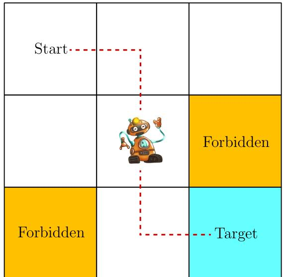

---
{"dg-publish":true,"dg-path":"人工智能/强化学习/Basic-Concepts.md","permalink":"/人工智能/强化学习/Basic-Concepts/","dgPassFrontmatter":true,"noteIcon":"","created":"2025-12-05T10:27:16.843+08:00","updated":"2025-12-07T20:12:58.881+08:00"}
---

This chapter introduces the basic concepts of reinforcement learning. These concepts are important because they will be widely used in this book. We first introduce these concepts using examples and then formalize them in the framework of Markov decision processes.  

### 1.1 A grid world example  
Consider an example as shown in Figure 1.2, where a robot moves in a grid world. The robot, called agent, can move across adjacent cells in the grid. At each time step, it can only occupy a single cell. The white cells are accessible for entry, and the orange cells are forbidden. There is a target cell that the robot would like to reach. We will use such grid world examples throughout this book since they are intuitive for illustrating new concepts and algorithms.  

Figure 1.2: The grid world example is used throughout the book. 

The ultimate goal of the agent is to find a "good" policy that enables it to reach the target cell when starting from any initial cell. How can the "goodness" of a policy be defined? The idea is that the agent should reach the target without entering any forbidden cells, taking unnecessary detours, or colliding with the boundary of the grid.  

It would be trivial to plan a path to reach the target cell if the agent knew the map of the grid world. The task becomes nontrivial if the agent does not know any information about the environment in advance. Then, the agent must interact with the environment to find a good policy by trial and error. To do that, the concepts presented in the rest of the chapter are necessary.  

### 1.2 State and action 

The first concept to be introduced is the **state 状态,** **which describes the agent's status with respect to the environment**.
	In the grid world example, the state corresponds to the agent's location. Since there are nine cells, there are nine states as well. They are indexed as $s_{1}, s_{2}, \ldots , s_{9}$ , as shown in Figure 1.3 (a). 

状态空间：**The set of all the states is called the state space**, denoted as $\mathcal{S} = \{s_{1}, \ldots , s_{9}\}$ .  

For each state, the agent can take five possible actions: moving upward, moving rightward, moving downward, moving leftward, and staying still. These five actions are denoted as $a_{1}, a_{2}, \ldots , a_{5}$ , respectively (see Figure 1.3 (b)). The set of all actions is called the action space, denoted as $\mathcal{A} = \{a_{1}, \ldots , a_{5}\}$ . Different states can have different action spaces. For instance, considering that taking $a_{1}$ or $a_{4}$ in state $s_{1}$ would lead to a collision with the boundary, we can set the action space for state $s_{1}$ as $\mathcal{A}(s_{1}) = \{a_{2}, a_{3}, a_{5}\}$ . In this book, we consider the most general case: $\mathcal{A}(s_{i}) = \mathcal{A} = \{a_{1}, \ldots , a_{5}\}$ for all $i$ .

Figure 1.3: Illustrations of the state and action concepts. (a) There are nine states $\{s_{1},\ldots ,s_{9}\}$ . (b) Each state has five possible actions $\{a_{1}, a_{2}, a_{3}, a_{4}, a_{5}\} .$ 

### 1.3 State transition  
When taking an action, the agent may move from one state to another. Such a process is called **state transition**. **状态转移**

For example, if the agent is in state $s_{1}$ and selects action $a_{2}$ (that is, moving rightward), then the agent moves to state $s_{2}$ . Such a process can be expressed as  
$$s_{1}\xrightarrow{a_{2}}s_{2}.$$  

We next examine two important examples.  

What is the next state when the agent attempts to go beyond the boundary, for example, taking action $a_{1}$ in state $s_{1}$ ? The answer is that the agent will be bounced back because it is impossible for the agent to exit the state space. Hence, we have $s_{1}\xrightarrow{a_{1}}s_{1}$ .  

What is the next state when the agent attempts to enter a forbidden cell, for example, taking action $a_{2}$ in state $s_{5}$ ? Two different scenarios may be encountered. In the first scenario, although $s_{6}$ is forbidden, it is still accessible. In this case, the next state is $s_{6}$ ; hence, the state transition process is $s_{5}\xrightarrow{a_{2}}s_{6}$ . In the second scenario, $s_{6}$ is not accessible because, for example, it is surrounded by walls. In this case, the agent is bounced back to $s_{5}$ if it attempts to move rightward; hence, the state transition process is $s_{5}\xrightarrow{a_{2}}s_{5}$ .  

Which scenario should we consider? The answer depends on the physical environment. In this book, we consider the first scenario where the forbidden cells are accessible, although stepping into them may get punished. This scenario is more general and interesting. Moreover, since we are considering a simulation task, we can define the state transition process however we prefer. In real- world applications, the state transition process is determined by real- world dynamics.  

The state transition process is defined for each state and its associated actions. This process can be described by a table as shown in Table 1.1. In this table, each row corresponds to a state, and each column corresponds to an action. Each cell indicates the next state to transition to after the agent takes an action at the corresponding state.  

|     | a1 (upward) | a2 (rightward) | a3 (downward) | a4 (leftward) | a5 (still) |
| --- | ----------- | -------------- | ------------- | ------------- | ---------- |
| s1  | s1          | s2             | s4            | s1            | s1         |
| s2  | s2          | s3             | s5            | s1            | s2         |
| s3  | s3          | s3             | s6            | s2            | s3         |
| s4  | s1          | s5             | s7            | s4            | s4         |
| s5  | s2          | s6             | s8            | s4            | s5         |
| s6  | s3          | s6             | s9            | s5            | s6         |
| s7  | s4          | s8             | s7            | s7            | s7         |
| s8  | s5          | s9             | s8            | s7            | s8         |
| s9  | s6          | s9             | s9            | s8            | s9         |
Table 1.1: A tabular representation of the state transition process. Each cell indicates the next state to transition to after the agent takes an action at a state.  

Mathematically, **the state transition process can be described by conditional probabilities**.  [[条件概率\|条件概率]] For example, for $s_{1}$ and $a_{2}$ , the conditional probability distribution is  

$$\begin{align}
p(s_1|s_1,a_2)=0, \\
p(s_2|s_1,a_2)=1, \\
p(s_3|s_1,a_2)=0, \\
p(s_4|s_1,a_2)=0, \\
p(s_5|s_1,a_2)=0,
\end{align}$$  

which indicates that, when taking $a_{2}$ at $s_{1}$ , the probability of the agent moving to $s_{2}$ is one, and the probabilities of the agent moving to other states are zero. As a result, taking action $a_{2}$ at $s_{1}$ will certainly cause the agent to transition to $s_{2}$ . The preliminaries of conditional probability are given in Appendix A. Readers are strongly advised to be familiar with probability theory since it is necessary for studying reinforcement learning.  

Although it is intuitive, the tabular representation is only able to describe deterministic state transitions. In general, state transitions can be stochastic and must be described by conditional probability distributions. For instance, when random wind gusts are applied across the grid, if taking action $a_{2}$ at $s_{1}$ , the agent may be blown to $s_{5}$ instead of $s_{2}$ . We have $p(s_5|s_1,a_2)>0$ in this case. Nevertheless, we merely consider deterministic state transitions in the grid world examples for simplicity in this book.  

### 1.4 Policy  

> 策略  **A policy tells the agent which actions to take at every state**. 

Intuitively, policies can be depicted as arrows (see Figure 1.4 (a)). Following a policy, the agent can generate a trajectory starting from an initial state (see Figure 1.4 (b)).

Figure 1.4: A policy represented by arrows and some trajectories obtained by starting from different initial states. 

Mathematically, **policies can be described by conditional probabilities** . Denote the policy in Figure 1.4 as $\pi (a|s)$ , which is a conditional probability distribution function defined for every state. For example, the policy for $s_1$ is  

**在此策略下**
$$\begin{align}
\pi (a_{1}|s_{1}) = 0, \\
\pi (a_{2}|s_{1}) = 1, \\
\pi (a_{3}|s_{1}) = 0, \\
\pi (a_{4}|s_{1}) = 0, \\
\pi (a_{5}|s_{1}) = 0,
\end{align}$$

which indicates that the probability of taking action $a_2$ in state $s_1$ is one, and the probabilities of taking other actions are zero.  

The above policy is deterministic. Policies may be stochastic in general. For example, the policy shown in Figure 1.5 is stochastic: in state $s_1$ , the agent may take actions to go either rightward or downward. The probabilities of taking these two actions are the same (both are 0.5). In this case, the policy for $s_{1}$ is  

$$\begin{align}
 & \pi (a_1|s_1) = 0, \\
 & \pi (a_2|s_1) = 0.5,\\
  & \pi (a_3|s_1) = 0.5, \\
 & \pi (a_4|s_1) = 0,  \\
 & \pi (a_5|s_1) = 0.  
\end{align}$$

Figure 1.5: A stochastic policy. In state $s_{1}$ , the agent may move rightward or downward with equal probabilities of 0.5. 

Policies represented by conditional probabilities can be stored as tables. For example, Table 1.2 represents the stochastic policy depicted in Figure 1.5. The entry in the ith row and jth column is the probability of taking the jth action at the ith state. Such a representation is called a tabular representation. We will introduce another way to represent policies as parameterized functions in Chapter 8.  

|     | a1 (upward) | a2 (rightward) | a3 (downward) | a4 (leftward ) | a5 (still) |
| --- | ----------- | -------------- | ------------- | -------------- | ---------- |
| s1  | 0           | 0.5            | 0.5           | 0              | 0          |
| s2  | 0           | 0              | 1             | 0              | 0          |
| s3  | 0           | 0              | 0             | 1              | 0          |
| s4  | 0           | 1              | 0             | 0              | 0          |
| s5  | 0           | 0              | 1             | 0              | 0          |
| s6  | 0           | 0              | 1             | 0              | 0          |
| s7  | 0           | 1              | 0             | 0              | 0          |
| s8  | 0           | 1              | 0             | 0              | 0          |
| s9  | 0           | 0              | 0             | 0              | 1          |

Table 1.2: A tabular representation of a policy. Each entry indicates the probability of taking an action at a state.  

### 1.5 Reward  
奖励 **Reward is one of the most unique concepts in reinforcement learning.**
After executing an action at a state, the agent obtains a reward, denoted as $r$ , **as feedback from the environment**. The reward is a function of the state $s$ and action $a$ . Hence, it is also denoted as $r(s,a)$ . 

Its value can be a positive or negative real number or zero. Different rewards have different impacts on the policy that the agent would eventually learn. Generally speaking, with a positive reward, we encourage the agent to take the corresponding action. With a negative reward, we discourage the agent from taking that action. In the grid world example, the rewards are designed as follows:  

In the grid world example, the rewards are designed as follows:.  

If the agent attempts to exit the boundary, let $r_{\mathrm{boundary}} = - 1$ If the agent attempts to enter a forbidden cell, let $r_{\mathrm{forbidden}} = - 1$ If the agent reaches the target state, let $r_{\mathrm{target}} = +1$ Otherwise, the agent obtains a reward of $r_{\mathrm{other}} = 0$  

Special attention should be given to the target state $s_{9}$ . The reward process does not have to terminate after the agent reaches $s_{9}$ . If the agent takes action $a_{5}$ at $s_{9}$ , the next state is again $s_{9}$ , and the reward is $r_{\mathrm{target}} = +1$ . If the agent takes action $a_{2}$ , the next state is also $s_{9}$ , but the reward is $r_{\mathrm{boundary}} = - 1$ .  

A reward can be interpreted as a human- machine interface, with which we can guide the agent to behave as we expect. For example, with the rewards designed above, we can expect that the agent tends to avoid exiting the boundary or stepping into the forbidden cells. Designing appropriate rewards is an important step in reinforcement learning. This step is, however, nontrivial for complex tasks since it may require the user to understand the given problem well. Nevertheless, it may still be much easier than solving the problem with other approaches that require a professional background or a deep understanding of the given problem.  

The process of getting a reward after executing an action can be intuitively represented as a table, as shown in Table 1.3. Each row of the table corresponds to a state, and each column corresponds to an action. The value in each cell of the table indicates the reward that can be obtained by taking an action at a state.  

One question that beginners may ask is as follows: if given the table of rewards, can we find good policies by simply selecting the actions with the greatest rewards? The answer is no. That is because these rewards are immediate rewards that can be obtained after taking an action. To determine a good policy, we must consider the total reward obtained in the long run (see Section 1.6 for more information). An action with the greatest immediate reward may not lead to the greatest total reward.  

Although intuitive, the tabular representation is only able to describe deterministic reward processes. A more general approach is to use conditional probabilities $p(r|s,a)$ to describe reward processes. For example, for state $s_{1}$ , we have  

$$p(r = -1|s_1,a_1) = 1,\quad p(r\neq -1|s_1,a_1) = 0.$$

|     | a1 (upward)     | a2 (rightward)  | a3 (downward)   | a4 (leftward)   | a5 (still)      |
| --- | --------------- | --------------- | --------------- | --------------- | --------------- |
| s1  | $r_{boundary}$  | 0               | 0               | $r_{boundary}$  | 0               |
| s2  | $r_{boundary}$  | 0               | 0               | 0               | 0               |
| s3  | $r_{boundary}$  | $r_{boundary}$  | $r_{forbidden}$ | 0               | 0               |
| s4  | 0               | 0               | $r_{forbidden}$ | $r_{boundary}$  | 0               |
| s5  | 0               | $r_{forbidden}$ | 0               | 0               | 0               |
| s6  | 0               | $r_{boundary}$  | rtarget         | 0               | $r_{forbidden}$ |
| s7  | 0               | 0               | $r_{boundary}$  | $r_{boundary}$  | $r_{forbidden}$ |
| s8  | 0               | rtarget         | $r_{boundary}$  | $r_{forbidden}$ | 0               |
| s9  | $r_{forbidden}$ | $r_{boundary}$  | $r_{boundary}$  | 0               | rtarget         |

Table 1.3: A tabular representation of the process of obtaining rewards. Here, the process is deterministic. Each cell indicates how much reward can be obtained after the agent takes an action at a given state.

This indicates that, when taking $a_{1}$ at $s_{1}$ , the agent obtains $r=-1$ with certainty. In this example, the reward process is deterministic. In general, it can be stochastic. For example, if a student studies hard, he or she would receive a positive reward (e.g., higher grades on exams), but the specific value of the reward may be uncertain.

### 1.6 Trajectories, returns, and episodes

Figure 1.6: Trajectories obtained by following two policies. The trajectories are indicated by red dashed lines.

**A trajectory is a state-action-reward chain**.   轨迹是状态-动作-奖励的链

For example, given the policy shown in Figure 1.6 (a), the agent can move along a trajectory as follows:
$$s_{1}\xrightarrow[r=0]{a_{2}}s_{2}\xrightarrow[r=0]{a_{3}}s_{5}\xrightarrow[r=0]{a_{3}}s_{8}\xrightarrow[r=1]{a_{2}}s_{9}.$$
The return of this trajectory is defined as the sum of all the rewards collected along the trajectory:
$$\mathrm {return}=0+0+0+1=1.\tag{1.1}$$

**Returns are also called total rewards or cumulative rewards.**  累计奖励
Returns can be used to evaluate policies. For example, we can evaluate the two policies in Figure 1.6 by comparing their returns. In particular, starting from $s_{1}$ , the return obtained by the left policy is 1 as calculated above. For the right policy, starting from $s_{1}$ , the following trajectory is generated:  
$$s_{1}\xrightarrow[r=0]{a_{3}}s_{4}\xrightarrow[r=-1]{a_{3}}s_{7}\xrightarrow[r=0]{a_{2}}s_{8}\xrightarrow[r=+1]{a_{2}}s_{9}.$$ 
The corresponding return is  
$$\mathrm{return} = 0 - 1 + 0 + 1 = 0. \quad (1.2)$$ 
The returns in (1.1) and (1.2) indicate that the left policy is better than the right one since its return is greater. This mathematical conclusion is consistent with the intuition that the right policy is worse since it passes through a forbidden cell.  

**A return consists of an immediate reward and future rewards.** Here, the immediate reward is the reward obtained after taking an action at the initial state; the future rewards refer to the rewards obtained after leaving the initial state. It is possible that the immediate reward is negative while the future reward is positive. Thus, which actions to take should be determined by the return (i.e., the total reward) rather than the immediate reward to avoid short- sighted decisions.  

The return in (1.1) is defined for **a finite- length trajectory**. 
Return can also be defined for **infinitely long trajectories**. 

For example, the trajectory in Figure 1.6 stops after reaching $s_{9}$ . Since the policy is well defined for $s_{9}$ , the process does not have to stop after the agent reaches $s_{9}$ . We can design a policy so that the agent stays still after reaching $s_{9}$ . Then, the policy would generate the following infinitely long trajectory:  

$$s_{1}\xrightarrow[r=0]{a_{2}}s_{2}\xrightarrow[r=0]{a_{3}}s_{5}\xrightarrow[r=0]{a_{3}}s_{8}\xrightarrow[r=1]{a_{2}}s_{9}\xrightarrow[r=1]{a_{5}}s_{9}\xrightarrow[r=1]{a_{5}}s_{9}\ldots$$  
The direct sum of the rewards along this trajectory is which unfortunately diverges.
$$\operatorname {return} = 0 + 0 + 0 + 1 + 1 + 1 + \dots = \infty ,$$ 
 Therefore, we must introduce the **discounted return** concept for infinitely long trajectories. In particular, the discounted return is the sum of the **discounted rewards**:  折扣奖励
$$\mathrm{discounted~return} = 0 + \gamma 0 + \gamma^{2}0 + \gamma^{3}1 + \gamma^{4}1 + \gamma^{5}1 + \ldots , \quad (1.3)$$ 
where $\gamma \in (0,1)$ is called the **discount rate**  **折扣因子**. When $\gamma \in (0,1)$ , the value of (1.3) can be calculated as  
$$\mathrm{discounted~return} = \gamma^{3}(1 + \gamma +\gamma^{2} + \ldots) = \gamma^{3}\frac{1}{1 - \gamma}.$$
[[幂级数\|幂级数]]

The introduction of the discount rate is useful for the following reasons. 
First, it removes the stop criterion and allows for infinitely long trajectories. 
Second, the discount rate can be used to adjust the emphasis placed on near- or far- future rewards. 

In particular,
- if $\gamma$ is close to 0, then the agent places more emphasis on rewards obtained in the near future. The resulting policy would be short- sighted. 
- If $\gamma$ is close to 1, then the agent places more emphasis on the far future rewards. The resulting policy is far-sighted and dares to take risks of obtaining negative rewards in the near future. These points will be demonstrated in Section 3.5.  

One important notion that was not explicitly mentioned in the above discussion is the episode. When interacting with the environment by following a policy, the agent may stop at some terminal states. The resulting trajectory is called an episode (or a trial). If the environment or policy is stochastic, we obtain different episodes when starting from the same state. However, if everything is deterministic, we always obtain the same episode when starting from the same state.  

**An episode is usually assumed to be a finite trajectory.** Tasks with episodes are called **episodic tasks**. 
However, some tasks may have no terminal states, meaning that the process of interacting with the environment will never end. Such tasks are called **continuing tasks**.

In fact, we can treat episodic and continuing tasks in a unified mathematical manner by converting episodic tasks to continuing ones. To do that, we need well define the process after the agent reaches the terminal state. Specifically, after reaching the terminal state in an episodic task, the agent can continue taking actions in the following two ways.  

First, if we treat the terminal state as a special state, we can specifically design its action space or state transition so that the agent stays in this state forever. Such states are called absorbing states, meaning that the agent never leaves a state once reached. For example, for the target state $s_{9}$ , we can specify $\mathcal{A}(s_9) = \{a_5\}$ or set $\mathcal{A}(s_9) = \{a_1,\dots,a_5\}$ with $p(s_9|s_9,a_i) = 1$ for all $i = 1,\dots,5$ .  

Second, if we treat the terminal state as a normal state, we can simply set its action space to the same as the other states, and the agent may leave the state and come back again. Since a positive reward of $r = 1$ can be obtained every time $s_9$ is reached, the agent will eventually learn to stay at $s_9$ forever to collect more rewards. Notably, when an episode is infinitely long and the reward received for staying at $s_9$ is positive, a discount rate must be used to calculate the discounted return to avoid divergence.  

In this book, we consider the second scenario where the target state is treated as a normal state whose action space is $\mathcal{A}(s_9) = \{a_1,\dots,a_5\}$ .

### 1.7 Markov decision processes 
The previous sections of this chapter illustrated some fundamental concepts in reinforcement learning through examples. This section presents these concepts in a more formal way under the framework of **Markov decision processes (MDPs)**.  

An MDP is a general framework for describing stochastic dynamical systems. The key ingredients of an MDP are listed below.  

$\diamond$ Sets:  
- **State space**: the set of all states, denoted as $\mathcal{S}$ .  
- **Action space**: a set of actions, denoted as $\mathcal{A}(s)$ , associated with each state $s \in \mathcal{S}$ .  
- **Reward set**: a set of rewards, denoted as $\mathcal{R}(s,a)$ , associated with each state-action pair $(s,a)$ .  

$\diamond$ Model:  
- **State transition probability**: In state $s$ , when taking action $a$ , the probability of transitioning to state $s'$ is $p(s'|s,a)$ . It holds that $\sum_{s'\in S} p(s'|s,a) = 1$ for any $(s,a)$ .  
	在状态 $s$ 下，采取动作 $a$ 转移到状态 $s'$ 的概率
- **Reward probability**: In state $s$ , when taking action $a$ , the probability of obtaining reward $r$ is $p(r|s,a)$ . It holds that $\sum_{r\in R(s,a)} p(r|s,a) = 1$ for any $(s,a)$ .  
	在状态 $s$ 下，采取动作 $a$ 获得奖励 $r$ 的概率

$\diamond$ Policy: In state $s$ , the probability of choosing action $a$ is $\pi (a|s)$ . It holds that $\sum_{a\in A(s)}\pi (a|s) = 1$ for any $s\in \mathcal{S}$ .  
	在策略 $\pi$ 下， 状态 $s$ 采取动作 $a$ 的概率

$\diamond$ Markov property: The Markov property refers to the memoryless property of a stochastic process. Mathematically, it means that  
$$\begin{array}{l}{{p(s_{t+1}|s_t,a_t,s_{t-1},a_{t-1},\ldots,s_0,a_0)=p(s_{t+1}|s_t,a_t),}}\\ {{p(r_{t+1}|s_t,a_t,s_{t-1},a_{t-1},\ldots,s_0,a_0)=p(r_{t+1}|s_t,a_t),}}\end{array} \quad (1.4)$$

where $t$ represents the current time step and $t + 1$ represents the next time step. Equation (1.4) indicates that the next state or reward depends merely on the current state and action and is independent of the previous ones. The Markov property is important for deriving the fundamental Bellman equation of MDPs, as shown in the next chapter.  

Here, $p(s^{\prime}|s,a)$ and $p(r|s,a)$ for all $(s,a)$ are called the model or dynamics. The model can be either stationary or nonstationary (or in other words, time- invariant or time- variant). A stationary model does not change over time; a nonstationary model may vary over time. For instance, in the grid world example, if a forbidden area may pop up or disappear sometimes, the model is nonstationary. In this book, we only consider stationary models.

One may have heard about the Markov processes (MPs). What is the difference between an MDP and an MP? The answer is that, once the policy in an MDP is fixed, the MDP degenerates into an MP. For example, the grid world example in Figure 1.7 can be abstracted as a Markov process. In the literature on stochastic processes, a Markov process is also called a Markov chain if it is a discrete- time process and the number of states is finite or countable. In this book, the terms “Markov process” and “Markov chain” are used interchangeably when the context is clear. Moreover, this book mainly considers finite MDPs where the numbers of states and actions are finite. This is the simplest case that should be fully understood.  

Figure 1.7: Abstraction of the grid world example as a Markov process. Here, the circles represent states and the links with arrows represent state transitions. 

Finally, reinforcement learning can be described as an agent- environment interaction process. The agent is a decision- maker that can sense its state, maintain policies, and execute actions. Everything outside of the agent is regarded as the environment. In the grid world examples, the agent and environment correspond to the robot and grid world, respectively. After the agent decides to take an action, the actuator executes such a decision. Then, the state of the agent would be changed and a reward can be obtained. By using interpreters, the agent can interpret the new state and the reward. Thus, a closed loop can be formed.  

### 1.8 Summary  
This chapter introduced the basic concepts that will be widely used in the remainder of the book. We used intuitive grid world examples to demonstrate these concepts and then formalized them in the framework of MDPs. For more information about MDPs, readers can see [1,2].  

### 1.9 Q&A  
Q: Can we set all the rewards as negative or positive? A: In this chapter, we mentioned that a positive reward would encourage the agent to take an action and that a negative reward would discourage the agent from taking  the action. In fact, it is the relative reward values instead of the absolute values that determine encouragement or discouragement.  

More specifically, we set $r_{\mathrm{boundary}} = - 1$ , $r_{\mathrm{forbidden}} = - 1$ , $r_{\mathrm{target}} = +1$ , and $r_{\mathrm{other}} = 0$ in this chapter. We can also add a common value to all these values without changing the resulting optimal policy. For example, we can add $- 2$ to all the rewards to obtain $r_{\mathrm{boundary}} = - 3$ , $r_{\mathrm{forbidden}} = - 3$ , $r_{\mathrm{target}} = - 1$ , and $r_{\mathrm{other}} = - 2$ . Although the rewards are all negative, the resulting optimal policy is unchanged. That is because optimal policies are invariant to affine transformations of the rewards. Details will be given in Chapter 3.5.  

Q: Is the reward a function of the next state?  

A: We mentioned that the reward $r$ depends only on $s$ and $a$ but not the next state $s'$ . However, this may be counterintuitive since it is the next state that determines the reward in many cases. For example, the reward is positive when the next state is the target state. As a result, a question that naturally follows is whether a reward should depend on the next state. A mathematical rephrasing of this question is whether we should use $p(r|s,a,s')$ where $s'$ is the next state rather than $p(r|s,a)$ . The answer is that $r$ depends on $s$ , $a$ , and $s'$ . However, since $s'$ also depends on $s$ and $a$ , we can equivalently write $r$ as a function of $s$ and $a$ : $p(r|s,a) = \sum_{s'} p(r|s,a,s')p(s'|s,a)$ . In this way, the Bellman equation can be easily established as shown in Chapter 2.

