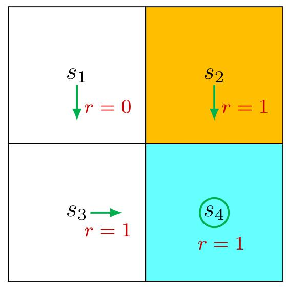

---
{"dg-publish":true,"dg-path":"人工智能/强化学习/Bellman Equation.md","permalink":"/人工智能/强化学习/Bellman Equation/","dgPassFrontmatter":true,"noteIcon":"","created":"2025-12-05T10:43:29.824+08:00","updated":"2025-12-12T10:52:07.620+08:00"}
---

We now introduce the Bellman equation, **a mathematical tool for analyzing state values**. 

In a nutshell 简而言之, the **Bellman equation is a set of linear equations that describe the relationships between the values of all the states**.     [[State values\|State values]]

We next derive the Bellman equation. First, note that $G_{t}$ can be rewritten as  

$$
\begin{align*}
G_t &= R_{t+1} + \gamma R_{t+2} + \gamma^2 R_{t+3} + \dots \\
&= R_{t+1} + \gamma (R_{t+2} + \gamma R_{t+3} + \dots) \\
&= R_{t+1} + \gamma G_{t+1},
\end{align*}
$$

where $G_{t + 1} = R_{t + 2} + \gamma R_{t + 3} + \dots$ . This equation establishes the relationship between $G_{t}$ and $G_{t + 1}$ . Then, the **state value** can be written as  

$$\begin{align}
v_{\pi}(s)  & = \mathbb{E}[G_{t}|S_{t} = s]  \\
 & = \mathbb{E}[R_{t + 1} + \gamma G_{t + 1}|S_{t} = s]  \\
 & = \mathbb{E}[R_{t + 1}|S_{t} = s] + \gamma \mathbb{E}[G_{t + 1}|S_{t} = s]. 
\end{align}\quad (2.4)$$

The two terms in (2.4) are analyzed below.  
可以分为两项，第一项是现在，第二项是加上折扣因子的未来

The first term, $\mathbb{E}[R_{t + 1}|S_t = s]$ , is the expectation of the immediate rewards. By using the law of total expectation (Appendix A), it can be calculated as  
策略 $\pi$ 下，采取动作 $a$ 的概率

$$\begin{align}
\mathbb{E}[R_{t + 1}|S_{t} = s]   &  = \sum\limits _{a\in \mathcal{A}}\pi (a|s)\mathbb{E}[R_{t + 1}|S_{t}  = s,A_{t} = a]  \\
 & ={ \sum\limits _{a\in \mathcal{A}}\pi (a|s)\sum_{r\in \mathcal{R}}p(r|s,a)r.} 
\end{align}\quad (2.6)$$

Here, $\mathcal{A}$ and $\mathcal{R}$ are the sets of possible actions and rewards, respectively. It should be noted that $\mathcal{A}$ may be different for different states. In this case, $\mathcal{A}$ should be written as $\mathcal{A}(s)$ . Similarly, $\mathcal{R}$ may also depend on $(s,a)$ . We drop the dependence on $s$ or $(s,a)$ for the sake of simplicity in this book. Nevertheless, the conclusions are still valid in the presence of dependence.  

The second term, $\mathbb{E}[G_{t + 1}|S_t = s]$ , **is the expectation of the future rewards**. It can be calculated as  

状态 $s$ 下，下一步为 $s'$ 的概率乘以下一步为 $s'$ 的**discounted return**的期望
- $s'$ 的**discounted return**的期望是 state value 
- 下一步为 $s'$ 的概率, 可以由策略 $\pi$ 下采取动作 $a$ 到达状态 $s'$ 的概率

$$\begin{aligned}\mathbb{E}[G_{t+1}|S_t=s]&=\sum_{s'\in\mathcal{S}}\mathbb{E}[G_{t+1}|S_t=s,S_{t+1}=s']p(s'|s)\\&=\sum_{s'\in\mathcal{S}}\mathbb{E}[G_{t+1}|S_{t+1}=s']p(s'|s)\qquad(\mathrm{due~to~the~Markov~property})\\&=\sum_{s'\in\mathcal{S}}v_{\pi}(s')p(s'|s)\\&=\sum_{s'\in\mathcal{S}}v_{\pi}(s')\sum_{a\in\mathcal{A}}p(s'|s,a)\pi(a|s).\end{aligned} \quad (2.6)$$  
The above derivation uses the fact that $\mathbb{E}[G_{t + 1}|S_t = s,S_{t + 1} = s'] = \mathbb{E}[G_{t + 1}|S_{t + 1} = s'],$ which is due to the Markov property that the future rewards depend merely on the present state rather than the previous ones.  

Substituting (2.5)-(2.6) into (2.4) yields 

$$\begin{align}
v_{\pi}(s)  & = \mathbb{E}[R_{t+1}|S_t = s] + \gamma \mathbb{E}[G_{t+1}|S_t = s], \\ \\
 & = \underbrace{ \sum_{a \in A} \pi(a|s)\sum_{r \in \mathcal{R}} p(r|s, a) r}_{\text{mean of immediate rewards}} + \underbrace{\gamma \sum_{a \in A} \pi(a|s) \sum_{s' \in \mathcal{S}} p(s'|s, a) v_\pi(s')}_{\text{mean of future rewards}} \\

 & = \sum_{a \in A} \pi(a|s) \left[ \sum_{r \in \mathcal{R}} p(r|s, a) r + \gamma \sum_{s' \in \mathcal{S}} p(s'|s, a) v_\pi(s') \right], \quad \text{for all } s \in \mathcal{S}. 
\end{align}\quad (2.7)$$

This equation is the **Bellman equation**, which characterizes the relationships of state values. It is a fundamental tool for designing and analyzing reinforcement learning algorithms.

The Bellman equation seems complex at first glance. In fact, it has a clear structure.
Some remarks are given below. 
- $v_\pi(s)$ and $v_\pi(s')$ are unknown state values to be calculated. It may be confusing to beginners how to calculate the unknown $v_\pi(s)$ given that it relies on another unknown $v_\pi(s')$. It must be noted that the Bellman equation refers to a set of linear equations for all states rather than a single equation. If we put these equations together, it becomes clear how to calculate all the state values. Details will be given in Section 2.7. 
- $\pi(a|s)$ is a given policy. Since state values can be used to evaluate a policy, solving the state values from the Bellman equation is a *policy evaluation* process, which is an important process in many reinforcement learning algorithms, as we will see later in the book. 
- $p(r|s,a)$ and $p(s'|s,a)$ represent the system model. We will first show how to calculate the state values *with* this model in Section 2.7, and then show how to do that *without* the model by using model-free algorithms later in this book.

In addition to the expression in (2.7), readers may also encounter other expressions of the Bellman equation in the literature. We next introduce two equivalent expressions.
First, it follows from the law of total probability that 

$$
\begin{align*}
p(s'|s,a) &= \sum_{r \in \mathcal{R}} p(s', r|s,a), \\
p(r|s,a) &= \sum_{s' \in \mathcal{S}} p(s', r|s,a).
\end{align*}
$$

Then, equation (2.7) can be rewritten as  
$$v_{\pi}(s) = \sum_{a\in \mathcal{A}}\pi (a|s)\sum_{s^{\prime}\in \mathcal{S}}\sum_{r\in \mathcal{R}}p(s^{\prime},r|s,a)[r + \gamma v_{\pi}(s^{\prime})].$$ 
Second, the reward $r$ may depend solely on the next state $s'$ in some problems. As a result, we can write the reward as $r(s')$ and hence $p(r(s'))|s,a) = p(s'|s,a)$ , substituting which into (2.7) gives  
$$v_{\pi}(s) = \sum_{a\in \mathcal{A}}\pi (a|s)\sum_{s'\in \mathcal{S}}p(s'|s,a)[r(s') + \gamma v_{\pi}(s')].$$  

### 2.5 Examples for illustrating the Bellman equation  

We next use two examples to demonstrate how to write out the Bellman equation and calculate the state values step by step. Readers are advised to carefully go through the examples to gain a better understanding of the Bellman equation.

Figure 2.4: An example for demonstrating the Bellman equation. The policy in this example is deterministic. 
  

Consider the first example shown in Figure 2.4, where the policy is deterministic. We next write out the Bellman equation and then solve the state values from it.  

First, consider state $s_{1}$ . Under the policy, the probabilities of taking the actions are $\pi (a = a_{3}|s_{1}) = 1$ and $\pi (a\neq a_{3}|s_{1}) = 0$ . The state transition probabilities are $p(s^{\prime} = s_{3}|s_{1},a_{3}) = 1$ and $p(s^{\prime}\neq s_{3}|s_{1},a_{3}) = 0$ . The reward probabilities are $p(r = 0|s_{1},a_{3}) = 1$ and $p(r\neq 0|s_{1},a_{3}) = 0$ . Substituting these values into (2.7) gives  

$$v_{\pi}(s_{1}) = 0 + \gamma v_{\pi}(s_{3}).$$  

Interestingly, although the expression of the Bellman equation in (2.7) seems complex, the expression for this specific state is very simple.  

Similarly, it can be obtained that  

$$\begin{aligned} v_{\pi}(s_{2}) & = 1 + \gamma v_{\pi}(s_{4}), \\ v_{\pi}(s_{3}) & = 1 + \gamma v_{\pi}(s_{4}), \\ v_{\pi}(s_{4}) & = 1 + \gamma v_{\pi}(s_{4}). \end{aligned}$$  

We can solve the state values from these equations. Since the equations are simple, we can manually solve them. More complicated equations can be solved by the algorithms presented in Section 2.7. Here, the state values can be solved as  

$$v_{\pi}(s_4) = \frac{1}{1 - \gamma},$$ $$v_{\pi}(s_3) = \frac{1}{1 - \gamma},$$ $$v_{\pi}(s_2) = \frac{1}{1 - \gamma},$$ $$v_{\pi}(s_1) = \frac{\gamma}{1 - \gamma}.$$

Furthermore, if we set $\gamma = 0.9$ , then  
$$v_{\pi}(s_{4}) = \frac{1}{1 - 0.9} = 10,$$ $$v_{\pi}(s_{3}) = \frac{1}{1 - 0.9} = 10,$$ $$v_{\pi}(s_{2}) = \frac{1}{1 - 0.9} = 10,$$ $$v_{\pi}(s_{1}) = \frac{0.9}{1 - 0.9} = 9.$$  

Figure 2.5: An example for demonstrating the Bellman equation. The policy in this example is stochastic. 
  

Consider the second example shown in Figure 2.5, where the policy is stochastic. We next write out the Bellman equation and then solve the state values from it.  

In state $s_1$ , the probabilities of going right and down equal 0.5. Mathematically, we have $\pi (a = a_2|s_1) = 0.5$ and $\pi (a = a_3|s_1) = 0.5$ . The state transition probability is deterministic since $p(s' = s_3|s_1,a_3) = 1$ and $p(s' = s_2|s_1,a_2) = 1$ . The reward probability is also deterministic since $p(r = 0|s_1,a_3) = 1$ and $p(r = - 1|s_1,a_2) = 1$ . Substituting these values into (2.7) gives  

$$v_{\pi}(s_{1}) = 0.5[0 + \gamma v_{\pi}(s_{3})] + 0.5[-1 + \gamma v_{\pi}(s_{2})].$$  

Similarly, it can be obtained that  

$$v_{\pi}(s_{2}) = 1 + \gamma v_{\pi}(s_{4}),$$ $$v_{\pi}(s_{3}) = 1 + \gamma v_{\pi}(s_{4}),$$ $$v_{\pi}(s_{4}) = 1 + \gamma v_{\pi}(s_{4}).$$  

The state values can be solved from the above equations. Since the equations are

simple, we can solve the state values manually and obtain  

$$v_{\pi}(s_{4}) = \frac{1}{1 - \gamma},$$ $$v_{\pi}(s_{3}) = \frac{1}{1 - \gamma},$$ $$v_{\pi}(s_{2}) = \frac{1}{1 - \gamma},$$ $$v_{\pi}(s_{1}) = 0.5[0 + \gamma v_{\pi}(s_{3})] + 0.5[-1 + \gamma v_{\pi}(s_{2})],$$ $$\qquad = -0.5 + \frac{\gamma}{1 - \gamma}.$$  

Furthermore, if we set $\gamma = 0.9$ , then  

$$v_{\pi}(s_4) = 10,$$ $$v_{\pi}(s_3) = 10,$$ $$v_{\pi}(s_2) = 10,$$ $$v_{\pi}(s_1) = -0.5 + 9 = 8.5.$$  

If we compare the state values of the two policies in the above examples, it can be seen that  

$$v_{\pi_1}(s_i)\geq v_{\pi_2}(s_i),\quad i = 1,2,3,4,$$  

which indicates that the policy in Figure 2.4 is better because it has greater state values. This mathematical conclusion is consistent with the intuition that the first policy is better because it can avoid entering the forbidden area when the agent starts from $s_1$ . As a result, the above two examples demonstrate that state values can be used to evaluate policies.  