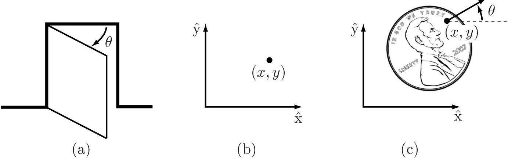

---
{"dg-publish":true,"dg-path":"机器人/Configuration Space.md","permalink":"/机器人/Configuration Space/","dgPassFrontmatter":true,"noteIcon":"","created":"2025-11-18T17:09:46.000+08:00","updated":"2025-12-03T22:41:03.987+08:00"}
---

Perhaps the most fundamental question one can ask about a robot is, where is it? 

The answer is given by the robot's **configuration**: a specification of the positions of all points of the robot.

Since the robot's links are rigid and of a known shape, only a few numbers are needed to represent its configuration. For example, 
- the configuration of a door can be represented by a single number, the angle $\theta$ about its hinge. 
- The configuration of a point on a plane can be described by two coordinates, $(x,y)$ . 
- The configuration of a coin lying heads up on a flat table can be described by three coordinates: two coordinates $(x,y)$ that specify the location of a particular point on the coin, and one coordinate $(\theta)$ that specifies the coin's orientation.

Figure 2.1: (a) The configuration of a door is described by the angle $\theta$ . (b) The configuration of a point in a plane is described by coordinates $(x, y)$ . (c) The configuration of a coin on a table is described by $(x, y,\theta)$ , where $\theta$ defines the direction in which Abraham Lincoln is looking. 

The above coordinates all take values over a **continuous range of real numbers**. The number of **degrees of freedom** (dof) of a robot is the **smallest number** of **real- valued** coordinates needed to represent its configuration. 

In the example above, the door has one degree of freedom. The coin lying heads up on a table has three degrees of freedom. Even if the coin could lie either heads up or tails up, its configuration space still would have only three degrees of freedom; a fourth variable, representing which side of the coin faces up, takes values in the discrete set {heads, tails}, and not over a continuous range of real values like the other three coordinates.  

Definition 2.1. The configuration of a robot is **a complete specification of the position of every point of the robot**. The **minimum number** $n$ of real- valued coordinates needed to represent the configuration is the number of **degrees of freedom (dof)** of the robot. The $n$ - dimensional space containing all possible configurations of the robot is called the **configuration space (C- space)**. The configuration of a robot is represented by a point in its C- space.  

In this chapter we study the C- space and degrees of freedom of general robots. Since our robots are constructed from rigid links, we examine first the degrees of freedom of a single rigid body, and then the degrees of freedom of general multi- link robots. Next we study the shape (or topology) and geometry of C- spaces and their mathematical representation. The chapter concludes with a discussion of the C- space of a robot's end- effector, its task space. In the following chapter we study in more detail the mathematical representation of the C- space of a single rigid body.  

### 基本章节 
[[Degrees of Freedom of a Rigid Body\|Degrees of Freedom of a Rigid Body]]  
[[Degrees of Freedom of a Robot\|Degrees of Freedom of a Robot]]
[[Grübler's Formula\|Grübler's Formula]]
[[Topology and Representation of Configuration Space\|Topology and Representation of Configuration Space]]
[[Configuration and Velocity Constraints  \|Configuration and Velocity Constraints  ]]
[[Task Space and Workspace\|Task Space and Workspace]]

### 总结
- A robot is mechanically constructed from links that are connected by various types of joint. The links are usually modeled as rigid bodies. An end-effector such as a gripper may be attached to some link of the robot. Actuators deliver forces and torques to the joints, thereby causing motion of the robot.  

- The most widely used one-dof joints are the revolute joint, which allows rotation about the joint axis, and the prismatic joint, which allows translation in the direction of the joint axis. Some common two-dof joints include the cylindrical joint, which is constructed by serially connecting a revolute and prismatic joint, and the universal joint, which is constructed by orthogonally connecting two revolute joints. The spherical joint, also known as the ball-and-socket joint, is a three-dof joint whose function is similar to the human shoulder joint.  

- The configuration of a rigid body is a specification of the location of all its points. For a rigid body moving in the plane, three independent parameters are needed to specify the configuration. For a rigid body moving in three-dimensional space, six independent parameters are needed to specify the configuration.  

- The configuration of a robot is a specification of the configuration of all its links. The robot's configuration space is the set of all possible robot configurations. The dimension of the C-space is the number of degrees of freedom of a robot.  

- The number of degrees of freedom of a robot can be calculated using Grübler's formula,  

$$\operatorname {dof} = m (N - 1 - J) + \sum_{i = 1}^{J}f_{i},$$  

where $m = 3$ for planar mechanisms and $m = 6$ for spatial mechanisms, $N$ is the number of links (including the ground link), $J$ is the number of joints, and $f_{i}$ is the number of degrees of freedom of joint $i$

<--- Page 57 --->

- A robot's C-space can be parametrized explicitly or represented implicitly. For a robot with $n$ degrees of freedom, an explicit parametrization uses $n$ coordinates, the minimum necessary. An implicit representation involves $m$ coordinates with $m \geq n$ , with the $m$ coordinates subject to $m - n$ constraint equations. With an implicit parametrization, a robot's C-space can be viewed as a surface of dimension $n$ embedded in a space of higher dimension $m$ .  

- The C-space of an $n$ -dof robot whose structure contains one or more closed loops can be implicitly represented using $k$ loop-closure equations of the form $g (\theta) = 0$ , where $\theta \in \mathbb{R}^{m}$ and $g: \mathbb{R}^{m} \to \mathbb{R}^{k}$ . Such constraint equations are called holonomic constraints. Assuming that $\theta$ varies with time $t$ , the holonomic constraints $g (\theta (t)) = 0$ can be differentiated with respect to $t$ to yield  

$$\frac{\partial g}{\partial\theta} (\theta)\dot{\theta} = 0,$$  

where $\partial g (\theta) / \partial \theta$ is a $k\times m$ matrix.  

- A robot's motion can also be subject to velocity constraints of the form  

$$A (\theta)\dot{\theta} = 0,$$  

where $A (\theta)$ is a $k\times m$ matrix that cannot be expressed as the differential of some function $g (\theta)$ . In other words, there does not exist any $g (\theta), g:\mathbb{R}^{m}\rightarrow \mathbb{R}^{k}$ , such that  

$$A (\theta) = \frac{\partial g}{\partial\theta} (\theta).$$  

Such constraints are said to be nonholonomic constraints, or nonintegrable constraints. These constraints reduce the dimension of feasible velocities of the system but do not reduce the dimension of the reachable C- space. Nonholonomic constraints arise in robot systems subject to conservation of momentum or rolling without slipping.  

- A robot's task space is a space in which the robot's task can be naturally expressed. A robot's workspace is a specification of the configurations that the end-effector of the robot can reach.  

### 2.7 Notes and References  

In the kinematics literature, structures that consist of links connected by joints are also called mechanisms or linkages. The number of degrees of freedom of a 

