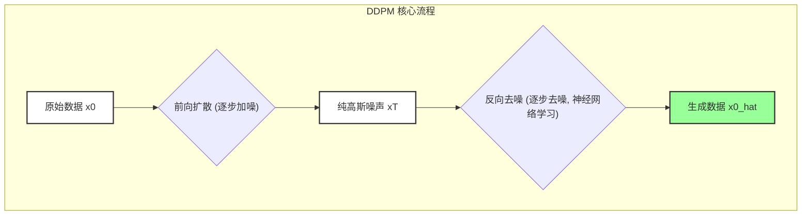

---
{"alias":["Denoising Diffusion Probabilistic Models"],"dg-publish":true,"dg-path":"人工智能/深度学习/DDPM.md","tags":["DL","Diffusion Model"],"permalink":"/人工智能/深度学习/DDPM/","dgPassFrontmatter":true,"noteIcon":"","created":"2025-06-21T17:00:21.580+08:00","updated":"2025-08-28T21:53:14.000+08:00"}
---

(terminology::**Denoising Diffusion Probabilistic Model**)  去噪扩散概率模型

> DDPM（Denoising Diffusion Probabilistic Models）是[[扩散模型\|扩散模型]]领域的开山之作，由Jonathan Ho等人于2020年提出。它提供了一个简单而强大的框架，通过模拟一个**逐步加噪（前向扩散）** 和**逐步去噪（反向去噪）** 的过程来生成高质量的图像。DDPM的成功极大地推动了扩散模型在生成任务中的应用。

### 核心思想：噪声与去噪的循环

DDPM的核心思想可以概括为两个过程：

1.  **前向扩散过程 (Forward Diffusion Process)**: 这是一个固定的、马尔可夫链式的过程。它在每个时间步 $t$ 向数据 $x_{t-1}$ 中添加少量高斯噪声，直到经过 $T$ 个时间步后，原始数据 $x_0$ 完全变为纯高斯噪声 $x_T$。
2.  **反向去噪过程 (Reverse Denoising Process)**: 这是一个需要学习的过程。它训练一个[[神经网络\|神经网络]]来预测并移除在每个时间步添加的噪声，从而能够从纯高斯噪声 $x_T$ 逐步恢复出原始数据 $x_0$。

### 前向扩散过程

前向扩散过程是一个固定的马尔可夫链，在每个时间步 $t$，根据预设的方差调度 $\beta_t$ 向数据中添加噪声：

$$ q(x_t | x_{t-1}) = \mathcal{N}(x_t; \sqrt{1 - \beta_t} x_{t-1}, \beta_t I) $$

其中 $\beta_t$ 是一个小的正数，通常随 $t$ 增大。经过 $T$ 步后，$x_T$ 将近似于标准正态分布。

一个重要的性质是，我们可以直接从 $x_0$ 采样得到 $x_t$：

$$ q(x_t | x_0) = \mathcal{N}(x_t; \sqrt{\bar{\alpha}_t} x_0, (1 - \bar{\alpha}_t) I) $$

其中 $\bar{\alpha}_t = \prod_{s=1}^t (1 - \beta_s)$。这意味着 $x_t$ 可以表示为 $x_t = \sqrt{\bar{\alpha}_t} x_0 + \sqrt{1 - \bar{\alpha}_t} \epsilon$，其中 $\epsilon \sim \mathcal{N}(0, I)$。这个**重参数化技巧**对于训练反向去噪网络至关重要。

### 反向去噪过程

反向去噪过程也是一个马尔可夫链，但其转移概率是需要学习的：

$$ p_\theta(x_{t-1} | x_t) = \mathcal{N}(x_{t-1}; \mu_\theta(x_t, t), \Sigma_\theta(x_t, t)) $$

DDPM的关键洞察是，如果 $\beta_t$ 足够小，那么反向过程的均值 $\mu_\theta$ 可以通过预测在 $x_t$ 中添加的噪声 $\epsilon_\theta$ 来估计。因此，DDPM训练一个[[神经网络\|神经网络]] $\epsilon_\theta(x_t, t)$ 来预测噪声。

### 训练目标

DDPM的训练目标是最小化预测噪声 $\epsilon_\theta(x_t, t)$ 与真实噪声 $\epsilon$ 之间的均方误差：

$$ L(\theta) = E_{x_0 \sim q(x_0), t \sim U(1, T), \epsilon \sim \mathcal{N}(0, I)} [\|\epsilon - \epsilon_\theta(\sqrt{\bar{\alpha}_t} x_0 + \sqrt{1 - \bar{\alpha}_t} \epsilon, t)\|^2] $$

这个损失函数非常简单，使得DDPM的训练非常稳定。

### 采样过程

训练完成后，生成新样本的过程如下：

1.  从纯高斯噪声 $x_T \sim \mathcal{N}(0, I)$ 开始。
2.  对于 $t = T, T-1, \dots, 1$：
    -   使用训练好的[[神经网络\|神经网络]] $\epsilon_\theta(x_t, t)$ 预测噪声。
    -   根据预测的噪声和一些预设的方差，计算 $x_{t-1}$。
    $$ x_{t-1} = \frac{1}{\sqrt{\alpha_t}} \left( x_t - \frac{1 - \alpha_t}{\sqrt{1 - \bar{\alpha}_t}} \epsilon_\theta(x_t, t) \right) + \sigma_t z $$
    其中 $z \sim \mathcal{N}(0, I)$，$\alpha_t = 1 - \beta_t$。
3.  最终得到去噪后的样本 $x_0$。

### U-Net 架构

在DDPM中，用于预测噪声的[[神经网络\|神经网络]]通常采用**U-Net**架构。U-Net是一种[[卷积神经网络\|卷积神经网络]]，其编码器-解码器结构和跳跃连接使其非常适合处理图像，并能在不同尺度上捕捉特征。

### 优缺点分析

| 优点 (Pros)                                       | 缺点 (Cons)                                    |
| ----------------------------------------------- | -------------------------------------------- |
| **生成质量高**：能够生成非常逼真、高质量的图像。                      | **采样速度慢**：生成一个样本需要迭代 $T$ 次（通常是几百到几千步），计算成本高。 |
| **训练稳定**：损失函数简单，训练过程比GAN更稳定。                    |                                              |
| **模式覆盖好**：相比GAN，更不容易出现[[模式崩溃\|模式崩溃]]，能够覆盖真实数据分布的更多模式。 |                                              |

> [[扩散模型\|扩散模型]]