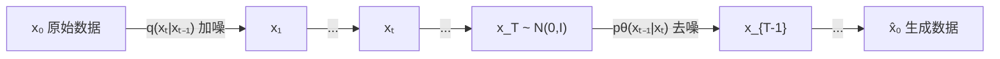

---
{"alias":["Denoising Diffusion Probabilistic Models"],"dg-publish":true,"dg-path":"人工智能/深度学习/DDPM.md","tags":["DL","Diffusion Model"],"permalink":"/人工智能/深度学习/DDPM/","dgPassFrontmatter":true,"noteIcon":"","dg-note-properties":{"alias":["Denoising Diffusion Probabilistic Models"],"tags":["DL","Diffusion Model"]}}
---


(terminology::**Denoising Diffusion Probabilistic Model**) 去噪扩散概率模型

> **DDPM 通过模拟一个逐步加噪的前向扩散过程和一个逐步去噪的反向生成过程，使用[[神经网络\|神经网络]]学习噪声预测，从而生成高质量样本。** 由 Jonathan Ho 等人于 2020 年提出，是[[扩散模型\|扩散模型]]领域的奠基性工作。

### 核心思想：噪声与去噪的循环

DDPM 的核心思想可以概括为两个过程：

1. **前向扩散过程 (Forward Diffusion Process)**：固定的马尔可夫链，在每个时间步 $t$ 向数据 $x_{t-1}$ 中添加少量高斯噪声，经过 $T$ 步后原始数据 $x_0$ 完全变为纯高斯噪声 $x_T$
2. **反向去噪过程 (Reverse Denoising Process)**：训练一个神经网络预测并移除每个时间步添加的噪声，从纯高斯噪声 $x_T$ 逐步恢复出原始数据 $x_0$


```mermaid
graph LR
    A["x₀ 原始数据"] -->|"q(xₜ|xₜ₋₁) 加噪"| B["x₁"]
    B -->|"..."| C["xₜ"]
    C -->|"..."| D["x_T ~ N(0,I)"]
    D -->|"pθ(xₜ₋₁|xₜ) 去噪"| E["x_{T-1}"]
    E -->|"..."| F["x̂₀ 生成数据"]
```

### 前向扩散过程

前向扩散是一个固定的马尔可夫链，在每个时间步 $t$ 根据预设的方差调度 $\beta_t$ 添加噪声：

$$q(x_t | x_{t-1}) = \mathcal{N}(x_t; \sqrt{1 - \beta_t} \, x_{t-1}, \beta_t I)$$

其中 $\beta_t \in (0, 1)$ 是噪声调度参数，通常随 $t$ 线性或余弦递增。经过 $T$ 步后（通常 $T = 1000$），$x_T$ 近似于标准正态分布。

**关键性质——任意步采样**：利用 $\alpha_t = 1 - \beta_t$ 和 $\bar{\alpha}_t = \prod_{s=1}^t \alpha_s$，可以直接从 $x_0$ 采样得到任意时间步的 $x_t$：

$$q(x_t | x_0) = \mathcal{N}(x_t; \sqrt{\bar{\alpha}_t} \, x_0, (1 - \bar{\alpha}_t) I)$$

等价于**重参数化**形式：

$$x_t = \sqrt{\bar{\alpha}_t} \, x_0 + \sqrt{1 - \bar{\alpha}_t} \, \epsilon, \quad \epsilon \sim \mathcal{N}(0, I)$$

> [!note] 重参数化技巧
> 这个性质使得训练时无需逐步执行前向过程，可以直接对任意时间步 $t$ 进行采样，大幅提高了训练效率。同样的技巧在 [[VAE\|VAE]] 中也被使用。

### 反向去噪过程

反向过程也是一个马尔可夫链，其转移概率需要学习：

$$p_\theta(x_{t-1} | x_t) = \mathcal{N}(x_{t-1}; \mu_\theta(x_t, t), \sigma_t^2 I)$$

DDPM 的关键洞察：当 $\beta_t$ 足够小时，反向过程的均值 $\mu_\theta$ 可以通过预测噪声 $\epsilon_\theta(x_t, t)$ 来参数化：

$$\mu_\theta(x_t, t) = \frac{1}{\sqrt{\alpha_t}} \left( x_t - \frac{\beta_t}{\sqrt{1 - \bar{\alpha}_t}} \epsilon_\theta(x_t, t) \right)$$

### 训练目标

DDPM 的训练目标是最小化预测噪声与真实噪声之间的均方误差：

$$L(\theta) = \mathbb{E}_{x_0, t, \epsilon} \left[ \left\| \epsilon - \epsilon_\theta\left(\sqrt{\bar{\alpha}_t} \, x_0 + \sqrt{1 - \bar{\alpha}_t} \, \epsilon, \; t\right) \right\|^2 \right]$$

其中 $x_0 \sim q(x_0)$，$t \sim \text{Uniform}(1, T)$，$\epsilon \sim \mathcal{N}(0, I)$。

> [!important] 简洁的损失函数
> 这个目标函数从变分下界 (VLB) 推导而来，但形式极其简洁——本质上就是一个去噪自编码器的训练目标。正是这种简洁性使得 DDPM 的训练非常稳定。

### 采样算法

```text
Algorithm: DDPM Sampling
Input: 训练好的噪声预测网络 ε_θ
Output: 生成样本 x_0

1. x_T ~ N(0, I)
2. for t = T, T-1, ..., 1:
     z ~ N(0, I) if t > 1, else z = 0
     x_{t-1} = (1/√α_t)(x_t - β_t/√(1-ᾱ_t) · ε_θ(x_t, t)) + σ_t · z
3. return x_0
```

数学形式：

$$x_{t-1} = \frac{1}{\sqrt{\alpha_t}} \left( x_t - \frac{1 - \alpha_t}{\sqrt{1 - \bar{\alpha}_t}} \epsilon_\theta(x_t, t) \right) + \sigma_t z$$

其中 $\sigma_t = \sqrt{\beta_t}$（或 $\sigma_t = \sqrt{\tilde{\beta}_t}$，$\tilde{\beta}_t = \frac{1 - \bar{\alpha}_{t-1}}{1 - \bar{\alpha}_t} \beta_t$）。

### U-Net 架构

DDPM 中的噪声预测网络 $\epsilon_\theta$ 采用 **U-Net** 架构，包含以下关键组件：

| 组件 | 功能 |
|------|------|
| 编码器（下采样路径） | 通过 [[CNN\|CNN]] 卷积 + 下采样逐步提取多尺度特征 |
| 解码器（上采样路径） | 通过转置卷积逐步恢复空间分辨率 |
| 跳跃连接 (Skip Connection) | 将编码器特征直接传递给对应层级的解码器 |
| 时间步嵌入 | 将时间步 $t$ 通过正弦位置编码 + MLP 注入网络各层 |
| 自注意力层 | 在低分辨率特征图上捕捉全局依赖关系 |

### PyTorch 训练示例

```python
import torch
import torch.nn as nn

def ddpm_train_step(model, x_0, T=1000, beta_min=1e-4, beta_max=0.02):
    """DDPM 单步训练"""
    betas = torch.linspace(beta_min, beta_max, T)
    alphas = 1.0 - betas
    alpha_bars = torch.cumprod(alphas, dim=0)

    # 随机采样时间步
    t = torch.randint(0, T, (x_0.shape[0],))
    alpha_bar_t = alpha_bars[t].view(-1, 1, 1, 1)

    # 前向加噪（重参数化）
    epsilon = torch.randn_like(x_0)
    x_t = torch.sqrt(alpha_bar_t) * x_0 + torch.sqrt(1 - alpha_bar_t) * epsilon

    # 预测噪声
    epsilon_pred = model(x_t, t)

    # 计算损失
    loss = nn.functional.mse_loss(epsilon_pred, epsilon)
    return loss
```

### 噪声调度策略

| 调度方式 | 公式 | 特点 |
|----------|------|------|
| 线性 (Linear) | $\beta_t$ 从 $10^{-4}$ 线性增长到 $0.02$ | DDPM 原始方案，简单直接 |
| 余弦 (Cosine) | $\bar{\alpha}_t = \frac{f(t)}{f(0)}$, $f(t) = \cos^2\left(\frac{t/T + s}{1+s} \cdot \frac{\pi}{2}\right)$ | Improved DDPM 提出，信噪比更平滑 |

### 优缺点分析

| 优点 | 缺点 |
|------|------|
| 生成质量高，样本逼真 | 采样速度慢（需迭代 $T$ 步，通常 1000 步） |
| 训练稳定，损失函数简单 | 单次采样需数秒至数分钟 |
| 模式覆盖好，不易出现[[模式崩溃\|模式崩溃]] | 计算资源需求大 |
| 理论基础扎实（变分推断） | 隐空间缺乏可解释结构（对比 [[VAE\|VAE]]） |

### 后续发展

| 模型 | 改进方向 | 关键贡献 |
|------|----------|----------|
| Improved DDPM | 方差学习 + 余弦调度 | 更少步数达到同等质量 |
| DDIM | 非马尔可夫采样 | 采样步数可降至 10-50 步 |
| Score SDE | 统一分数匹配与扩散模型 | 连续时间扩散框架 |
| Latent Diffusion (LDM) | 在潜空间而非像素空间扩散 | 大幅降低计算成本，Stable Diffusion 基础 |
| Classifier-Free Guidance | 无分类器引导 | 提升条件生成质量 |
| DiT | 用 Transformer 替代 U-Net | 更好的可扩展性 |

---

> [[扩散模型\|扩散模型]] | [[深度学习\|深度学习]] | [[GAN\|GAN]] | [[VAE\|VAE]]
