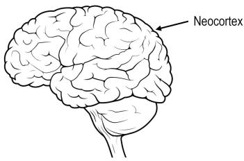
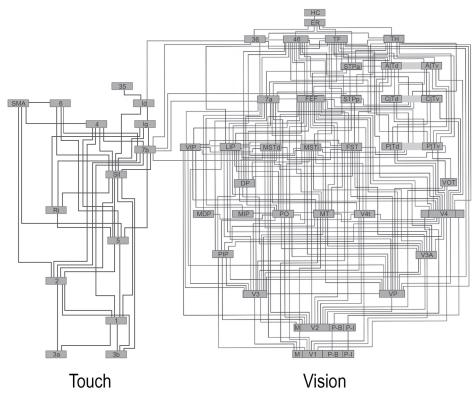
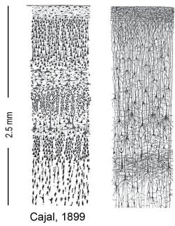

---
{"aliases":["Old Brain—New Brain"],"dg-publish":true,"permalink":"/thousand-brains-chapters/Part01 大脑的新理解/01 旧脑与新脑/","dgPassFrontmatter":true,"noteIcon":"","dg-note-properties":{"aliases":["Old Brain—New Brain"]}}
---

(terminology:: **Old Brain—New Brain**)  旧脑与新脑

要理解大脑如何创造智能，你首先需要了解一些基础知识。
## 基础知识

### 发展

达尔文发表进化论后不久，生物学家就意识到人脑本身也经历了漫长的演化，而这段演化史从大脑的外观就能看出端倪。与物种往往在新物种出现后消失不同，**大脑的演化方式是在旧结构之上不断叠加新结构**。例如，
- 最古老、最简单的神经系统是沿着微小蠕虫背部排列的一组神经元，它们让蠕虫能做简单的运动——这就是我们**脊髓**（spinal cord）的前身，脊髓同样负责我们许多基本动作。
- 接下来出现的是身体一端的一团神经元，控制消化和呼吸等功能，这就是我们**脑干**（brain stem）的前身，脑干同样掌管着消化和呼吸。脑干是对已有结构的延伸，而非替代。随着时间推移，大脑通过在旧结构上演化出新结构，逐渐具备了越来越复杂的行为能力。这种"叠加式生长"适用于大多数复杂动物的大脑。**旧脑结构之所以保留至今，原因很简单：无论我们多么聪明、多么精密，呼吸、进食、性和反射反应对生存仍然至关重要**。
- 我们大脑最新的部分是**新皮层**（neocortex），意为"新的外层"。所有哺乳动物——也只有哺乳动物——拥有新皮层。人类的新皮层尤其庞大，占据大脑体积的约 70%。如果你能把新皮层从头颅中取出并熨平，它大约有一块大餐巾那么大，厚度约 2.5 毫米。它包裹在大脑的旧结构外面，因此当你观察人脑时，看到的大部分就是新皮层（带有标志性的褶皱和沟回），旧脑和脊髓则从底部露出一小部分。

人脑

**新皮层是智能的器官。几乎所有我们认为属于"智能"的能力——视觉、语言、音乐、数学、科学、工程——都由新皮层创造**。当我们思考时，主要是新皮层在工作。你的新皮层正在阅读或聆听这本书，而我的新皮层正在写这本书。如果我们想理解智能，就必须理解新皮层做了什么、以及它是如何做到的。

动物不需要新皮层也能过上复杂的生活。鳄鱼的大脑大致相当于我们的大脑去掉新皮层。鳄鱼有精密的行为，会照顾幼崽，知道如何在环境中导航。大多数人会说鳄鱼具有某种程度的智能，但远不及人类智能。

### 新脑与旧脑

新皮层和旧脑通过神经纤维相连，因此我们不能把它们看作完全独立的器官。它们更像是室友——各有各的议程和性格，但必须合作才能完成任何事情。新皮层处于一个明显不公平的位置：它不能直接控制行为。与大脑其他部分不同，新皮层中没有任何细胞直接连接到肌肉，所以它无法独自让任何肌肉运动。当新皮层想做某件事时，它向旧脑发送信号，某种意义上是"请求"旧脑执行它的意愿。例如，呼吸是脑干的功能，不需要新皮层的思考或输入。新皮层可以暂时控制呼吸——比如你有意识地决定屏住呼吸。但如果脑干检测到身体需要更多氧气，它会无视新皮层并夺回控制权。类似地，新皮层可能想："别吃这块蛋糕，不健康。"但如果更古老、更原始的脑区说"看起来不错，闻起来不错，吃吧"，蛋糕就很难抗拒。这种新旧脑之间的拉锯是本书的一条暗线，在我们讨论人类面临的存在性风险时将扮演重要角色。

旧脑包含数十个独立的器官，各有特定功能。它们在视觉上彼此不同，其形状、大小和连接方式反映了各自的功能。例如，**杏仁核**（amygdala）中有几个豌豆大小的器官，分别负责不同类型的攻击行为，如预谋性攻击和冲动性攻击。

新皮层则截然不同。尽管它占据了大脑近四分之三的体积，负责无数认知功能，却没有明显的视觉分区。那些褶皱和沟回只是为了把新皮层塞进颅骨——就像你把一块餐巾塞进大酒杯时看到的效果。如果忽略褶皱和沟回，新皮层看起来就是一大片细胞，没有明显的分界。

### 新皮层区域划分的研究

尽管如此，新皮层仍然被划分为数十个区域（region），执行不同的功能。有些区域负责视觉，有些负责听觉，有些负责触觉，还有负责语言和规划的区域。当新皮层受损时，出现的缺陷取决于受损的部位。后脑勺受损会导致失明，左侧受损可能导致语言丧失。

新皮层的各区域通过在新皮层下方行走的神经纤维束相互连接，即大脑的**白质**（white matter）。通过仔细追踪这些神经纤维，科学家可以确定有多少个区域以及它们如何连接。由于研究人脑很困难，第一个以这种方式被分析的复杂哺乳动物是猕猴。1991 年，两位科学家 Daniel Felleman 和 David Van Essen 综合了数十项独立研究的数据，创建了一幅著名的猕猴新皮层连接图。下面是他们创建的图像之一（人类新皮层的连接图在细节上会有所不同，但整体结构相似）。

新皮层中的连接

图中数十个小矩形代表新皮层的不同区域，线条代表信息如何通过白质从一个区域流向另一个区域。

对这幅图的一种常见解读是：新皮层是层级式的，像一张流程图。来自感官的输入从底部进入（在这张图中，来自皮肤的输入在左侧，来自眼睛的输入在右侧）。**输入经过一系列步骤处理，每一步都从输入中提取越来越复杂的特征**。例如，接收眼睛输入的第一个区域可能检测简单的模式，如线条或边缘；这些信息被发送到下一个区域，该区域可能检测更复杂的特征，如角或形状。这个逐步过程一直持续，直到某些区域检测到完整的物体。

支持这种流程图层级解读的证据很多。例如，当科学家观察层级底部区域的细胞时，发现它们对简单特征反应最强，而下一个区域的细胞对更复杂的特征有反应。有时他们在更高区域发现对完整物体有反应的细胞。然而，也有大量证据表明新皮层并不像流程图。从图中可以看到，各区域并非像流程图那样一个叠一个排列。每个层级有多个区域，大多数区域连接到层级的多个级别。事实上，区域之间的大多数连接根本不符合层级方案。此外，每个区域中只有部分细胞表现得像特征检测器；科学家尚未确定每个区域中大多数细胞在做什么。

这给我们留下了一个谜题：智能的器官——新皮层——被划分为数十个执行不同功能的区域，但表面上它们看起来都一样。各区域以复杂的方式相互连接，有点像流程图，但大部分不是。智能的器官为什么长成这样，并不是一目了然的。

接下来显而易见的做法是深入新皮层内部，观察其 2.5 毫米厚度中的详细电路。你可能会想，即使新皮层的不同区域从外面看起来一样，创造视觉、触觉和语言的详细神经回路在内部应该看起来不同。但事实并非如此。

第一个观察新皮层内部详细电路的人是 Santiago Ramón y Cajal。19 世纪末，人们发现了染色技术，可以在显微镜下看到大脑中的单个神经元。Cajal 用这些染色法为大脑的每个部分绘制图像。他创作了数千幅图像，首次展示了大脑在细胞层面的样貌。Cajal 所有精美而复杂的大脑图像都是手绘的。他最终因这项工作获得了诺贝尔奖。下面是 Cajal 绘制的两幅新皮层图像。左边那幅只显示神经元的细胞体，右边那幅包含了细胞之间的连接。这些图像展示的是新皮层 2.5 毫米厚度的横切面。

新皮层切片中的神经元

制作这些图像所用的染色法只能给一小部分细胞着色。这其实是幸运的，因为如果每个细胞都被染色，我们看到的就只是一片漆黑。请记住，实际的神经元数量远比你在这里看到的多得多。

Cajal 和其他人的第一个观察是：**新皮层中的神经元似乎排列成层。这些层与新皮层表面平行（在图中为水平方向），由神经元大小和排列密度的差异造成**。想象你有一根玻璃管，依次倒入一英寸的豌豆、一英寸的扁豆和一英寸的大豆。从侧面看，你会看到三层。在上面的图片中你可以看到这些层。层数取决于谁在计数以及他们用什么标准来区分各层。Cajal 看到了六层。一个简单的解读是：每一层神经元在做不同的事情。

今天我们知道新皮层中有数十种不同类型的神经元，而不是六种。科学家仍然使用六层术语。例如，某种细胞可能位于第 3 层，另一种位于第 5 层。第 1 层在新皮层最外表面，最靠近颅骨，位于 Cajal 绘图的顶部。第 6 层最靠近大脑中心，离颅骨最远。重要的是要记住，层只是某种神经元可能所在位置的粗略指南。更重要的是神经元连接到什么以及它如何行为。当你按连接性对神经元分类时，有数十种类型。

第二个观察是：**大多数神经元之间的连接是纵向的，在层与层之间运行**。神经元有树状的附属结构，称为**轴突**（axon）和**树突**（dendrite），使它们能够相互传递信息。Cajal 看到大多数轴突在层与层之间运行，垂直于新皮层表面（在这些图像中为上下方向）。某些层的神经元会建立长距离的水平连接，但大多数连接是纵向的。这意味着到达新皮层某个区域的信息主要在层与层之间上下移动，然后才被发送到其他地方。

在 Cajal 首次对大脑成像后的 120 年里，数百位科学家研究了新皮层，试图发现关于其神经元和回路的尽可能多的细节。关于这个主题有数千篇科学论文，远超我能概括的范围。

## 三个总体观察
在此，我想强调三个总体观察。

### 1. 新皮层的局部回路极其复杂

在一平方毫米的新皮层下方（约 2.5 立方毫米），大约有十万个神经元、五亿个神经元之间的连接（称为**突触**，synapse），以及数公里长的轴突和树突。想象把数公里的电线沿着一条路铺开，然后试图把它压缩到两立方毫米——大约一粒米的大小。每平方毫米下有数十种不同类型的神经元，每种类型都与其他类型建立典型的连接模式。科学家经常把新皮层的某个区域描述为执行简单功能，比如检测特征。然而，检测特征只需要少量神经元。新皮层中随处可见的精密而极其复杂的神经回路告诉我们：每个区域所做的事情远比特征检测复杂得多。

### 2. 新皮层各处看起来都很相似

新皮层的复杂电路在视觉区域、语言区域和触觉区域看起来惊人地相似。甚至在大鼠、猫和人类等不同物种之间也很相似。差异是存在的。例如，某些区域的某些细胞更多，另一些更少；有些区域有一种在其他地方找不到的额外细胞类型。大概这些区域所做的事情受益于这些差异。但总体而言，**区域之间的变异与相似性相比是相对较小的**。

### 3. 新皮层的每个部分都产生运动

长期以来人们认为，信息通过"感觉区域"进入新皮层，在区域层级中上下传递，最终到达"运动区域"。运动区域的细胞投射到脊髓中控制肌肉和肢体运动的神经元。我们现在知道这种描述是有误导性的。在科学家检查过的每个区域中，都发现了投射到旧脑中与运动相关部分的细胞。例如，接收眼睛输入的视觉区域会向旧脑中负责眼球运动的部分发送信号。类似地，接收耳朵输入的听觉区域投射到旧脑中移动头部的部分。转动头部会改变你听到的内容，就像移动眼睛会改变你看到的内容一样。现有证据表明，**新皮层中随处可见的复杂电路执行的是一种感觉-运动任务。不存在纯粹的运动区域，也不存在纯粹的感觉区域。**

## 总结

新皮层是智能的器官。它是一片餐巾大小的神经组织薄片，被划分为数十个区域。有负责视觉、听觉、触觉和语言的区域，也有不那么容易标记的区域负责高级思维和规划。各区域通过神经纤维束相互连接。区域之间的某些连接是层级式的，暗示信息像流程图一样有序地从一个区域流向另一个区域。但区域之间还有其他连接似乎没什么秩序，暗示信息同时四处流动。所有区域，无论执行什么功能，在细节上看起来都与其他区域相似。

我们将在下一章认识第一个理解了这些观察的人。

这里适合说几句关于本书写作风格的话。我是为有求知欲的普通读者写作的。我的目标是传达你理解这个新理论所需的一切，但不会多太多。我假设大多数读者对神经科学的先验知识有限。不过，如果你有神经科学背景，你会知道我在哪里省略了细节、简化了复杂话题。如果你属于这种情况，请多包涵。书末有一份带注释的阅读清单，供有兴趣的读者查找更多细节。
