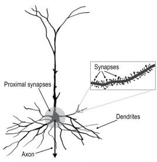

---
{"aliases":["The Brain Reveals Its Secrets"],"dg-publish":true,"permalink":"/thousand-brains-chapters/Part01 大脑的新理解/04 大脑揭示其秘密/","dgPassFrontmatter":true,"noteIcon":"","dg-note-properties":{"aliases":["The Brain Reveals Its Secrets"]}}
---

(terminology:: **The Brain Reveals Its Secrets**) 大脑揭示其秘密

人们常说大脑是宇宙中最复杂的东西，并由此推断不可能有简单的解释来说明它如何运作，甚至我们可能永远无法理解它。但科学发现的历史表明他们错了。**重大发现几乎总是在令人困惑的复杂观察之后出现。有了正确的理论框架，复杂性并不会消失，但它不再显得混乱或令人生畏**。

一个熟悉的例子是行星运动。几千年来，天文学家仔细追踪行星在恒星间的运动轨迹。一颗行星在一年中的路径极其复杂，忽左忽右，在天空中画出环形。很难想象这些狂野运动背后有什么解释。如今，每个孩子都学过行星绕太阳运行这一基本概念。行星运动仍然复杂，预测其轨道需要高深的数学，但有了正确的框架，复杂性不再神秘。很少有科学发现在基本层面上难以理解——孩子能学会地球绕太阳转，高中生能学会进化、遗传学、量子力学和相对论的原理。这些科学进步之前都有令人困惑的观察，但现在看来都显得直截了当、合乎逻辑。

同样，我一直相信新皮层（neocortex）看起来复杂主要是因为我们不理解它，事后看来它会显得相对简单。一旦我们知道了答案，就会回头说："哦，当然，我们怎么没想到呢？"每当研究停滞或有人告诉我大脑太难理解时，我就会想象一个未来——脑理论成为每所高中课程的一部分。这让我保持动力。

在试图破解新皮层的过程中，我们的进展起起伏伏。在十八年间——三年在红杉神经科学研究所（Redwood Neuroscience Institute），十五年在 Numenta——我和同事们一直在攻克这个问题。有时我们取得小进展，有时取得大突破，有时我们追寻的想法起初令人兴奋但最终证明是死胡同。我不打算带你走过所有这些历史，而是想描述几个关键时刻——我们的理解实现飞跃的时刻，自然在我们耳边低语、告诉我们某些被忽视之事的时刻。有三个这样的"顿悟"时刻我记忆犹新。

## 发现一：新皮层学习世界的预测模型

我已经描述过 1986 年我如何意识到新皮层学习世界的**预测模型**（predictive model）。这个想法的重要性怎么强调都不为过。我称之为"发现"，因为当时对我来说确实如此。哲学家和科学家讨论相关想法有很长的历史，今天神经科学家说大脑学习世界的预测模型也不罕见。但在 1986 年，神经科学家和教科书仍然更多地将大脑描述为一台计算机——信息进来、被处理、然后大脑行动。当然，学习世界模型和做出预测并不是新皮层做的唯一事情。然而，通过研究新皮层如何做出预测，我相信我们可以揭开整个系统的运作方式。

这一发现引出了一个重要问题：大脑如何做出预测？一个可能的答案是大脑有两类神经元：一类在大脑实际看到某物时放电，另一类在大脑预测将看到某物时放电。为了避免产生幻觉，大脑需要将预测与现实分开。使用两组神经元可以很好地做到这一点。然而，这个想法有两个问题。
- 第一，鉴于新皮层每时每刻都在做出大量预测，我们预期会发现大量的预测神经元。但迄今为止并未观察到这一点。科学家确实发现了一些在输入之前就变得活跃的神经元，但这些神经元并不像我们预期的那样常见。
- 第二个问题基于一个长期困扰我的观察：如果新皮层在任何时刻都在做出成百上千个预测，为什么我们对大多数预测毫无意识？如果我用手抓起一个杯子，我并不会意识到大脑在预测每根手指应该感受到什么——除非我感到异常，比如一条裂缝。我们对大脑做出的大多数预测没有意识，除非发生错误。试图理解新皮层中的神经元如何做出预测，引出了第二个发现。

## 发现二：预测发生在神经元内部

回想一下，新皮层做出的预测有两种形式。
- 一种是因为**周围世界在变化**。例如你在听一段旋律，你可以闭着眼睛坐着不动，进入耳朵的声音随着旋律推进而变化。如果你熟悉这段旋律，大脑就会持续预测下一个音符，如果任何音符不对你就会注意到。
- 第二种预测是因为**你相对于世界在移动**。例如，当我在办公室大厅锁自行车时，新皮层根据我的动作做出许多关于我将感受到、看到和听到什么的预测。自行车和锁不会自己移动，我的每个动作都会产生一组预测。如果我改变动作的顺序，预测的顺序也随之改变。

Mountcastle 提出的**共同皮层算法（common cortical algorithm）暗示新皮层中的每个皮层柱都能做出这两种预测**，否则皮层柱就会有不同的功能。我的团队还意识到这两种预测密切相关，因此我们认为在一个子问题上的进展会带动另一个子问题的进展。

### 序列记忆

预测旋律中的下一个音符——也称为**序列记忆**（sequence memory）—— 是两个问题中较简单的一个，所以我们先从它入手。序列记忆的用途远不止学习旋律：它还用于创建行为。例如，淋浴后用毛巾擦干身体时，我通常遵循几乎相同的动作模式，这就是一种序列记忆。序列记忆也用于语言——识别一个口语单词就像识别一段短旋律，单词由一系列音素定义，旋律由一系列音程定义。还有更多例子，但为简单起见我只用旋律来说明。通过推导皮层柱中的神经元如何学习序列，我们希望发现神经元如何预测一切事物的基本原理。

我们在旋律预测问题上工作了好几年才推导出解决方案，而这个方案必须展示众多能力。例如，旋律经常有重复段落，如副歌或贝多芬第五交响曲的"哒哒哒——噔"。要预测下一个音符，你不能只看前一个音符或前五个音符——正确的预测可能依赖于很久以前出现的音符。神经元必须弄清楚需要多少上下文才能做出正确预测。另一个要求是神经元必须能玩"猜歌名"游戏——你听到的前几个音符可能属于几首不同的旋律，神经元必须追踪所有与已听到内容一致的可能旋律，直到听到足够多的音符来排除所有旋律只剩一首。

用工程方法解决序列记忆问题很容易，但弄清楚真实的神经元——按照我们在新皮层中看到的方式排列——如何解决这些及其他要求，却很困难。几年间我们尝试了不同方法，大多数在某种程度上有效，但没有一个展示出我们需要的所有能力，也没有一个精确符合我们已知的大脑生物学细节。我们对部分解决方案或"受生物启发"的方案不感兴趣。我们想确切知道真实的神经元——按照新皮层中所见的方式排列——如何学习序列和做出预测。

我记得想出旋律预测问题解决方案的那一刻。那是 2010 年，感恩节假期前一天。解决方案灵光一闪。但当我仔细思考时，我意识到它要求神经元做一些我不确定它们能否做到的事情。换句话说，我的假说做出了几个详细且令人惊讶的预测，我可以去验证。

科学家通常通过实验来检验理论的预测是否成立。但神经科学不同寻常——每个子领域都有数百到数千篇已发表的论文，其中大多数呈现的实验数据尚未被纳入任何整体理论。这为像我这样的理论家提供了机会，可以通过搜索过去的研究来快速检验新假说，寻找支持或否定它的实验证据。我找到了几十篇期刊论文，其中包含可以验证新序列记忆理论的实验数据。我的大家庭正在家里过节，但我太兴奋了，等不及所有人离开。我记得自己一边做饭一边读论文，还拉着亲戚们讨论神经元和旋律。读得越多，我就越确信自己发现了重要的东西。

### 树突脉冲

关键洞见是对神经元的一种全新理解。

一个典型的神经元

上图是新皮层中最常见的神经元类型。这样的神经元有数千个、有时数万个**突触**（synapse），分布在树突的分支上。一些树突靠近细胞体（图像底部），另一些树突较远（图像顶部）。方框显示了一个树突分支的放大视图，可以看到突触有多小、排列有多紧密——树突上的每个凸起就是一个突触。

我还标出了细胞体周围的一个区域，这个区域的突触称为**近端突触**（proximal synapse）。如果近端突触接收到足够的输入，神经元就会产生脉冲。脉冲从细胞体开始，通过轴突传递到其他神经元。如果你只考虑近端突触和细胞体，这就是神经元的经典视图。如果你读过关于神经元的内容或学过人工神经网络，你会认出这个描述。

奇怪的是，不到 10% 的突触位于近端区域。其余 90% 距离太远，无法引起脉冲。如果输入到达其中一个**远端突触**（distal synapse），比如方框中显示的那些，它对细胞体几乎没有影响。研究人员只能说远端突触起某种调节作用。**多年来，没有人知道新皮层中 90% 的突触在做什么**。

大约从 1990 年开始，这幅图景发生了变化。科学家发现了沿树突传播的新型脉冲。
- 以前我们只知道一种脉冲：从细胞体开始，沿轴突传播到其他细胞。
- 现在我们了解到还有其他脉冲沿树突传播。一种**树突脉冲**（dendrite spike）在大约二十个相邻突触同时接收输入时产生。**一旦树突脉冲被激活，它就沿树突传播直到到达细胞体。到达后，它提高了细胞的电压，但不足以让神经元产生脉冲**。就像树突脉冲在"逗弄"神经元——几乎强到让神经元激活，但又差一点。

神经元在这种被激发的状态下停留一小段时间，然后恢复正常。科学家再次困惑：如果树突脉冲不够强大到在细胞体产生脉冲，它们有什么用？不知道树突脉冲的用途，AI 研究人员使用的模拟神经元就没有树突脉冲，也没有树突和树突上的数千个突触。我知道远端突触必定在大脑功能中扮演关键角色。**任何不能解释大脑中 90% 突触的理论和神经网络都一定是错的**。

### 预测状态
> **我的重大洞见是：树突脉冲就是预测**。

树突脉冲发生在远端树突上一组相邻突触同时接收输入时，这意味着神经元识别出了其他神经元中的一种活动模式。当这种活动模式被检测到时，它产生树突脉冲，提高细胞体的电压，使细胞进入我们所说的**预测状态**（predictive state）。神经元随后被"预备"好准备放电。这类似于短跑运动员听到"各就位，预备……"后准备起跑。如果处于预测状态的神经元随后在近端突触接收到足够输入产生动作电位脉冲，那么该细胞会比不在预测状态时稍早一点放电。

想象有十个神经元都在近端突触上识别相同的模式。这就像十个短跑运动员在起跑线上，都在等待同一个信号开始比赛。其中一个运动员听到了"各就位，预备……"并预感到比赛即将开始。她蹲进起跑器，准备好出发。当"跑"的信号响起时，她比其他没有被预备、没有听到准备信号的运动员更快地冲出起跑器。看到第一个运动员领先起跑，其他运动员放弃了，甚至不开始跑，等待下一场比赛。这种竞争在整个新皮层中都在发生。

在每个微柱（minicolumn）中，多个神经元对相同的输入模式做出响应。它们就像起跑线上的运动员，都在等待同一个信号。如果它们偏好的输入到来，它们都想开始放电。然而，如果其中一个或多个神经元处于预测状态，根据我们的理论，只有那些神经元放电，其他神经元被抑制。因此，**当一个意外的输入到来时，多个神经元同时放电；如果输入是被预测到的，则只有处于预测状态的神经元变得活跃。这是关于新皮层的一个常见观察：意外输入比预期输入引起更多的活动**。

如果你取几千个神经元，将它们排列成微柱，让它们相互建立连接，再加上一些抑制性神经元——这些神经元就能解决"猜歌名"问题，不会被重复的子序列搞混，并且集体预测序列中的下一个元素。

让这一切运作的关键是对神经元的全新理解。我们之前知道预测是大脑的普遍功能，但不知道预测在哪里、如何做出。有了这个发现，我们理解了大多数预测发生在神经元内部。预测发生在神经元识别出一种模式、产生树突脉冲、并被预备好比其他神经元更早放电的时候。凭借数千个远端突触，每个神经元可以识别数百种预测其何时应该激活的模式。预测内建于新皮层的基本结构——神经元之中。

我们花了一年多时间测试新的神经元模型和序列记忆回路。我们编写了软件模拟来测试其容量，惊讶地发现仅两万个神经元就能学习数千个完整序列。我们发现即使 30% 的神经元死亡或输入有噪声，序列记忆仍然有效。我们花在测试理论上的时间越多，就越有信心它确实捕捉到了新皮层中正在发生的事情。我们还发现越来越多来自实验室的经验证据支持我们的想法。例如，理论预测树突脉冲以某些特定方式表现，但起初我们找不到确凿的实验证据。然而，通过与实验学家交流，我们能够更清楚地理解他们的发现，并看到数据与我们的预测一致。我们于 2011 年首次在白皮书中发表了这一理论，随后在 2016 年发表了同行评审期刊论文，题为"[[Why Neurons Have Thousands of Synapses, a Theory of Sequence Memory in the Neocortex\|Why Neurons Have Thousands of Synapses, a Theory of Sequence Memory in the Neocortex]]"。论文的反响令人鼓舞，它迅速成为该期刊阅读量最高的论文。

## 发现三：皮层柱的秘密是参考框架

接下来，我们将注意力转向预测问题的后半部分：当我们移动时，新皮层如何预测下一个输入？与旋律不同，这种情况下输入的顺序不是固定的，因为它取决于我们朝哪个方向移动。例如，如果我向左看，我看到一样东西；如果我向右看，我看到另一样东西。要让皮层柱预测其下一个输入，它必须知道即将发生什么运动。

预测序列中的下一个输入与预测移动时的下一个输入是类似的问题。我们意识到，如果给神经元一个代表传感器如何移动的额外输入，我们的序列记忆回路就能做出这两种预测。然而，我们不知道与运动相关的信号应该是什么样子。

我们从能想到的最简单的东西开始：如果与运动相关的信号只是"向左移动"或"向右移动"呢？我们测试了这个想法，它有效。我们甚至造了一个小型机器人手臂，能在左右移动时预测其输入，并在一次神经科学会议上做了演示。然而，我们的机器人手臂有局限性。它对简单问题有效，比如在两个方向上移动，但当我们试图将其扩展到真实世界的复杂性——比如同时在多个方向移动——时，它需要太多训练。我们觉得接近正确答案了，但有什么地方不对。我们尝试了几种变体都没有成功，令人沮丧。几个月后我们陷入了僵局，看不到解决问题的方法，于是暂时搁置这个问题，转去做其他事情。

2016 年 2 月底，我在办公室等妻子 Janet 来一起吃午饭。我手里拿着一个 Numenta 咖啡杯，观察着手指触碰杯子。我问了自己一个简单的问题：我的大脑需要知道什么才能预测手指移动时会感受到什么？如果我的一根手指在杯子侧面，我把它向顶部移动，大脑会预测我将感受到杯口的弧形曲线。大脑在手指触碰杯口之前就做出了这个预测。大脑需要知道什么才能做出这个预测？答案很容易陈述：大脑需要知道两件事——它触碰的是什么物体（在这个例子中是咖啡杯），以及手指移动后将在杯子上的什么位置。

注意，大脑需要知道的是手指相对于杯子的位置。手指相对于身体在哪里无关紧要，杯子在哪里或如何摆放也无关紧要。杯子可以向左倾斜或向右倾斜，可以在我面前或在一侧。重要的是手指相对于杯子的位置。

这个观察意味着新皮层中必定有神经元在一个附着于杯子的**参考框架**（reference frame）中表示手指的位置。**我们一直在寻找的与运动相关的信号——我们预测下一个输入所需的信号——就是"物体上的位置"**。

你可能在高中学过参考框架。定义某物在空间中位置的 x、y、z 轴就是参考框架的一个例子。另一个熟悉的例子是经纬度，它定义了地球表面上的位置。起初，我们很难想象神经元如何能表示类似 x、y、z 坐标的东西。但更令人困惑的是，神经元竟然能将参考框架附着到像咖啡杯这样的物体上。杯子的参考框架是相对于杯子的，因此参考框架必须随杯子移动。

想象一把办公椅。我的大脑预测我触碰椅子时会感受到什么，就像预测触碰咖啡杯时的感受一样。因此，我的新皮层中必定有神经元知道手指相对于椅子的位置，这意味着新皮层必须建立一个固定于椅子的参考框架。如果我让椅子转一圈，参考框架也跟着转。如果我把椅子翻过来，参考框架也翻过来。你可以把参考框架想象成一个围绕并附着于椅子的不可见三维网格。神经元是简单的东西，很难想象它们能创建参考框架并将其附着到物体上——即使那些物体在外部世界中移动和旋转。但事情变得更加令人惊讶。

我身体的不同部位（指尖、手掌、嘴唇）可能同时触碰咖啡杯。触碰杯子的每个身体部位都根据其在杯子上的独特位置做出单独的预测。**因此，大脑不是做一个预测，而是同时做出几十个甚至几百个预测**。新皮层必须知道触碰杯子的每个身体部位相对于杯子的位置。

**我意识到，视觉做的事情和触觉一样**。视网膜上的小区域类似于皮肤上的小区域。你视网膜的每个小区域只看到整个物体的一小部分，就像皮肤的每个小区域只触碰物体的一小部分。**大脑不是处理一张图片——它从眼睛后面的图像开始，但随后将其分解成数百个碎片，然后将每个碎片分配到相对于被观察物体的一个位置**。

创建参考框架和追踪位置不是简单的任务。我知道这需要几种不同类型的神经元和多层细胞来完成这些计算。由于每个皮层柱中的复杂回路都是相似的，位置和参考框架必定是新皮层的普遍属性。**新皮层中的每个柱——无论它代表视觉输入、触觉输入、听觉输入、语言还是高级思维——都必须有表示参考框架和位置的神经元**。

在那之前，大多数神经科学家（包括我）认为新皮层主要处理感觉输入。那天我意识到的是，我们需要把新皮层看作主要处理参考框架。大部分回路的存在是为了创建参考框架和追踪位置。感觉输入当然是必不可少的。正如我将在后面章节中解释的，**大脑通过将感觉输入与参考框架中的位置关联来构建世界模型**。

### 参考框架重要性
> 为什么参考框架如此重要？大脑从中获得了什么？

第一，**参考框架允许大脑学习事物的结构**。咖啡杯之所以是一个"东西"，是因为它由一组特征和表面在空间中相对排列而成。同样，一张脸是鼻子、眼睛和嘴巴按相对位置排列。你需要参考框架来指定物体的相对位置和结构。

第二，**通过用参考框架定义物体**，大脑可以一次性操纵整个物体。例如，一辆汽车有许多相对排列的特征。一旦我们学会了一辆车，就可以想象它从不同角度看起来是什么样子，或者如果在某个维度上被拉伸会怎样。要实现这些，大脑只需旋转或拉伸参考框架，汽车的所有特征就随之旋转和拉伸。

第三，**参考框架是规划和创建运动所必需的**。假设我的手指正触碰手机正面，我想按顶部的电源键。如果大脑知道手指的当前位置和电源键的位置，就能计算出从当前位置到目标位置所需的运动。相对于手机的参考框架是做出这个计算所必需的。

参考框架在许多领域都有应用。机器人学家依靠它们来规划机器人手臂或身体的运动。参考框架也用于动画电影中渲染移动的角色。一些人曾建议某些 AI 应用可能需要参考框架。但据我所知，此前没有任何重要讨论提出新皮层基于参考框架工作，以及每个皮层柱中大多数神经元的功能是创建参考框架和追踪位置。现在这对我来说显而易见。

Vernon Mountcastle 主张每个皮层柱中存在一种通用算法，但他不知道那个算法是什么。Francis Crick 写道我们需要一个新框架来理解大脑，但他也不知道那个框架应该是什么。2016 年那天，手里拿着杯子，我意识到 Mountcastle 的算法和 Crick 的框架都基于参考框架。我还不理解神经元如何能做到这一点，但我知道这一定是真的。参考框架是缺失的成分，是解开新皮层之谜和理解智能的关键。

所有这些关于位置和参考框架的想法似乎在一瞬间涌入我脑中。我太兴奋了，从椅子上跳起来跑去告诉同事 Subutai Ahmad。当我冲过那二十英尺到他桌前时，撞上了 Janet，差点把她撞倒。我急着和 Subutai 说话，但在扶稳 Janet 并向她道歉的时候，我意识到还是晚点再和他谈比较明智。Janet 和我一边分享冻酸奶一边讨论参考框架和位置。

### 参考框架

这里适合回答一个我经常被问到的问题：如果一个理论还没有经过实验验证，我怎么能如此自信地谈论它？我刚才描述的就是这样一种情况。我有了新皮层充满参考框架的洞见，立刻就开始确定地谈论它。在我写这本书时，支持这个新想法的证据越来越多，但它仍未被彻底验证。然而，我毫不犹豫地将这个想法描述为事实。原因如下。

在研究一个问题的过程中，我们会发现我所说的**约束条件**（constraint）。约束条件是问题的解决方案必须满足的要求。我在描述序列记忆时给出了几个约束条件的例子，比如"猜歌名"的要求。大脑的解剖学和生理学也是约束条件。脑理论最终必须解释大脑的所有细节，正确的理论不能违反其中任何一个。

你在一个问题上工作的时间越长，发现的约束条件就越多，也就越难想象一个解决方案。我在本章描述的顿悟时刻都是关于我们工作了多年的问题。因此，我们对这些问题有深刻的理解，约束条件清单很长。一个解决方案正确的可能性随着它满足的约束条件数量呈指数增长。这就像解填字游戏：通常有几个词匹配单个线索。如果你选了其中一个词，它可能是错的。如果你找到两个交叉的词都能对上，那么它们都正确的可能性就大得多。如果你找到十个交叉的词，它们全部错误的概率微乎其微。你可以毫无顾虑地用钢笔写下答案。

**顿悟时刻发生在一个新想法同时满足多个约束条件的时候。你在一个问题上工作的时间越长——因而解决方案满足的约束条件越多——顿悟的感觉就越强烈，你对答案的信心也越大。新皮层充满参考框架这个想法解决了如此多的约束条件，以至于我立刻知道它是正确的**。

我们花了三年多时间来推导这一发现的含义，在我写作时仍未完成。到目前为止我们已经发表了几篇相关论文。第一篇题为"[[A Theory of How Columns in the Neocortex Enable Learning the Structure of the World\|A Theory of How Columns in the Neocortex Enable Learning the Structure of the World]]"。这篇论文从我们在 2016 年关于神经元和序列记忆的论文中描述的同一回路开始，然后增加了一层表示位置的神经元和一层表示被感知物体的神经元。通过这些添加，我们展示了单个皮层柱如何通过感知-移动-感知-移动来学习物体的三维形状。
	例如，想象把手伸进一个黑箱子，用一根手指触碰一个新物体。你可以通过移动手指沿着物体的边缘来学习整个物体的形状。我们的论文解释了单个皮层柱如何做到这一点。我们还展示了一个柱如何以同样的方式识别之前学过的物体——例如通过移动手指。然后我们展示了新皮层中的多个柱如何协同工作以更快地识别物体。例如，如果你把手伸进黑箱子，用整只手抓住一个未知物体，你可以用更少的移动来识别它，某些情况下一次抓握就够了。

我们对提交这篇论文感到紧张，并讨论是否应该等待。我们提出整个新皮层通过创建参考框架来工作，同时有数千个参考框架活跃着。这是一个激进的想法。然而，我们对神经元如何实际创建参考框架还没有方案。我们的论证大致是："我们推导出位置和参考框架必须存在，假设它们确实存在，这就是皮层柱可能的工作方式。哦，顺便说一下，我们不知道神经元实际上如何能创建参考框架。"我们还是决定提交论文。我问自己：即使论文不完整，我会想读它吗？我的答案是肯定的。新皮层在每个柱中表示位置和参考框架这个想法太令人兴奋了，不能仅仅因为我们不知道神经元如何做到就把它压着不发。我确信基本想法是正确的。

撰写一篇论文需要很长时间。仅文字部分就可能花费数月，通常还有需要运行的模拟，这可能又要几个月。在这个过程接近尾声时，我有了一个想法，在提交前加入了论文。我建议我们可能通过观察大脑中一个更古老的部分——**内嗅皮层**（entorhinal cortex）——来找到神经元如何创建参考框架的答案。论文在几个月后被接受时，我们已经知道这个猜想是正确的，我将在下一章讨论这个问题。

我们刚才涵盖了很多内容，让我们做一个快速回顾。本章的目标是向你介绍新皮层中每个皮层柱都创建参考框架这一概念。我带你走过了我们得出这一结论的步骤。我们从新皮层学习丰富而详细的世界模型这一想法开始，它用这个模型不断预测下一个感觉输入。然后我们问神经元如何做出这些预测。这引出了一个新理论：大多数预测由树突脉冲表示，树突脉冲暂时改变神经元内部的电压，使神经元比正常情况稍早放电。预测不会沿细胞的轴突发送给其他神经元，这解释了为什么我们对大多数预测毫无意识。然后我们展示了使用新神经元模型的新皮层回路如何学习和预测序列。我们将这个想法应用于当输入因我们自身运动而变化时，这样的回路如何预测下一个感觉输入。为了做出这些感觉-运动预测，我们推导出每个皮层柱必须知道其输入相对于被感知物体的位置。要做到这一点，皮层柱需要一个固定于物体的参考框架。
