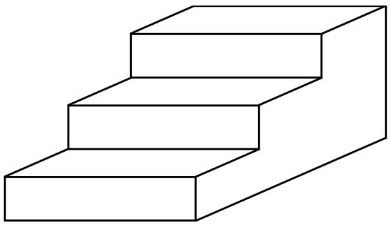

---
{"aliases":["The Thousand Brains Theory of Intelligence"],"dg-publish":true,"permalink":"/thousand-brains-chapters/Part01 大脑的新理解/07 千脑智能理论/","dgPassFrontmatter":true,"noteIcon":"","dg-note-properties":{"aliases":["The Thousand Brains Theory of Intelligence"]}}
---

(terminology:: **The Thousand Brains Theory of Intelligence**) 千脑智能理论

Numenta 从创立之初，目标就是建立一套关于新皮层如何运作的宏观理论。神经科学家每年发表数千篇论文，覆盖大脑的方方面面，但缺乏将这些细节串联起来的系统性理论。我们决定先聚焦于理解单个**皮层柱**（cortical column）。我们知道皮层柱在物理结构上非常复杂，因此它必然承担着复杂的功能。如果我们连单个皮层柱做什么都不清楚，就去追问各柱之间为何以第二章所示的那种混乱、半层级式的方式相互连接，那就好比在对人一无所知的情况下去追问社会如何运转。

现在我们对皮层柱的功能已经了解很多。**我们知道每个皮层柱都是一个感觉-运动系统；每个皮层柱能学习数百个物体的模型，而这些模型基于参考框架**。一旦理解了皮层柱的这些能力，新皮层作为整体的工作方式就变得清晰了——它与此前人们的设想截然不同。我们把这一新视角称为**千脑智能理论**（Thousand Brains Theory of Intelligence）。在解释这个理论之前，有必要先了解它所取代的旧观点。

## 关于新皮层的旧观点

当前最主流的新皮层思维方式类似于流程图：来自感官的信息在从一个皮层区域传递到下一个区域的过程中被逐步处理。科学家称之为**特征检测器层级**（hierarchy of feature detectors）。这一理论最常以视觉为例来描述，大致如下：视网膜上的每个细胞检测图像中一小块区域的光线，然后将信号投射到新皮层。新皮层中最先接收这些输入的区域叫做 V1 区。V1 区的每个神经元只接收来自视网膜一小部分的输入，就好像它们通过一根吸管观察世界。

这些事实暗示 V1 区的皮层柱无法识别完整物体。因此，V1 的角色被限定为检测图像局部区域中的简单视觉特征，如线条或边缘。然后 V1 的神经元将这些特征传递给新皮层的其他区域。下一个视觉区域 V2 将 V1 的简单特征组合成更复杂的特征，如拐角或弧线。这个过程在几个区域中再重复几次，直到神经元对完整物体产生响应。**人们假定触觉和听觉也存在类似的过程——从简单特征到复杂特征再到完整物体。这种将新皮层视为特征检测器层级的观点已经主导了五十年**。

这个理论最大的问题在于，它把视觉当作一个静态过程，就像拍照一样。但视觉并非如此。大约每秒三次，我们的眼睛会做出快速的**扫视运动**（saccadic movements），每次扫视都会使从眼睛到大脑的输入完全改变。当我们向前走或左右转头时，视觉输入同样在变化。特征层级理论忽略了这些变化，把视觉当作一次拍一张照片然后贴标签的过程。但即便是随意观察也能告诉你，视觉是一个依赖运动的交互过程。例如，要学习一个新物体的外观，我们会把它拿在手里翻来覆去地转动，从不同角度观察。只有通过运动，我们才能学习物体的模型。

很多人忽视视觉的动态特性，一个原因是我们有时确实能在不移动眼睛的情况下识别图像——比如屏幕上一闪而过的画面——但那是例外，不是常态。**正常的视觉是一个主动的感觉-运动过程，而非静态过程**。

运动的核心作用在触觉和听觉中更为明显。如果有人把一个物体放在你张开的手掌上，除非你移动手指，否则无法辨认它。同样，听觉始终是动态的。听觉对象（如口语词汇）本身就由随时间变化的声音定义，而且我们在聆听时会转动头部来主动调整所听到的内容。特征层级理论如何适用于触觉或听觉并不清楚。对于视觉，你至少可以想象大脑在处理一幅类似照片的图像，但触觉和听觉中没有与之对等的东西。

还有许多观察表明特征层级理论需要修正。以下是几个与视觉相关的例子：

- 第一和第二视觉区域 V1 和 V2 是人类新皮层中面积最大的区域之一，远大于据说负责识别完整物体的其他视觉区域。为什么检测数量有限的小特征需要比识别数量众多的完整物体占用更大比例的大脑？在某些哺乳动物（如小鼠）中，这种不平衡更为严重——小鼠的 V1 区占据了整个新皮层的很大一部分，其他视觉区域相比之下微不足道。仿佛小鼠的几乎全部视觉都发生在 V1 区。

- V1 中的特征检测神经元是在这样的实验中发现的：研究者在麻醉动物眼前投射图像，同时记录 V1 神经元的活动。他们发现有些神经元对图像局部区域中的简单特征（如边缘）产生响应。因为这些神经元只对小区域中的简单特征响应，研究者便假定完整物体必须在别处被识别，由此产生了层级特征模型。但在这些实验中，V1 中大多数神经元对任何明显的东西都没有响应——它们可能偶尔发放一个脉冲，或者持续发放一阵然后停止。大多数神经元无法用特征层级理论来解释，因此基本被忽略了。然而，V1 中所有这些未被解释的神经元一定在做某些重要的、并非特征检测的事情。

- 当眼睛从一个注视点扫视到另一个注视点时，V1 和 V2 区域中的一些神经元会做出一件了不起的事：它们似乎在眼睛尚未停止运动之前就已经知道自己将看到什么。这些神经元变得活跃，仿佛已经看到了新的输入，但输入实际上还没有到达。发现这一现象的科学家感到惊讶——这意味着 V1 和 V2 的神经元能够获取关于所观察物体整体的知识，而不仅仅是其中一小部分。

- 视网膜中心的感光细胞比外围密集得多。如果把眼睛比作相机，那它就是一台带有严重鱼眼镜头的相机。视网膜上还有些区域完全没有感光细胞，例如视神经离开眼球的盲点，以及血管穿过视网膜的地方。因此，传入新皮层的输入并不像一张照片，而是一幅高度扭曲且不完整的图像碎片拼贴。然而我们对这些扭曲和缺失毫无察觉——我们对世界的感知是均匀而完整的。特征层级理论无法解释这是如何实现的。这个问题被称为**绑定问题**（binding problem）或**传感器融合问题**（sensor-fusion problem）。更广义地说，**绑定问题追问的是：来自不同感官、散布在新皮层各处且带有各种扭曲的输入，如何被整合成我们每个人都体验到的那种单一的、无扭曲的感知**。

- 正如我在第一章中指出的，虽然新皮层区域之间的一些连接看起来是层级式的（像逐步流程图），但大多数并非如此。例如，低级视觉区域和低级触觉区域之间存在连接，这在特征层级理论中说不通。

- 尽管特征层级理论或许能解释新皮层如何识别一幅图像，但它无法揭示我们如何学习物体的三维结构、物体如何由其他物体组成、以及物体如何随时间变化和运动。它也无法解释我们如何想象一个物体旋转或变形后的样子。

面对这么多不一致和缺陷，你可能会好奇为什么特征层级理论仍然被广泛接受。原因有几个。
- 第一，它确实符合大量数据，尤其是很久以前收集的数据。
- 第二，理论的问题是随时间慢慢积累的，每个新问题单独看都容易被视为小问题而忽略。
- 第三，它是我们拥有的最好的理论，在没有替代方案的情况下，我们只能沿用它。
- 最后，正如我即将论证的，它并非完全错误——只是需要一次重大升级。

## 关于新皮层的新观点

我们提出的"皮层柱中的参考框架"概念，暗示了一种不同的新皮层工作方式。**它表明所有皮层柱——即使是低级感觉区域中的皮层柱——都能够学习和识别完整物体。一个只感知物体一小部分的皮层柱，可以通过在时间上整合其输入来学习整个物体的模型，就像你我通过逐一造访不同地点来了解一座新城市一样**。因此，严格来说，识别物体并不需要皮层区域的层级结构。我们的理论解释了为什么小鼠仅凭一个基本上单层的视觉系统就能看到并识别世界中的物体。

新皮层对任何特定物体都拥有许多模型，分布在不同的皮层柱中。**这些模型并不相同，而是互补的**。例如，一个接收指尖触觉输入的皮层柱可以学习手机的模型，包括其形状、表面纹理以及按钮按下时的手感。一个接收视网膜视觉输入的皮层柱也可以学习手机的模型，同样包括形状，但与指尖柱不同的是，它的模型还能包含手机各部分的颜色以及屏幕图标在使用过程中的变化。视觉柱无法学习电源键的段落感，触觉柱也无法学习屏幕图标的变化。

任何单个皮层柱都不可能学习世界上每一个物体的模型——那是不可能的。
- 首先，**单个皮层柱能学习的物体数量有物理上限**。我们还不确切知道这个容量是多少，但模拟实验表明单个皮层柱可以学习数百个复杂物体，这远少于你所知道的事物总数。
- 其次，**皮层柱能学什么受限于它的输入**。例如，触觉柱无法学习云的模型，视觉柱无法学习旋律。

**即使在单一感觉模态（如视觉）内部，不同的皮层柱也接收不同类型的输入，因而学习不同类型的模型**。例如，有些视觉柱接收颜色输入，有些接收黑白输入。再比如，V1 和 V2 区的皮层柱都接收来自视网膜的输入：V1 的柱接收视网膜上非常小的区域的输入，如同通过一根细吸管看世界；V2 的柱接收更大区域的输入，如同通过一根粗吸管看世界，但图像更模糊。现在想象你正在阅读你能看清的最小字体。我们的理论认为，只有 V1 区的皮层柱能识别最小字体的字母和单词——V2 看到的图像太模糊了。随着字体增大，V2 和 V1 都能识别文字。如果字体继续增大，V1 反而难以识别，但 V2 仍然可以。因此，V1 和 V2 的皮层柱可能都在学习物体（如字母和单词）的模型，但模型在尺度上有所不同。

## 知识储存在大脑的哪里？

大脑中的知识是分布式的。我们所知道的任何东西都不是存储在单一位置（如一个细胞或一个皮层柱）中的，也不是像全息图那样存储在所有地方。**某样东西的知识分布在数千个皮层柱中，但这些只是所有皮层柱的一小部分**。

再想想我们的咖啡杯。关于咖啡杯的知识存储在大脑的哪里？视觉区域中有许多接收视网膜输入的皮层柱，每个看到杯子一部分的皮层柱都会学习杯子的模型并尝试识别它。同样，如果你用双手握住杯子，触觉区域中数十到数百个模型就会被激活。并不存在单一的咖啡杯模型。你对咖啡杯的了解存在于数千个皮层柱中的数千个模型里——但仍然只占新皮层中所有皮层柱的一小部分。这就是我们称之为"千脑理论"的原因：**关于任何特定事物的知识都分布在数千个互补的模型中**。

这里有一个类比。假设有一座拥有十万市民的城市，城市有一套管道、水泵、水箱和过滤器系统来为每户家庭输送清洁水。供水系统需要维护才能正常运转。维护供水系统的知识存在于哪里？只让一个人掌握这些知识是不明智的，让每个市民都掌握也不现实。解决方案是将知识分布在许多人之间，但不能太多。在这个例子中，假设供水部门有五十名员工。继续这个类比，假设供水系统有一百个部件——即一百个水泵、阀门、水箱等——五十名工人中的每一位都知道如何维护和修理其中不同但有重叠的二十个部件。

那么，供水系统的知识存储在哪里？一百个部件中的每一个大约有十个人了解。如果某天一半的工人请了病假，极有可能仍然有五个左右的人能修理任何特定部件。每个员工都能独立维护和修复系统的 20%，无需监督。维护和修理供水系统的知识分布在少数人群中，而且即使大量员工流失，知识仍然是稳健的。

注意，供水部门可能有某种层级控制，但阻止任何自主性或将某项知识只分配给一两个人是不明智的。复杂系统在知识和行动分布于许多（但不是太多）元素之间时运作得最好。

大脑中的一切都以这种方式运作。例如，一个神经元从不依赖单个突触，而是可能使用三十个突触来识别一个模式——即使其中十个突触失效，神经元仍能识别该模式。**一个神经元网络从不依赖单个细胞。在我们创建的模拟网络中，即使损失 30% 的神经元，通常也只对网络性能产生边际影响。同样，新皮层也不依赖单个皮层柱。即使中风或创伤摧毁了数千个皮层柱，大脑仍能继续运作**。

因此，大脑不依赖任何事物的单一模型也就不足为奇了。我们对某样东西的知识分布在数千个皮层柱中。**这些皮层柱不是冗余的，也不是彼此的精确副本。最重要的是，每个皮层柱都是一个完整的感觉-运动系统**，就像每个供水部门的工人都能独立修复供水基础设施的某些部分一样。

## 绑定问题的解决方案

如果我们有数千个模型，为什么我们的感知是单一的？当我们拿着并看着一个咖啡杯时，为什么杯子感觉像一个东西而不是数千个东西？如果我们把杯子放在桌上发出声响，声音如何与杯子的图像和触感统一起来？换句话说，我们的感觉输入如何被绑定成一个单一的感知？科学家长期以来假设，新皮层中各种各样的输入必须汇聚到大脑中的某个单一位置，在那里感知到类似咖啡杯这样的东西。这个假设是特征层级理论的一部分。然而，**新皮层中的连接并不是这样的——连接不是汇聚到一个位置，而是朝各个方向延伸**。这是绑定问题被视为谜团的原因之一。但我们提出了一个答案：皮层柱进行**投票**（voting）。**你的感知就是皮层柱通过投票达成的共识**。

让我们回到纸质地图的类比。回忆一下，你有一组不同城镇的地图，地图被切成小方块并混在一起。你被丢在一个未知地点，看到一家咖啡店。如果你在多个地图方块上找到外观相似的咖啡店，你就无法确定自己在哪里。如果四个不同的城镇都有咖啡店，你知道自己一定在四个城镇之一，但无法确定是哪一个。

现在假设还有四个和你一样的人。他们也有城镇地图，被丢在和你同一个城镇但不同的随机位置。和你一样，他们不知道自己在哪个城镇或哪个位置。他们摘下眼罩环顾四周。一个人看到图书馆，查看地图方块后发现六个不同城镇有图书馆。另一个人看到玫瑰园，发现三个城镇有玫瑰园。其他两人也做了同样的事。没有人知道自己在哪个城镇，但每个人都有一份可能城镇的列表。现在大家投票。五个人的手机上都有一个应用，列出各自可能所在的城镇和位置，每个人都能看到其他人的列表。只有 9 号城镇出现在所有人的列表上——因此所有人现在都知道自己在 9 号城镇。通过比较可能城镇的列表，只保留出现在每个人列表上的城镇，大家立刻就知道了自己的位置。我们把这个过程称为投票。

在这个例子中，五个人就像五根手指触摸物体的不同位置。单独一根手指无法确定触摸的是什么物体，但合在一起就可以。如果你只用一根手指触摸某物，就必须移动手指才能识别物体。但如果你用整只手抓住物体，通常可以立刻识别。几乎在所有情况下，用五根手指比用一根需要更少的移动。同样，如果你通过一根吸管看物体，必须移动吸管才能识别。但如果用整只眼睛观看，通常不需要移动就能识别。

继续这个类比，想象被丢在城镇中的五个人里，有一个人只能听。那个人的地图方块标注的是每个位置应该听到的声音。当他们听到喷泉声、树上的鸟鸣或小酒馆的音乐时，就去找标注了这些声音的地图方块。类似地，假设两个人只能触摸东西，他们的地图标注的是不同位置预期的触觉感受。最后，两个人只能看，他们的地图方块标注的是每个位置预期看到的东西。现在我们有五个人拥有三种不同的传感器：视觉、触觉和听觉。五个人都感知到了什么，但无法确定自己在哪里，于是他们投票。投票机制与之前描述的完全相同——他们只需要在城镇上达成一致，其他细节都不重要。**投票跨感觉模态同样有效**。

注意，你几乎不需要了解其他人的任何信息。你不需要知道他们有什么感官或有多少张地图。你不需要知道他们的地图方块比你的多还是少，或者方块代表的区域更大还是更小。你不需要知道他们如何移动——也许有些人可以跳过方块，有些人只能对角线移动。这些细节都不重要。唯一的要求是每个人都能分享自己的可能城镇列表。**皮层柱之间的投票解决了绑定问题，它使大脑能够将众多类型的感觉输入统一为对所感知事物的单一表征**。

投票还有一个额外的要素。当你用手抓住一个物体时，我们相信代表各手指的触觉皮层柱还会共享另一条信息——它们之间的相对位置，这使得判断触摸的是什么变得更容易。想象我们的五位探索者被丢在一个未知城镇中。他们看到的五样东西很可能在许多城镇都存在，比如两家咖啡店、一座图书馆、一个公园和一座喷泉。投票会排除任何不同时拥有这五个特征的城镇，但探索者仍然无法确定自己在哪里，因为好几个城镇都有这五个特征。然而，如果五位探索者知道彼此的相对位置，就可以排除那些虽有这五个特征但排列方式不对的城镇。我们推测，关于相对位置的信息也在某些皮层柱之间共享。

## 投票在大脑中如何实现？

回忆一下，皮层柱中的大部分连接在各层之间上下传递，基本保持在柱的边界之内。但有几个众所周知的例外：某些层中的细胞会将轴突发送到新皮层内很远的距离。它们可能从大脑一侧发送轴突到另一侧——例如在代表左手和右手的区域之间；或者从 V1（初级视觉区）发送到 A1（初级听觉区）。我**们提出，这些拥有长距离连接的细胞就是在进行投票**。

只有特定的细胞适合投票。皮层柱中的大多数细胞并不表征各柱之间可以投票的那类信息。例如，一个柱的感觉输入与其他柱不同，因此接收这些输入的细胞不会投射到其他柱。但表征"正在感知什么物体"的细胞可以投票，并会广泛投射。

皮层柱如何投票的基本思路并不复杂。通过长距离连接，一个皮层柱广播它认为自己正在观察的东西。通常一个柱会不确定，这时它的神经元会同时发送多种可能性。与此同时，该柱接收来自其他柱的投射，代表它们的猜测。**最常见的猜测会抑制最不常见的猜测，直到整个网络稳定在一个答案上**。令人惊讶的是，一个柱不需要将投票发送给每一个其他柱。即使长距离轴突只连接到随机选择的一小部分其他柱，投票机制也能很好地工作。投票还需要一个学习阶段。在我们发表的论文中，我们描述了软件模拟，展示了学习如何发生以及投票如何快速可靠地进行。

## 感知的稳定性

皮层柱投票还解决了大脑的另一个谜题：为什么在输入不断变化的情况下，我们对世界的感知似乎是稳定的？当眼睛扫视时，输入随每次眼动而改变，因此活跃的神经元也必然在变化。然而我们的视觉感知是稳定的——世界并不会随着眼睛的移动而跳来跳去。大多数时候，我们完全意识不到眼睛在移动。触觉也存在类似的感知稳定性。想象一个咖啡杯在你桌上，你用手握着它。你感知到这个杯子。现在你漫不经心地用手指在杯子上滑动。在这个过程中，新皮层的输入在变化，但你的感知是杯子是稳定的——你不会觉得杯子在变化或移动。

那么为什么我们的感知是稳定的，为什么我们意识不到来自皮肤和眼睛的输入在不断变化？识别一个物体意味着各皮层柱已经投票并就它们正在感知的物体达成了一致。每个柱中的投票神经元形成一个稳定的模式，代表该物体以及它相对于你的位置。只要各柱仍在感知同一个物体，投票神经元的活动就不会随着你移动眼睛和手指而改变。每个柱中的其他神经元会随运动而变化，但投票神经元——那些代表物体的神经元——不会。

**如果你能俯瞰新皮层，你会看到某一层细胞中有一个稳定的活动模式。这种稳定性跨越大片区域，覆盖数千个皮层柱。这些就是投票神经元**。其他层中细胞的活动则在逐柱快速变化。我们所感知的正是基于稳定的投票神经元。这些神经元的信息被广泛传播到大脑的其他区域，在那里可以被转化为语言或存储在短期记忆中。我们并不能有意识地觉察到每个柱内部不断变化的活动，因为它留在柱内，对大脑的其他部分不可访问。

为了阻止癫痫发作，医生有时会切断新皮层左右两侧之间的连接。手术后，这些患者表现得好像拥有两个大脑。实验清楚地表明，大脑的两侧有不同的想法并得出不同的结论。皮层柱投票可以解释这一点：左右新皮层之间的连接用于投票。当它们被切断时，两侧就无法再投票，因此各自得出独立的结论。

在任何时刻，活跃的投票神经元数量很少。如果你是一位观察投票神经元的科学家，你可能会看到 98% 的细胞沉默，2% 持续放电。皮层柱中其他细胞的活动则随输入变化而变化。你很容易把注意力集中在变化的神经元上，而忽略投票神经元的重要性。

大脑想要达成共识。你可能见过上面这幅图，它既可以看成花瓶，也可以看成两张脸。在这类例子中，各皮层柱无法确定哪个才是正确的物体。就好像它们有两个不同城镇的地图，但这些地图至少在某些区域是相同的。"花瓶城"和"人脸城"很相似。投票层想要达成共识——它不允许两个物体同时活跃——所以它选择一种可能性而非另一种。你可以感知到人脸或花瓶，但不能同时感知两者。

## 注意力

我们的感官经常被部分遮挡，比如你看到一个人站在车门后面。虽然我们只看到半个人，但不会被欺骗——我们知道车门后面站着一个完整的人。看到这个人的皮层柱进行投票，它们确信这个物体是一个人。投票神经元将信息投射到那些输入被遮挡的皮层柱，于是每个柱都知道那里有一个人。即使是被遮挡的皮层柱也能预测如果车门不在那里它们会看到什么。

片刻之后，我们可以将注意力转移到车门上。就像花瓶和人脸的双稳态图像一样，输入存在两种解读。我们可以在"人"和"门"之间来回切换注意力。每次切换时，投票神经元都会稳定在一个不同的物体上。我们有两个物体都在那里的感知，尽管我们一次只能注意一个。

大脑可以注意视觉场景中更小或更大的部分。例如，我可以注意整扇车门，也可以只注意门把手。大脑究竟如何做到这一点尚不完全清楚，但它涉及大脑中一个叫做**丘脑**（thalamus）的部分，丘脑与新皮层的所有区域紧密相连。

**注意力在大脑学习模型的过程中扮演着核心角色**。在日常生活中，你的大脑在快速而持续地注意不同的事物。例如，阅读时你的注意力从一个词跳到另一个词。或者，看一栋建筑时，你的注意力可以从建筑整体到窗户、到门、到门闩，再回到门，如此往复。我们认为发生的事情是：每次你注意一个不同的物体时，你的大脑都会确定该物体相对于之前注意的物体的位置。这是自动的，是注意过程的一部分。例如，我走进一间餐厅。我可能先注意到一把椅子，然后注意到桌子。我的大脑识别出椅子，然后识别出桌子。然而，我的大脑同时也计算了椅子相对于桌子的位置。当我环顾餐厅时，我的大脑不仅在识别房间里的所有物体，还在同时确定每个物体相对于其他物体以及相对于房间本身的位置。**仅仅通过环顾四周，我的大脑就建立了一个包含我所注意到的所有物体的房间模型**。

通常，你学到的模型是临时的。假设你坐下来和家人在餐厅吃饭。你环顾餐桌，看到各种菜肴。然后我让你闭上眼睛告诉我土豆在哪里。你几乎肯定能做到，这证明你在短暂观看的时间里就学会了餐桌及其内容的模型。几分钟后，食物传递了一圈，我再让你闭上眼睛指出土豆的位置。你现在会指向一个新位置——你最后一次看到土豆的地方。这个例子的要点是，**我们在不断学习所感知的一切事物的模型**。如果模型中特征的排列保持固定（如咖啡杯上的标志），那么模型可能被记住很长时间。如果排列发生变化（如桌上的菜肴），那么模型就是临时的。

**新皮层永远不会停止学习模型。每一次注意力的转移——无论你是在看餐桌上的菜肴、走在街上，还是注意到咖啡杯上的标志——都在为某个事物的模型添加新的条目。无论模型是短暂的还是持久的，学习过程都是相同的**。

## 千脑理论中的层级结构

几十年来，大多数神经科学家都坚持特征层级理论，而且理由充分——这个理论虽然有很多问题，但确实符合大量数据。我们的理论提出了一种不同的新皮层思考方式。千脑智能理论认为，新皮层区域的层级结构并非严格必要。即使单个皮层区域也能识别物体，小鼠的视觉系统就是证据。那么，到底哪个是对的？新皮层是以层级方式组织的，还是以数千个模型投票达成共识的方式运作的？

新皮层的解剖结构表明两种类型的连接都存在。如何理解这一点？我们的理论提出了一种与层级模型和单柱模型都兼容的新思路：**在层级之间传递的是完整物体，而非特征。新皮层不是用层级来将特征组装成被识别的物体，而是用层级来将物体组装成更复杂的物体**。

我之前讨论过层级组合。回忆一下咖啡杯侧面印有标志的例子。我们学习这样一个新物体时，先注意杯子，再注意标志。标志本身也由物体组成（如图形和文字），但我们不需要记住标志的特征相对于杯子的位置——我们只需要学习标志的参考框架相对于杯子的参考框架的位置。标志的所有详细特征都被隐式地包含在内了。

**整个世界就是这样被学习的：作为一个复杂的物体层级，物体相对于其他物体定位**。新皮层究竟如何做到这一点仍不清楚。例如，我们怀疑一定量的层级学习发生在每个皮层柱内部，但肯定不是全部。有些会由区域之间的层级连接来处理。单个柱内学习了多少、区域间连接学习了多少，目前尚不清楚。我们正在研究这个问题，答案几乎肯定需要更好地理解注意力，这也是我们正在研究丘脑的原因。

在本章前面，我列出了"新皮层是特征检测器层级"这一主流观点的问题。现在让我们重新审视那个列表，讨论千脑智能理论如何解决每个问题，从运动的核心作用开始：

- 千脑智能理论**本质上是一个感觉-运动理论**。它解释了我们如何通过运动来学习和识别物体。重要的是，它也解释了为什么我们有时可以不通过运动就识别物体——比如看到屏幕上一闪而过的图像，或用所有手指同时抓住一个物体。因此，千脑智能理论是层级模型的超集。

- 灵长类动物中 V1 和 V2 区域相对较大的面积，以及小鼠中 V1 区域独占性的大面积，在千脑智能理论中说得通，**因为每个皮层柱都能识别完整物体**。与当今许多神经科学家的看法相反，千脑智能理论认为我们所认为的大部分视觉活动发生在 V1 和 V2 区域。初级和次级触觉相关区域同样相对较大。

- 千脑智能理论可以解释神经元如何在眼睛仍在运动时就知道下一个输入是什么这一谜题。在该理论中，**每个皮层柱拥有完整物体的模型，因此知道在物体的每个位置应该感知到什么**。如果一个柱知道其输入的当前位置以及眼睛的运动方向，它就能预测新位置以及在那里将感知到什么。这就像看着一张城镇地图，预测如果你朝某个方向走会看到什么。

- 绑定问题基于一个假设：新皮层对世界上每个物体只有一个模型。千脑智能理论将此颠倒过来，认为**每个物体都有数千个模型。传入大脑的各种输入并不被绑定或合并成单一模型**。各皮层柱有不同类型的输入无关紧要，一个柱代表视网膜的一小部分而另一个代表更大部分也无关紧要。视网膜有空洞无关紧要，就像手指之间有间隙无关紧要一样。投射到 V1 区的模式可以是扭曲的、混乱的，这都不要紧，因为新皮层的任何部分都不试图重新组装这个被打乱的表征。千脑智能理论的投票机制解释了为什么我们拥有单一的、无扭曲的感知。它也解释了为什么在一种感觉模态中识别物体会导致在其他感觉模态中产生预测。

- 最后，千脑智能理论展示了新皮层如何使用参考框架来学习物体的三维模型。作为一个小小的额外证据，看看下面这幅图。它是一堆印在平面上的直线。没有消失点，没有汇聚线，没有暗示深度的对比度递减。然而你看这幅图时不可能不把它看成一组三维台阶。**你观察的图像是二维的并不重要——你新皮层中的模型是三维的，而那才是你所感知到的**。

大脑是复杂的。位置细胞和网格细胞如何创建参考框架、学习环境模型并规划行为，其细节比我所描述的更为复杂，而且只被部分理解。我们提出新皮层使用类似的机制，这些机制同样复杂且更不被理解。这是实验神经科学家和像我们这样的理论家都在积极研究的领域。

要在这些和其他主题上走得更远，我就必须引入更多神经解剖学和神经生理学的细节——这些细节既难以描述，对理解千脑智能理论的基本原理也不是必需的。因此，**我们到达了一个边界——这本书的探索在此结束，科学论文需要覆盖的内容从此开始**。

在本书的引言中，我说过大脑就像一幅拼图。我们有数万条关于大脑的事实，每条都像一块拼图碎片。但没有理论框架，我们不知道拼图的完成图是什么样子。没有理论框架，我们最多只能在这里那里拼上几块。千脑智能理论就是一个框架——它就像完成了拼图的边框，让我们知道整体画面是什么样子。在我写作时，我们已经填充了拼图内部的一些部分，而许多其他部分尚未完成。虽然还有很多工作要做，但我们的任务现在更简单了，因为知道了正确的框架，就更清楚哪些部分还有待填充。

我不想给你留下一个错误印象，以为我们理解了新皮层所做的一切。我们离那还很远。关于大脑整体、尤其是新皮层，我们不理解的东西还很多。然而，我不认为会出现另一个整体性的理论框架——一种不同的边框碎片排列方式。理论框架会随时间被修正和完善，我预期千脑智能理论也会如此，但我在这里呈现的核心思想，我相信大部分会保持不变。

在我们离开本章和本书第一部分之前，我想告诉你我与弗农·蒙卡斯尔会面的后续故事。回忆一下，我在约翰斯·霍普金斯大学做了一次演讲，在那天结束时我与蒙卡斯尔和他的系主任见了面。离开的时间到了——我要赶飞机。我们互相道别，一辆车在外面等我。当我走过办公室门口时，蒙卡斯尔拦住了我，把手放在我肩上，用一种"给你一个忠告"的语气说：

> "You should stop talking about hierarchy. It doesn't really exist."

"你应该停止谈论层级结构。它并不真正存在。"

我惊呆了。蒙卡斯尔是世界上最权威的新皮层专家，而他在告诉我新皮层最大、最有据可查的特征之一并不存在。我的震惊程度就好像弗朗西斯·克里克本人对我说："哦，那个 DNA 分子，它并不真正编码你的基因。"我不知道如何回应，所以什么也没说。在去机场的车上，我试图理解他临别时的话。

今天，我对新皮层层级结构的理解已经发生了巨大变化——它远没有我曾经认为的那么层级化。弗农·蒙卡斯尔当时就知道这一点吗？他说层级不真正存在时有理论依据吗？他是否在想着我不知道的实验结果？他于 2015 年去世，我永远无法问他了。在他去世后，我重新阅读了他的许多著作和论文。他的思考和写作总是富有洞察力。他 1998 年的《感知神经科学：大脑皮层》是一本装帧精美的书，至今仍是我最喜欢的大脑书籍之一。回想那天，我本应冒着错过航班的风险多和他谈谈。更重要的是，我希望现在能和他交谈。我愿意相信他会喜欢我刚才向你描述的这个理论。

现在，我想把我们的注意力转向千脑智能理论将如何影响我们的未来。

## 机器智能

在他的名著《科学革命的结构》中，历史学家托马斯·库恩（Thomas Kuhn）论证说，大多数科学进步都基于被广泛接受的理论框架，他称之为**科学范式**（scientific paradigms）。偶尔，一个既有范式会被推翻并被新范式取代——库恩称之为科学革命。

今天，神经科学的许多子领域都有既定范式，如大脑如何进化、脑相关疾病、网格细胞和位置细胞等。在这些领域工作的科学家共享术语和实验技术，并就他们想要回答的问题达成一致。**但对于新皮层和智能，并不存在被普遍接受的范式。关于新皮层做什么，甚至我们应该试图回答什么问题，几乎没有共识。库恩会说，对智能和新皮层的研究处于前范式状态**。

在本书第一部分，我介绍了一个关于新皮层如何工作以及智能意味着什么的新理论。可以说我正在为新皮层研究提出一个范式。我有信心这个理论大体上是正确的，但重要的是，它也是可检验的。正在进行和未来的实验将告诉我们理论的哪些部分是对的，哪些需要修正。

在本书的第二部分，我将描述我们的新理论将如何影响人工智能的未来。AI 研究有一个既定范式——一套被称为人工神经网络的通用技术。AI 科学家共享术语和目标，这使得该领域在近年来取得了稳步进展。

**千脑智能理论表明，机器智能的未来将与当今大多数 AI 从业者的想法有本质不同。我相信 AI 已经准备好迎接一场科学革命，而我之前描述的智能原理将成为这场革命的基础。**

写这些内容时我有些犹豫，因为我职业生涯早期有过一次谈论计算未来的经历，结果并不顺利。

在我创办 Palm Computing 不久后，我被邀请在英特尔做一次演讲。英特尔每年都会把几百名最资深的员工带到硅谷参加为期三天的规划会议。作为会议的一部分，他们会邀请几位外部人士向全体与会者发言，1992 年我是其中之一。我视此为荣幸。英特尔正在引领个人计算革命，是世界上最受尊敬、最有影响力的公司之一。而我的公司 Palm 还是一家尚未发布第一款产品的小型初创企业。我的演讲主题是个人计算的未来。

我提出，个人计算的未来将由小到可以放进口袋的计算机主导。这些设备售价在五百到一千美元之间，靠电池运行一整天。对全球数十亿人来说，口袋大小的计算机将是他们拥有的唯一一台电脑。对我来说，这种转变是不可避免的。数十亿人想要使用计算机，但笔记本和台式机太贵、太难用。我看到了一种不可阻挡的力量在推动口袋计算机的出现——它们更易用、更便宜。

当时有数亿台台式和笔记本个人电脑，英特尔为其中大部分提供 CPU。平均每颗 CPU 芯片售价约四百美元，功耗远远超出电池供电手持设备的承受范围。我向英特尔的管理者们建议，如果他们想继续保持在个人计算领域的领导地位，应该聚焦三个方面：降低功耗、缩小芯片尺寸、以及弄清楚如何在售价低于一千美元的产品中盈利。我的语气很谦逊，并不激进，就像是："顺便说一下，我相信这件事会发生，你们可能想考虑以下影响。"

演讲结束后我接受提问。所有人都坐在午餐桌旁，食物要等我结束才上，所以我没指望收到很多问题。我只记得一个。一个人站起来，用似乎带着些许轻蔑的语气问道："人们要用这些手持电脑做什么？"这个问题很难回答。

当时个人电脑主要用于文字处理、电子表格和数据库，这些应用都不适合小屏幕、没有键盘的手持设备。逻辑告诉我手持电脑主要用于获取信息而非创建信息，这就是我给出的答案。我说查看日历和通讯录将是最初的应用，但我知道这些不足以变革个人计算。我说我们会发现更重要的新应用。

回想一下，1992 年初还没有数字音乐、数字摄影、Wi-Fi、蓝牙，手机上也没有数据服务。第一个消费级网页浏览器尚未被发明。我不知道这些技术会被发明出来，因此也无法想象基于它们的应用。**但我知道人们总是想要更多信息，而且不知怎的，我们会找到方法将信息传递到移动计算机上**。

演讲后，我被安排坐在戈登·摩尔（Gordon Moore）博士——英特尔的传奇创始人——旁边。那是一张圆桌，大约坐了十个人。我问摩尔博士对我演讲的看法。所有人都安静下来等他回答。他避免给我直接答复，然后在整顿饭期间都避免和我说话。很快就清楚了，无论是他还是桌上的其他任何人都不相信我说的话。

这次经历让我很受打击。如果我连计算领域最聪明、最成功的人都无法说服他们哪怕考虑一下我的提议，那也许我是错的，或者向手持计算的转变会比我想象的困难得多。我决定最好的前进道路是专注于制造手持计算机，而不是担心别人怎么想。从那天起，我不再做关于计算未来的"远见"演讲，而是尽一切可能让那个未来成为现实。

今天，我发现自己处于类似的境地。从这里开始，我将描述一个与大多数人——包括大多数专家——预期不同的未来。首先，我描述一个与当今大多数 AI 领袖想法相悖的人工智能未来；然后在第三部分，我以一种你可能从未考虑过的方式描述人类的未来。当然，我可能是错的——预测未来是出了名的困难。但对我来说，我即将呈现的想法似乎是不可避免的，更像是逻辑推演而非猜测。然而，正如我多年前在英特尔的经历所示，我可能无法说服所有人。我会尽力而为，并请你保持开放的心态。

在接下来的四章中，我将谈论人工智能的未来。AI 目前正在经历一场复兴，是科技领域最热门的方向之一。每天似乎都有新的应用、新的投资和性能的提升。AI 领域由人工神经网络主导，尽管它们与我们在大脑中看到的神经元网络毫无相似之处。**我将论证，AI 的未来将基于与当今不同的原理——更接近模仿大脑的原理。要构建真正智能的机器，我们必须让它们遵循我在本书第一部分阐述的原理。**

我不知道 AI 未来的应用会是什么。但就像个人计算向手持设备的转变一样，我认为 AI 向基于大脑原理的转变是不可避免的。
