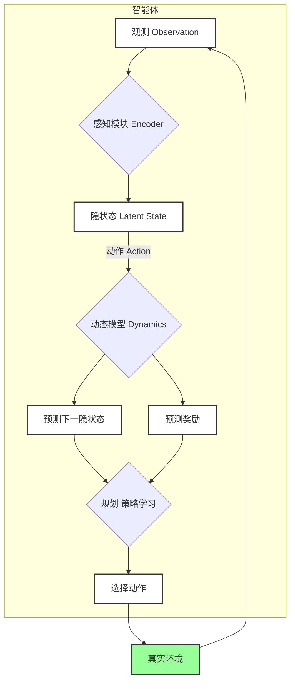

---
{"dg-publish":true,"dg-path":"人工智能/世界模型.md","permalink":"/人工智能/世界模型/","dgPassFrontmatter":true,"noteIcon":"","created":"2025-04-25T23:25:00.000+08:00","updated":"2025-08-30T17:55:44.393+08:00"}
---

(terminology::**World Model**)   世界模型
在[[人工智能\|人工智能]]（尤其是强化学习、机器人学、认知科学）领域中，指的是：**智能体（agent）对环境运行规律的内部表征和预测机制**。智能体用它来**理解过去、预测未来、计划行动**。

> 世界模型是[[人工智能\|人工智能]]体（Agent）在内部构建的一个关于其所处环境如何运作的**可执行的模拟器**。它就像一个“大脑中的虚拟现实引擎”，允许智能体在采取实际行动之前，先在“想象”中对不同行为的可能后果进行推演和预测。

### 核心思想：从反应到思考

传统 AI（特别是早期的强化学习）大多是“反应式”的，它们直接学习从“状态”到“动作”的映射。而引入世界模型，则是推动 AI 从“反应式”迈向“思考式”的关键一步。

- 反应式 AI (Model-Free): 看到状态 -> 直接输出动作。学习效率低，需要大量的真实世界试错。
- 思考式 AI (Model-based): 看到状态 -> 更新内部世界模型 -> 在模型中进行快速、低成本的模拟规划 -> 选择最优动作。

### 世界模型在强化学习中的作用

在强化学习中，世界模型是基于模型强化学习 (Model-based RL) 的核心。它允许智能体在不与真实环境交互的情况下，通过在内部模拟环境中进行“想象”和“规划”，来学习和优化其行为策略。

### 世界模型的核心组件

一个典型的世界模型通常由以下几个关键部分组成：

1.  感知模块 (Perception/Encoder): 负责将高维的原始观测数据（如图像、传感器读数）压缩成一个低维、紧凑的隐状态 (Latent State)。这个隐状态是世界模型进行内部模拟的基础。它将原始观测 $o_t$ 映射到隐状态 $s_t$。
    - 常用技术: 卷积神经网络 (CNN), 自编码器 (VAE)。

2.  动态模型 (Dynamics Model): 这是世界模型的核心。它学习环境的动态变化规律，能够预测在给定当前隐状态 $s_t$ 和智能体执行的动作 $a_t$ 后，下一个隐状态 $s_{t+1}$ 和获得的奖励 $r_{t+1}$。
    - 状态转移预测: $P(s_{t+1} | s_t, a_t)$
    - 奖励预测: $P(r_{t+1} | s_t, a_t, s_{t+1})$
    - 常用技术: 循环神经网络 (RNN), 长短期记忆网络 (LSTM), Transformer。

3.  奖励预测器 (Reward Predictor): 从隐状态中预测奖励。在某些世界模型中，这部分可能集成在动态模型中。

|模块|作用|类比|
|---|---|---|
|表征（Encoder）|把观测（图片、数据）压缩成内部特征|人脑感知|
|动态模型（Dynamics）|根据当前特征和动作预测下一步特征|人脑推理|
|观测生成器（Decoder）|从内部特征还原出具体观测（比如图像）|人脑想象|
|奖励预测器（Optional）|预测执行某动作后能得到多少奖励|经验判断|

### 理论基础
**预测学习** （Predictive Learning）
	世界模型本质上就是一种**预测学习**：  给定当前状态和动作，预测未来的状态。这种思想最早来源于**控制理论**（如卡尔曼滤波器）和**心理学**（人脑预测未来感知的能力）。
**具身认知** （Embodied Cognition）
	智能体与环境的交互过程中，**感知、动作和推理**是不可分割的。世界模型强调不仅要**被动感知**，还要**主动模拟、推演环境变化**。
**理性规划** （Model-Based Planning）
	世界模型可以被视为强化学习中**从model-free到model-based的演进**：
	 **Model-Free**：不建模环境，只根据经验学习策略（如DQN、PPO）
	 **Model-Based**：构建环境模型，用于内部模拟决策（如Dreamer、PlaNet）
**压缩感知**（Compression and Representation Learning）
	世界模型常通过学习一个低维、抽象的隐空间来表示环境状态。这与**信息瓶颈理论**（Information Bottleneck Theory）有关：  要在保留关键信息的同时最大限度地压缩无关细节。

### 数学基础
[[马尔可夫决策过程\|马尔可夫决策过程]]
[[自编码器\|自编码器]]
由于环境本身可能是**部分可观测（POMDP）**，预测未来存在不确定性。世界模型需要表达这种不确定性：[[正态分布\|高斯分布]]
[[混合密度网络\|混合密度网络]]
[[贝叶斯神经网络\|贝叶斯神经网络]]
[[VAE\|VAE]]
[[MPC\|MPC]]

### 为何世界模型如此重要？

1.  **大幅提升数据效率**: 智能体可以在内部模型中进行数千次的“想象”试错，这比在真实世界中进行一次交互要快得多、成本也低得多。这对于[[强化学习\|强化学习]]在[[机器人\|机器人]]等领域的应用至关重要。

2.  **实现零样本规划 (Zero-Shot Planning)**: 一旦世界模型学习到了环境的通用规则，即使面对一个全新的任务目标，智能体也可以不经过任何额外的真实交互，仅通过在内部模型中进行搜索和规划，就能直接找到解决方案。

3.  **增强泛化与想象力**: 一个好的世界模型不仅能模拟已知的动态，还能对未见过的场景进行合理的推断和“想象”，这是通往更高级通用智能的基石。例如，视频生成模型（如 Sora）可以被看作是一种强大的视觉世界模型。

### 代表性研究

- **PlaNet**: 首次证明了仅从图像输入学习世界模型并进行成功规划的可行性。
- **Dreamer 系列 (Dreamer, DreamerV2, DreamerV3)**: 强化学习领域最著名的基于世界模型的方法系列，通过在“梦境”（即世界模型的想象）中学习行为策略，取得了顶尖性能。
- **Sora**: 虽然主要被视为视频生成模型，但其对物理世界连贯、一致的模拟能力，使其成为迄今最强大的视觉世界模型之一。

### 挑战与未来

-   **模型误差累积**: 即使世界模型学习得很好，微小的预测误差也会在长时间的模拟中累积，导致“幻觉”或与真实环境的偏差。
-   **模型学习困难**: 学习一个准确且泛化的世界模型本身就是一个复杂的[[机器学习\|机器学习]]问题。
-   **探索与利用**: 如何在学习世界模型的同时，有效地探索环境以获取更多信息，是持续的挑战。