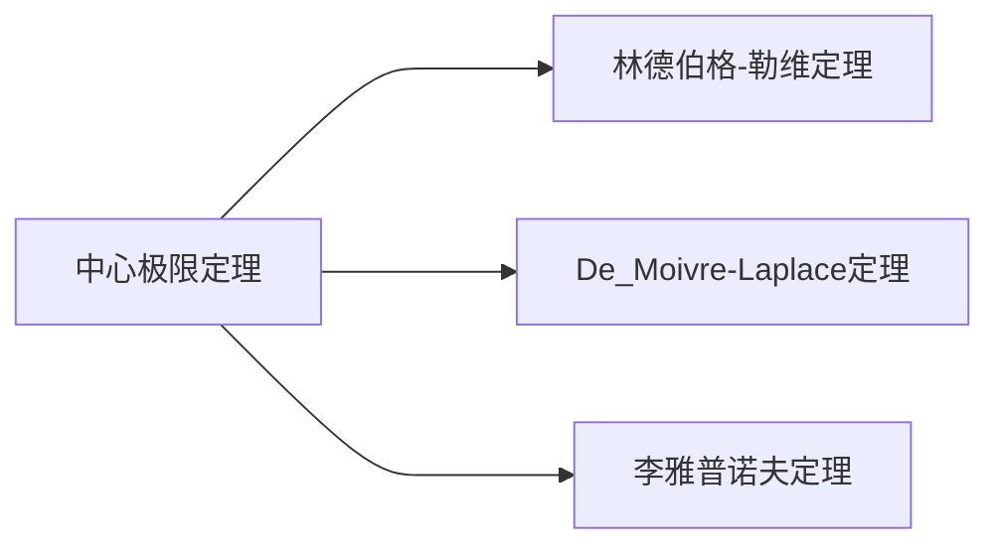

---
{"dg-publish":true,"dg-path":"A1- 数学/5. 概率论/中心极限定理.md","permalink":"/A1- 数学/5. 概率论/中心极限定理/","dgPassFrontmatter":true,"noteIcon":"","dg-note-properties":{}}
---

**Central Limit Theorem**     **CLT**

当一个量受许多随机因素的共同影响而随机取值时，它的分布近似服从[[正态分布\|正态分布]]
>概率的计算就可以简化为标准正态分布的简单计算

[[方差\|随机变量的标准化]]
和式的标准化形式
$$\begin{align}
Z_{n}=\dfrac{ \sum\limits_{k=1}^{n}X_{k}-\sum\limits_{k=1}^{n}E\left( X_{k} \right)}{\sqrt{\sum\limits_{k=1}^{n} D\left( X_{k} \right) }}
\end{align}$$

当 $n$ 充分大时：
$$\begin{align}
\lim\limits_{ n \to \infty } P\left\{Z_{n}\leq x \right\}=\lim\limits_{ n \to \infty } F(x)=\Phi(x)=\dfrac{1}{\sqrt{ 2\pi }}\int _{-\infty}^{x} e^{ - \frac{t^{2}}{2} }\, dt
\end{align}$$

>[!important] 本质
>将随机变量序列的总体看成一个随机变量，
>再进行随机变量的标准化，
>转化为[[正态分布\|标准正态分布]]的计算

[[特征函数\|特征函数]]
### Lindeberg-Lévy Theorem
林德伯格-勒维定理

$X_{1},X_{2},\cdots,X_{n},\cdots$ 为[[独立同分布\|独立同分布]]的随机变量序列
$E(X_{i})=\mu$   $D(X_{i}=\sigma^{2})$  

$$\begin{align}
\lim\limits_{ n \to \infty } P\left\{ \dfrac{\sum\limits_{i=1}^{n}X_{i}-n\mu}{\sigma \sqrt{ n }} \leq x \right\} =\int _{-\infty}^{x} \dfrac{1}{\sqrt{ 2\pi }}e^{ -\frac{t^{2}}{2} }\, dt
\end{align}$$

### De_Moivre-Laplace Theorem
为 Lindeberg-Lévy Theorem 的一个特列

$Y_{n}\sim B(n,p)$ 服从[[二项分布\|二项分布]]
$$\begin{align}
\lim\limits_{ n \to \infty } P\left\{\dfrac{Y_{n}-np}{\sqrt{ np(1-p) }} \leq x\right\}=\int _{-\infty}^{x} \dfrac{1}{\sqrt{ 2\pi }}e^{ -\frac{t^{2}}{2} }\, dt
\end{align}$$

当 $n$ 充分大时，二项分布可以近似为正态分布
### 例题

==问题==
一大批产品中，一级品率为 $10\%$, 现从中任取 500 件
分别用**切比雪夫不等式**和**中心极限定理**计算这 500 件产品中一级品的比例与 $10\%$ 之差的绝对值小于 $2\%$ 的概率
==解答==
设每次抽取为一次试验
从一大批产品中抽取，可近似为 n 重伯努利试验
设抽取出来的一级品的件数为 $X$
服从二项分布 $X\sim B(500,0.1)$
$E(X)=np=50$    $D(X)=np(1-p)=45$
问题即求概率：
$$\begin{align}
P\left\{\left\lvert  \dfrac{X}{500}-10\% \right\rvert<2\% \right\} 
\end{align}$$

[[切比雪夫不等式\|切比雪夫不等式]]得：
$$\begin{align}
 & P\left\{\left\lvert  \dfrac{X}{500}-10\% \right\rvert<2\% \right\} \\
&=P\left\{\left\lvert  X-50 \right\rvert<10 \right\}\geq 1-\dfrac{45}{10^{2}}=0.55
\end{align}$$
中心极限定理得：
$$\begin{align}
 & P\left\{\left\lvert  \dfrac{X}{500}-10\% \right\rvert<2\% \right\} \\
&=P\left\{\left\lvert  X-50 \right\rvert<10 \right\} \\
&=P\left\{-\dfrac{10}{\sqrt{ 45 }}\leq \dfrac{X-50}{\sqrt{ 45 }}\leq \dfrac{10}{\sqrt{ 45 }} \right\} \\
&=\Phi (\dfrac{2\sqrt{ 5 }}{3})-\Phi (-\dfrac{2\sqrt{ 5 }}{3}) \\
&=2\Phi (\dfrac{2\sqrt{ 5 }}{3})-1\approx 0.8638
\end{align}$$
***

==问题==
一盒同型号螺钉共有 100 个，该螺钉的质量为一个随机变量，
期望值是 100g，标准差 10g
求该盒螺钉质量超过 10.2kg 的概率
==解答==
该螺钉的质量为**独立同分布**的随机变量序列
一盒螺钉的总质量为 $X=\sum\limits_{i=1}^{100}X_{i}$
$E(X_{i})=100,D(X_{i})=10^{2}$
问题即求概率：$P\left\{X>10200 \right\}$
$$\begin{align}
 & P\left\{X>10200 \right\} \\
&=P\left\{\dfrac{\sum\limits_{i=1}^{100}X_{i}-n\mu}{\sigma \sqrt{ n }}> \dfrac{10200-n\mu}{\sigma \sqrt{ n }} \right\} \\
&=P\left\{\dfrac{X-10000}{100}> \dfrac{10200-10000}{100} \right\} \\
&=P\left\{ \dfrac{X-10000}{100}>2\right\} \\
&=1-P\left\{\dfrac{X-10000}{100}\leq 2 \right\} \\
&=1-\Phi(2)=0.02275
\end{align}$$

---

## AI 结构化补充（2026-05-02）

**Central Limit Theorem**     **CLT**

当一个量受许多随机因素的共同影响而随机取值时，它的分布近似服从[[正态分布\|正态分布]]
>概率的计算就可以简化为标准正态分布的简单计算

[[方差\|随机变量的标准化]]
和式的标准化形式
$$\begin{align}
Z_{n}=\dfrac{ \sum\limits_{k=1}^{n}X_{k}-\sum\limits_{k=1}^{n}E\left( X_{k} \right)}{\sqrt{\sum\limits_{k=1}^{n} D\left( X_{k} \right) }}
\end{align}$$

当 $n$ 充分大时：
$$\begin{align}
\lim\limits_{ n \to \infty } P\left\{Z_{n}\leq x \right\}=\lim\limits_{ n \to \infty } F(x)=\Phi(x)=\dfrac{1}{\sqrt{ 2\pi }}\int _{-\infty}^{x} e^{ - \frac{t^{2}}{2} }\, dt
\end{align}$$

>[!important] 本质
>将随机变量序列的总体看成一个随机变量，
>再进行随机变量的标准化，
>转化为[[正态分布\|标准正态分布]]的计算

[[特征函数\|特征函数]]
### Lindeberg-Lévy Theorem
林德伯格-勒维定理

$X_{1},X_{2},\cdots,X_{n},\cdots$ 为[[独立同分布\|独立同分布]]的随机变量序列
$E(X_{i})=\mu$   $D(X_{i})=\sigma^{2}$

$$\begin{align}
\lim\limits_{ n \to \infty } P\left\{ \dfrac{\sum\limits_{i=1}^{n}X_{i}-n\mu}{\sigma \sqrt{ n }} \leq x \right\} =\int _{-\infty}^{x} \dfrac{1}{\sqrt{ 2\pi }}e^{ -\frac{t^{2}}{2} }\, dt
\end{align}$$

### De_Moivre-Laplace Theorem
为 Lindeberg-Lévy Theorem 的一个特例

$Y_{n}\sim B(n,p)$ 服从[[二项分布\|二项分布]]
$$\begin{align}
\lim\limits_{ n \to \infty } P\left\{\dfrac{Y_{n}-np}{\sqrt{ np(1-p) }} \leq x\right\}=\int _{-\infty}^{x} \dfrac{1}{\sqrt{ 2\pi }}e^{ -\frac{t^{2}}{2} }\, dt
\end{align}$$

当 $n$ 充分大时，二项分布可以近似为正态分布
### 例题

==问题==
一大批产品中，一级品率为 $10\%$, 现从中任取 500 件
分别用**切比雪夫不等式**和**中心极限定理**计算这 500 件产品中一级品的比例与 $10\%$ 之差的绝对值小于 $2\%$ 的概率
==解答==
设每次抽取为一次试验
从一大批产品中抽取，可近似为 n 重伯努利试验
设抽取出来的一级品的件数为 $X$
服从二项分布 $X\sim B(500,0.1)$
$E(X)=np=50$    $D(X)=np(1-p)=45$
问题即求概率：
$$\begin{align}
P\left\{\left\lvert  \dfrac{X}{500}-10\% \right\rvert<2\% \right\}
\end{align}$$

[[切比雪夫不等式\|切比雪夫不等式]]得：
$$\begin{align}
 & P\left\{\left\lvert  \dfrac{X}{500}-10\% \right\rvert<2\% \right\} \\
&=P\left\{\left\lvert  X-50 \right\rvert<10 \right\}\geq 1-\dfrac{45}{10^{2}}=0.55
\end{align}$$
中心极限定理得：
$$\begin{align}
 & P\left\{\left\lvert  \dfrac{X}{500}-10\% \right\rvert<2\% \right\} \\
&=P\left\{\left\lvert  X-50 \right\rvert<10 \right\} \\
&=P\left\{-\dfrac{10}{\sqrt{ 45 }}\leq \dfrac{X-50}{\sqrt{ 45 }}\leq \dfrac{10}{\sqrt{ 45 }} \right\} \\
&=\Phi (\dfrac{2\sqrt{ 5 }}{3})-\Phi (-\dfrac{2\sqrt{ 5 }}{3}) \\
&=2\Phi (\dfrac{2\sqrt{ 5 }}{3})-1\approx 0.8638
\end{align}$$
***

==问题==
一盒同型号螺钉共有 100 个，该螺钉的质量为一个随机变量，
期望值是 100g，标准差 10g
求该盒螺钉质量超过 10.2kg 的概率
==解答==
该螺钉的质量为**独立同分布**的随机变量序列
一盒螺钉的总质量为 $X=\sum\limits_{i=1}^{100}X_{i}$
$E(X_{i})=100,D(X_{i})=10^{2}$
问题即求概率：$P\left\{X>10200 \right\}$
$$\begin{align}
 & P\left\{X>10200 \right\} \\
&=P\left\{\dfrac{\sum\limits_{i=1}^{100}X_{i}-n\mu}{\sigma \sqrt{ n }}> \dfrac{10200-n\mu}{\sigma \sqrt{ n }} \right\} \\
&=P\left\{\dfrac{X-10000}{100}> \dfrac{10200-10000}{100} \right\} \\
&=P\left\{ \dfrac{X-10000}{100}>2\right\} \\
&=1-P\left\{\dfrac{X-10000}{100}\leq 2 \right\} \\
&=1-\Phi(2)=0.02275
\end{align}$$

### 样本平均的方差缩小

中心极限定理说明：许多独立随机量的和在中心化、标准化后趋近[[正态分布\|正态分布]]。如果 $X_1,\ldots,X_N$ 独立同分布，均值为 $m$，方差为 $\sigma^2$，样本平均为

$$
A_N=\frac{X_1+\cdots+X_N}{N},
$$

则

$$
E[A_N]=m,\qquad \operatorname{Var}(A_N)=\frac{\sigma^2}{N}.
$$

这解释了平均值波动按 $1/\sqrt N$ 缩小：标准差是 $\sigma/\sqrt N$。

### 两个硬币变量例子

若 $X_i$ 等概率取 $1$ 或 $-1$，则

$$
E[X_i]=0,\qquad \operatorname{Var}(X_i)=1,
$$

所以

$$
\operatorname{Var}\left(\frac{X_1+\cdots+X_N}{N}\right)=\frac1N.
$$

若改用 $Y_i$ 等概率取 $1$ 或 $0$，则

$$
Y_i=\frac{X_i+1}{2},\qquad
E[Y_i]=\frac12,\qquad \operatorname{Var}(Y_i)=\frac14,
$$

于是平均值的方差变为

$$
\operatorname{Var}\left(\frac{Y_1+\cdots+Y_N}{N}\right)=\frac{1}{4N}.
$$

一般线性变换

$$
X_{\text{new}}=aX_{\text{old}}+b
$$

满足

$$
m_{\text{new}}=a\,m_{\text{old}}+b,\qquad
\operatorname{Var}(X_{\text{new}})=a^2\operatorname{Var}(X_{\text{old}}).
$$

### 二项分布到正态

公平硬币投掷 $N$ 次，令 $S_N$ 为正面次数，则 $S_N\sim B(N,\frac12)$，并且

$$
E[S_N]=\frac N2,\qquad \operatorname{Var}(S_N)=\frac N4.
$$

标准化变量

$$
Z_N=\frac{S_N-N/2}{\sqrt N/2}
$$

在 $N$ 增大时趋近标准正态分布。$N=3$ 时，正面次数 $0,1,2,3$ 的概率为

$$
\frac18(1,3,3,1),
$$

平均正面数为 $1.5$，已经围绕 $N/2$ 对称。$N=4$ 时，正面次数 $0,1,2,3,4$ 的概率为

$$
\frac{1}{16}(1,4,6,4,1),
$$

已经呈现以 $N/2$ 为中心的钟形轮廓。中心概率在偶数 $N$ 时为

$$
P(S_N=N/2)=\frac{1}{2^N}\frac{N!}{(N/2)!(N/2)!}.
$$

用 Stirling 近似 $N!\approx \sqrt{2\pi N}(N/e)^N$ 可得

$$
P(S_N=N/2)\approx \frac{\sqrt2}{\sqrt{\pi N}}
=\frac{1}{\sqrt{2\pi}\,(\sqrt N/2)},
$$

与方差 $N/4$ 的正态密度在中心处的高度一致。

### 适用边界

- 独立性、方差有限、没有单个变量支配总和，是常见中心极限定理形式的关键前提。
- 中心极限定理给出的是标准化后的分布极限，不保证小样本下尾部概率已经精确。
- 二项分布用正态近似时，$Np$ 与 $N(1-p)$ 都不应太小；极端概率或稀有事件更适合使用泊松近似或直接计算二项概率。
