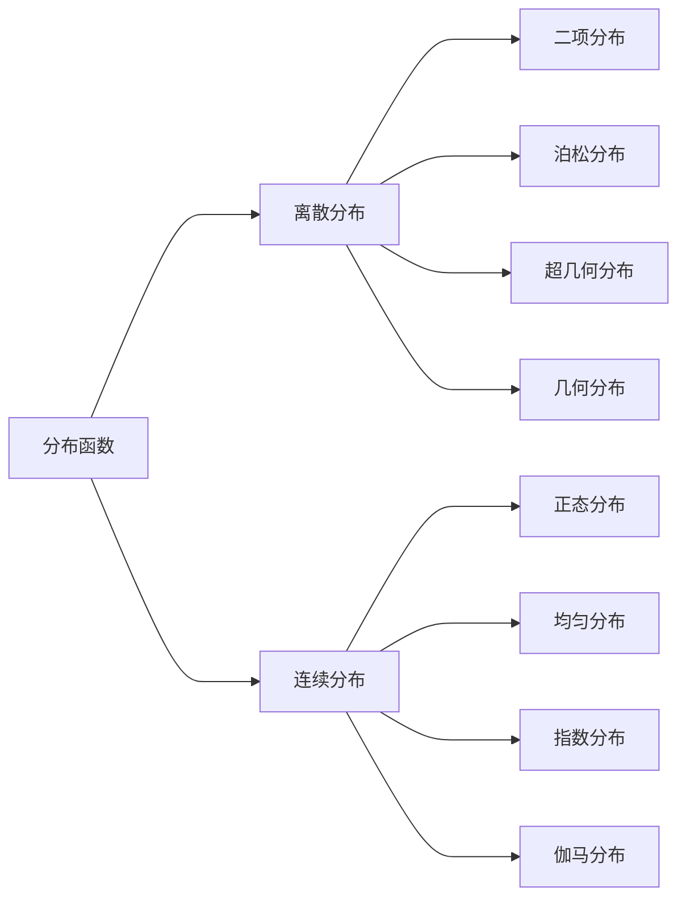

---
{"dg-publish":true,"dg-path":"A1- 数学/5. 概率论/分布函数.md","permalink":"/A1- 数学/5. 概率论/分布函数/","dgPassFrontmatter":true,"noteIcon":"","created":"2024-05-21T15:20:27.000+08:00","updated":"2025-07-01T10:16:27.000+08:00"}
---

(terminology::**Distribution**)
> [[概率\|概率]]的函数，可以描述任何类型的[[随机变量\|随机变量]]
> 完整地描述了随机变量的**统计规律性**，表示了概率分布情况

### 分布函数基础
#### 1. 基本定义
$X$ 为[[随机变量\|随机变量]]，$x$ 为任意实数，则函数 $F(x)=P\{X\leq x\}$ 称为 $X$ 的**分布函数**
$X$ 服从 $F(x)$，记为 $X\sim F(x)$

$$\begin{align}
P \left\{x_{1}<X\leq x_{2} \right\}&=P \left\{X \leq x_{2} \right\}-\left\{X \leq x_{1} \right\} \\
&=F(x_{2})-F(x_{1})
\end{align}$$
#### 2. 基本性质
- **单调性：**$F(x)$ 为单调不减的函数，$x_{1}<x_{2}$ 时，$F(x_{1})\leq F(x_{2})$
- **有界性：**$0\leq F(x)\leq 1$  $F(-\infty)=0$  $F(+\infty)=1$
- **右连续性**：为右连续的函数  $F(x_{0}+0)=F(x_{0})$

**满足上述三条性质的函数，必为某一随机变量的分布函数**

### 一、离散分布
> [[概率分布律\|概率质量函数]] 的累加

[[二项分布\|二项分布]]：描述n次独立伯努利试验中成功次数的概率分布
[[超几何分布\|超几何分布]]：描述不放回抽样中成功次数的概率分布
[[几何分布\|几何分布]]：描述首次成功所需的伯努利试验次数的概率分布
[[泊松分布\|泊松分布]]：描述单位时间或空间内稀有事件发生次数的概率分布

### 二、连续分布
> [[概率密度函数\|概率密度函数]]的积分

[[正态分布\|正态分布]]：对称的钟形分布，广泛用于自然和社会现象的建模
[[均匀分布\|均匀分布]]：所有可能结果在区间内概率均等的分布
[[指数分布\|指数分布]]：描述泊松过程中事件间隔时间的分布
[[伽马分布\|伽马分布]]：描述多个独立指数事件发生所需时间的分布
[[抽样分布\|抽样分布]]：统计量的概率分布，用于推断总体参数

>[!important] 注意
>1. 记特殊分布时，一般记忆的是特殊分布的 **分布律**/**密度函数**；求分布函数时，对其**累加/积分**  即可得到对应的分布函数
>2. 千万要注意**密度函数**的**分段表达**：求分布函数时，注意对应的积分上下限

### 求随机变量函数的分布函数
[[随机变量函数的分布\|随机变量函数的分布]]

