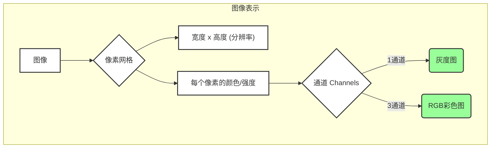

---
{"aliases":["Image"],"dg-publish":true,"dg-path":"人工智能/计算机视觉/图像.md","tags":["CV"],"permalink":"/人工智能/计算机视觉/图像/","dgPassFrontmatter":true,"noteIcon":"","created":"2024-10-08T17:10:09.000+08:00","updated":"2025-10-24T12:19:04.000+08:00"}
---

(terminology::**Image**)

> 在[[计算机视觉\|计算机视觉]]中，图像是现实世界场景的二维（或多维）表示，由离散的**像素 (Pixel)** 组成。每个像素都包含颜色或强度信息，共同构成了我们所看到的视觉内容。图像是计算机视觉系统最基础的输入数据。

### 图像的表示
图像在计算机中通常被表示为一个多维数组或[[矩阵\|矩阵]]，其维度取决于图像的类型。
1.  **像素 (Pixel)**:
-   图像的最小组成单元。每个像素代表图像中的一个点，并存储该点的颜色或强度信息。
-   像素值通常是整数，范围取决于颜色深度（如0-255）。

2.  **分辨率 (Resolution)**:
-   图像的宽度和高度，通常以像素为单位表示（如1920x1080）。
-   分辨率越高，图像包含的细节越多，文件越大。

3.  **颜色深度 (Color Depth)**:
-   每个像素用于表示颜色的位数。位数越多，能表示的颜色种类越多，颜色过渡越平滑。
-   例如，8位灰度图每个像素有256个灰度级；24位RGB彩色图每个像素有1677万种颜色。

4.  **通道 (Channels)**:
-   图像的颜色信息通常通过多个通道来表示。
-   **灰度图 (Grayscale Image)**: 只有一个通道，每个像素值代表亮度信息（通常0代表黑色，255代表白色）。
-   **RGB图 (Red, Green, Blue Image)**: 有三个通道，分别代表红、绿、蓝三种颜色分量。通过这三种颜色的不同组合，可以表示出几乎所有的可见光颜色。
-   **RGBA图**: 在RGB基础上增加一个Alpha通道，用于表示透明度。

grayscale 灰度 
decomposition 
pixels 像素
每个像素为 8bit 的值

compression 压缩
the nearby pixels generally have similar grayscales 

edges in the image are hard parts to compress 

帧 frames 
对于视频而言，在帧和帧之间其实没有很大的变化
只需要传输 small changes   **difference coding** 
compress change matrix by linear algebra 

### 图像的格式
[[svg\|svg]]
[[png\|png]]

### 图像的数学表示

从数学上讲，图像可以被视为一个函数 $I(x, y)$，其中 $(x, y)$ 是图像中的坐标，函数值 $I(x, y)$ 代表该坐标处的像素强度或颜色。

-   **灰度图**: 可以表示为一个二维函数 $I(x, y)$，其函数值是像素的亮度强度。
-   **彩色图**: 可以表示为一个三维函数 $I(x, y, c)$，其中 $c$ 代表颜色通道（如R, G, B）。或者更常见地，表示为三个独立的二维函数 $I_R(x, y), I_G(x, y), I_B(x, y)$。

### 图像处理基础

图像处理是[[计算机视觉\|计算机视觉]]的基础，涉及对图像进行各种操作以改善其质量、提取信息或准备用于进一步分析。

-   **灰度化**: 将彩色图像转换为灰度图像，减少数据量。
-   **二值化**: 将图像像素值转换为只有两个值（通常是0和255），用于突出前景和背景。
-   **滤波 (Filtering)**: 
    -   **高斯滤波 (Gaussian Blur)**: 使用高斯核进行卷积，用于图像平滑和去噪。
    -   **中值滤波 (Median Filter)**: 使用中值代替像素值，对椒盐噪声（Salt-and-pepper noise）非常有效。
-   **边缘检测 (Edge Detection)**: 识别图像中亮度变化剧烈的区域，这些区域通常对应物体的轮廓。
    -   **Sobel算子**: 用于计算图像梯度的近似值。
    -   **Canny边缘检测**: 一种多阶段的边缘检测算法，包括高斯滤波、非极大值抑制和双阈值检测。

### 图像工具
两图对比  (website::https://imgsli.com/)

