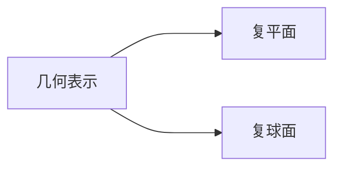

---
{"dg-publish":true,"dg-path":"A1- 数学/7. 复变函数/1.1 复数.md","permalink":"/A1- 数学/7. 复变函数/1.1 复数/","dgPassFrontmatter":true,"noteIcon":"","dg-note-properties":{}}
---

(terminology::**Complex number**)
>起源于求方程的根，在二次、三次代数方程的求根中出现负数开平方的情况

### 虚数
**虚数单位** $i$
定义：$i^2 = -1$
$i$   的幂次在 $\; i \: -1\: -i\;\;\;1$  中循环
$$\begin{align}
i^{4n}=1\quad i^{4n+1}=i \quad i^{4n+2}=-1\quad i^{4n+3}=-i
\end{align}$$

### 复数
对于两实数 $x\quad y$
$z=x+iy$
$i$  为虚数单位
- **实部  real part**  ：$\mathrm{Re}$ $z=x$    
- **虚部 imaginary part**：$\mathrm{Im}$ $z=y$      

**复数相等**的充要条件：
实部和虚部分别相等
>[!important] 注意
>这一充要条件似乎“天经地义”，“理所当然”
>但实际上有很多用处

比如可以化简诸如 $\sqrt{ 5+12i },\sqrt{ -i }$ 等根式
直接令 $\sqrt{ 5+12i }=x+iy$
再利用复数相等，实部与虚部的相等，即可求得
$5+12i=x^{2}-y^{2}+2xyi$
(复数中无法定义大小关系)

### 四则运算
$$\begin{align} 
 & z_{1}=x_{1}+iy_{1} \quad z_{2}=x_{2}+iy_{2}\\ \\

 & z_{1}\pm z_{2}=(x_{1}\pm x_{2})+i(y_{1}\pm y_{2}) \\
 & z_{1}\cdot z_{2}=(x_{1}x_{2}-y_{1}y_{2})+i(x_{2}y_{1}+x_{1}y_{2}) \\
 & \dfrac{z_{1}}{z_{2}}=\dfrac{z_{1}\bar{z_{2}}}{z_{2}\bar{z_{2}}}
\end{align}$$

### 共轭复数
(terminology::**Conjugate**)
**实部相同**而**虚部**绝对值相等**符号相反**的两个复数
$z=x+iy$
$\overline{z}=x-iy$

$$\begin{align}
z\cdot \overline{z}&=(x+iy)(x-iy) \\
&=x^{2}-(iy)^{2} \\
&=x^{2}+y^{2}   \\
&=[Re(z)]^{2}+[Im(z)]^{2}
\end{align}$$
 两个共轭复数的积为一个实数
 常常使用此来对分式进行化简
 （==上下同乘==分母的共轭复数）
 $z+\overline{z}=2Re(z)$
 $z-\overline{z}=2iIm(z)$
 $\overline{\overline{z}}=z$
 
### 复数的几何表示

复数与[[复平面\|复平面]]中的[[向量\|向量]]对应起来 
复数可以表示平面向量，所以有关平面向量的问题可以用复变函数来研究

### 三角表示和指数表示
$z$ 对应向量 $\vec{Oz}$

**模**： $\mid z\mid$ 为对应向量的长度
 $\mid z\mid$ = $\sqrt{ x^2+y^2 }$
 
**辐角**： $\vec{Oz}$ 与实轴正向的夹角
$Arg$ 一般表示，不受限制地取辐角的任意值
$Arg z=\theta$  

$z=0$ 模为 0，而辐角不确定

**主辐角**:  辐角的主值
辐角限制在 $-\pi$ 与 $\pi$ 之间

$$argz=\begin{cases}
\arctan \dfrac{y}{x}\quad x>0 \\
\quad \dfrac{\pi}{2}\quad \quad \quad x=0,y>0 \\
\arctan \dfrac{y}{x}+\pi\quad x<0,y\geq 0 \\
\arctan \dfrac{y}{x}-\pi\quad x<0,y<0 \\
\quad - \dfrac{\pi}{2}\quad \quad x=0,y<0
\end{cases}$$

$arg z \in(-\pi,\pi]$
$Arg\,z =arg\,z+2k \pi$ 

**三角表示**：$z=r(\cos \theta+i\sin\theta)$
**指数表示**： $z=re^{i\theta}$    （由[[欧拉公式\|欧拉公式]]）

>[!important] 注意
>- 表示成[[三角函数\|三角函数]]或者[[指数函数\|指数函数]]时，不要遗漏虚数单位 $i$
>- 最好画一个简易的图，不要搞错实部、虚部、符号、模的大小...... 等小细节
>- 也要注意三角表示和指数表示的形式
>	如果形式不为标准形式，应该先利用三角函数来转化为标准形式

### 复数的运算
#### 1.乘除法
$$\begin{align}
 & z_{1} =r_{1}(\cos \theta_{1}+i\sin \theta_{1})=r_{1}e^{ i\theta_{1} } \\
 & z_{2} =r_{2}(\cos \theta_{2}+i\sin \theta_{2})=r_{2}e^{ i\theta_{2} }  \\ \\

 & |z_{1}\cdot z_{2}| =r_{1}r_{2} \\
 & Arg(z_{1}\cdot z_{2})=Arg z_{1}+Argz_{2}  \\
 & z_{1}z_{2}=r_{1}r_{2}e^{ i(\theta_{1}+\theta_{2}) }\\ \\

 & \left\lvert  \dfrac{z_{1}}{z_{2}} \right\rvert=\frac{r_{1}}{r_{2}} \\
 & Arg \frac{z_{1}}{z_{2}}=Arg z_{1}-Argz_{2}  \\
 & \dfrac{z_{2}}{z_{1}}=\dfrac{r_{2}}{r_{1}}e^{ i(\theta_{2}-\theta_{1}) }
\end{align}$$

**几何意义**
**乘法**：
- 模等于两个复数模的乘积
- 辐角等于两个复数辐角的和
模长伸长，逆时针旋转角度

**除法**：
- 模等于两个复数模的商
- 辐角等于被除数与除数的辐角之差
模长缩短，顺时针旋转角度

#### 2.乘方开方
De Moivre 公式

$$\begin{align}
z^{n}&=[r(\cos \theta+i\sin \theta)]^{n} \\
&=r^{n}(\cos n \theta+i\sin n \theta)  \\
&=r^{n}e^{ i(n\theta) }\\
\end{align}$$

$$\begin{align}
\sqrt[n]{ z }&=[r(\cos \theta+i\sin \theta)]^{1/n} \\
&=r^{1/n}\left[ \cos \left( \frac{1}{n} (\theta+2k\pi) \right) +i\sin \left( \frac{1}{n} (\theta+2k\pi) \right) \right] \\
&=r^{1/n}e^{i(\frac{1}{n}(\theta+2k\pi))}\\
\end{align}$$

$(k=0,1,2\cdots,n-1)$

注意开 $n$ 次根号有 $n$ 个值

例题：
解方程 $(1+z)^{5}=(1-z)^{5}$
 
$(\dfrac{1+z}{1-z})^{5}=1\quad \omega=\dfrac{1+z}{1-z}$
$\omega=\sqrt[5]{1  }\quad \omega=e^{ i(0+2k\pi)/5 }=e^{ i\alpha }$
$$\begin{align}
z&=\dfrac{\omega-1}{\omega+1}=\dfrac{e^{ i\alpha }-1}{e^{ i\alpha }+1} \\
&=\dfrac{\cos \alpha+i\sin \alpha-1}{\cos \alpha+i\sin \alpha+1} \\
&=\dfrac{2\sin \dfrac{\alpha}{2}(-\sin \dfrac{\alpha}{2}+i\cos \dfrac{\alpha}{2})}{2\cos \dfrac{\alpha}{2}(\cos \dfrac{\alpha}{2}+i\sin \dfrac{\alpha}{2})} \\
&=i\tan \dfrac{\alpha}{2}
\end{align}$$

所以根为：
$z_{0}=0$
$z_{1}=i\tan \dfrac{\pi}{5}$
$z_{2}=i\tan \dfrac{2\pi}{5}$
$z_{3}=i\tan \dfrac{3\pi}{5}$
$z_{4}=i\tan \dfrac{4\pi}{5}$

---

## AI 结构化补充（2026-05-02）

(terminology::**Complex number**)
>起源于求方程的根，在二次、三次代数方程的求根中出现负数开平方的情况

复数的基本规则可以压缩为两个核心事实：代数上使用 $i^2=-1$，几何和周期性上使用 $e^{2\pi i}=1$。

### 虚数
**虚数单位** $i$
定义：$i^2=-1$
$i$   的幂次在 $\; i \: -1\: -i\;\;\;1$  中循环
$$\begin{align}
i^{4n}=1\quad i^{4n+1}=i \quad i^{4n+2}=-1\quad i^{4n+3}=-i
\end{align}$$

### 复数
对于两实数 $x\quad y$
$z=x+iy$
$i$  为虚数单位
- **实部  real part**  ：$\mathrm{Re}$ $z=x$
- **虚部 imaginary part**：$\mathrm{Im}$ $z=y$

**复数相等**的充要条件：
实部和虚部分别相等
>[!important] 注意
>这一充要条件似乎“天经地义”，“理所当然”
>但实际上有很多用处

比如可以化简诸如 $\sqrt{ 5+12i },\sqrt{ -i }$ 等根式
直接令 $\sqrt{ 5+12i }=x+iy$
再利用复数相等，实部与虚部的相等，即可求得
$5+12i=x^{2}-y^{2}+2xyi$
(复数中无法定义大小关系)

在通常记号中也写作 $z=a+bi$，其中 $a=\operatorname{Re}z$，$b=\operatorname{Im}z$。当 $b=0$ 时，实数就是复数的特例。

### 四则运算
$$\begin{align}
 & z_{1}=x_{1}+iy_{1} \quad z_{2}=x_{2}+iy_{2}\\ \\

 & z_{1}\pm z_{2}=(x_{1}\pm x_{2})+i(y_{1}\pm y_{2}) \\
 & z_{1}\cdot z_{2}=(x_{1}x_{2}-y_{1}y_{2})+i(x_{2}y_{1}+x_{1}y_{2}) \\
 & \dfrac{z_{1}}{z_{2}}=\dfrac{z_{1}\bar{z_{2}}}{z_{2}\bar{z_{2}}}
\end{align}$$

加法把实部和虚部分别相加，乘法则先按多项式展开，再把 $i^2$ 换成 $-1$：
$$
(3+2i)(1-i)=3-3i+2i-2i^2=5-i.
$$
另一个典型例子是
$$
(1+i)^2=1+2i+i^2=2i,\qquad (2i)^2=-4.
$$
$1+i$ 的辐角是 $\pi/4$，平方后辐角变为 $\pi/2$；再平方后辐角变为 $\pi$，对应负实轴方向。这说明复数乘法会在平面中产生角度相加，平方就是角度翻倍。

### 共轭复数
(terminology::**Conjugate**)
**实部相同**而**虚部符号相反**的两个复数互为共轭
$z=x+iy$
$\overline{z}=x-iy$

$$\begin{align}
z\cdot \overline{z}&=(x+iy)(x-iy) \\
&=x^{2}-(iy)^{2} \\
&=x^{2}+y^{2}   \\
&=[Re(z)]^{2}+[Im(z)]^{2}
\end{align}$$
 两个共轭复数的积为一个实数
 常常使用此来对分式进行化简
 （==上下同乘==分母的共轭复数）
 $z+\overline{z}=2Re(z)$
 $z-\overline{z}=2iIm(z)$
 $\overline{\overline{z}}=z$

对 $z=a+bi$，共轭是 $\bar z=a-bi$。共轭与加法、乘法相容：
$$
\overline{z_1+z_2}=\bar z_1+\bar z_2,\qquad
\overline{z_1z_2}=\bar z_1\bar z_2.
$$
它也给出模长和倒数：
$$
z\bar z=(a+bi)(a-bi)=a^2+b^2=|z|^2,
$$
$$
\frac{1}{a+ib}=\frac{a-ib}{a^2+b^2}.
$$
这个公式要求 $z\neq0$，也就是 $a^2+b^2\neq0$；分母为零只会发生在 $a=b=0$。
因此当 $|z|=1$，也就是 $z$ 在单位圆上时，$z\bar z=1$，所以
$$
\frac{1}{z}=\bar z.
$$

这个性质在实矩阵的复特征值中很重要。若 $A$ 是实矩阵且
$$
Ax=\lambda x,
$$
两边取共轭得
$$
A\bar x=\bar\lambda\,\bar x.
$$
因此实矩阵的非实复特征值总是以共轭对 $\lambda,\bar\lambda$ 出现，对应特征向量也成共轭对。

### 复数的几何表示

复数与[[复平面\|复平面]]中的[[向量\|向量]]对应起来
复数可以表示平面向量，所以有关平面向量的问题可以用复变函数来研究

具体地说，复数
$$
z=a+bi
$$
对应复平面中的点或向量 $(a,b)$。加法
$$
(a+bi)+(c+di)=(a+c)+(b+d)i
$$
就是平面向量 $(a,b)+(c,d)$ 的加法；但乘法
$$
(a+bi)(c+di)=(ac-bd)+(ad+bc)i
$$
不是普通向量乘法，而是复数结构特有的运算。它可以看成矩阵
$$
\begin{bmatrix}
a & -b\\
b & a
\end{bmatrix}
\begin{bmatrix}
c\\ d
\end{bmatrix}
=
\begin{bmatrix}
ac-bd\\
bc+ad
\end{bmatrix},
$$
即先缩放再旋转的平面线性变换。

### 三角表示和指数表示
$z$ 对应向量 $\vec{Oz}$

**模**： $\mid z\mid$ 为对应向量的长度
 $\mid z\mid$ = $\sqrt{ x^2+y^2 }$

**辐角**： $\vec{Oz}$ 与实轴正向的夹角
$Arg$ 一般表示，不受限制地取辐角的任意值
$Arg z=\theta$

$z=0$ 模为 0，而辐角不确定

**主辐角**:  辐角的主值
辐角限制在 $-\pi$ 与 $\pi$ 之间

$$argz=\begin{cases}
\arctan \dfrac{y}{x}\quad x>0 \\
\quad \dfrac{\pi}{2}\quad \quad \quad x=0,y>0 \\
\arctan \dfrac{y}{x}+\pi\quad x<0,y\geq 0 \\
\arctan \dfrac{y}{x}-\pi\quad x<0,y<0 \\
\quad - \dfrac{\pi}{2}\quad \quad x=0,y<0
\end{cases}$$

$arg z \in(-\pi,\pi]$
$Arg\,z =arg\,z+2k \pi$

**三角表示**：$z=r(\cos \theta+i\sin\theta)$
**指数表示**： $z=re^{i\theta}$    （由[[欧拉公式\|欧拉公式]]）

由 Euler 公式
$$
e^{i\theta}=\cos\theta+i\sin\theta
$$
可得
$$
z=a+bi=r(\cos\theta+i\sin\theta)=re^{i\theta}.
$$
特别地，$\theta=2\pi$ 时有 $e^{2\pi i}=1$。例如
$$
1+i=\sqrt2\left(\cos\frac{\pi}{4}+i\sin\frac{\pi}{4}\right)=\sqrt2 e^{i\pi/4}.
$$
因此高次幂可以直接读出：
$$
(1+i)^8=(\sqrt2)^8e^{i8\pi/4}=16e^{2\pi i}=16.
$$
模长变成 $16$，辐角转到 $2\pi$，所以结果回到正实轴上的实数 $16$。
若 $z=re^{i\theta}$，则
$$
\bar z=re^{-i\theta}.
$$
同一个点的辐角可以相差 $2\pi$ 的整数倍，所以共轭的角也可写为 $-\theta$ 或 $2\pi-\theta$。

>[!important] 注意
>- 表示成[[三角函数\|三角函数]]或者[[指数函数\|指数函数]]时，不要遗漏虚数单位 $i$
>- 最好画一个简易的图，不要搞错实部、虚部、符号、模的大小...... 等小细节
>- 也要注意三角表示和指数表示的形式
>	如果形式不为标准形式，应该先利用三角函数来转化为标准形式

### 复数的运算
#### 1.乘除法
$$\begin{align}
 & z_{1} =r_{1}(\cos \theta_{1}+i\sin \theta_{1})=r_{1}e^{ i\theta_{1} } \\
 & z_{2} =r_{2}(\cos \theta_{2}+i\sin \theta_{2})=r_{2}e^{ i\theta_{2} }  \\ \\

 & |z_{1}\cdot z_{2}| =r_{1}r_{2} \\
 & Arg(z_{1}\cdot z_{2})=Arg z_{1}+Argz_{2}  \\
 & z_{1}z_{2}=r_{1}r_{2}e^{ i(\theta_{1}+\theta_{2}) }\\ \\

 & \left\lvert  \dfrac{z_{1}}{z_{2}} \right\rvert=\frac{r_{1}}{r_{2}} \\
 & Arg \frac{z_{1}}{z_{2}}=Arg z_{1}-Argz_{2}  \\
 & \dfrac{z_{2}}{z_{1}}=\dfrac{r_{2}}{r_{1}}e^{ i(\theta_{2}-\theta_{1}) }
\end{align}$$

**几何意义**
**乘法**：
- 模等于两个复数模的乘积
- 辐角等于两个复数辐角的和
模长伸长，逆时针旋转角度。也就是说，复数乘法就是模相乘、角相加。

**除法**：
- 模等于两个复数模的商
- 辐角等于被除数与除数的辐角之差
模长缩短，顺时针旋转角度

#### 2.乘方开方
De Moivre 公式说明，复数的乘方会把模提升为幂，把角度乘以幂次：

$$\begin{align}
z^{n}&=[r(\cos \theta+i\sin \theta)]^{n} \\
&=r^{n}(\cos n \theta+i\sin n \theta)  \\
&=r^{n}e^{ i(n\theta) }\\
\end{align}$$

等价地，若 $z=re^{i\theta}$，则
$$
(re^{i\theta})^n=r^ne^{in\theta}.
$$

$$\begin{align}
\sqrt[n]{ z }&=[r(\cos \theta+i\sin \theta)]^{1/n} \\
&=r^{1/n}\left[ \cos \left( \frac{1}{n} (\theta+2k\pi) \right) +i\sin \left( \frac{1}{n} (\theta+2k\pi) \right) \right] \\
&=r^{1/n}e^{i(\frac{1}{n}(\theta+2k\pi))}\\
\end{align}$$

$(k=0,1,2\cdots,n-1)$

注意开 $n$ 次根号有 $n$ 个值

例题：
解方程 $(1+z)^{5}=(1-z)^{5}$

$(\dfrac{1+z}{1-z})^{5}=1\quad \omega=\dfrac{1+z}{1-z}$
$\omega=\sqrt[5]{1  }\quad \omega=e^{ i(0+2k\pi)/5 }=e^{ i\alpha }$
$$\begin{align}
z&=\dfrac{\omega-1}{\omega+1}=\dfrac{e^{ i\alpha }-1}{e^{ i\alpha }+1} \\
&=\dfrac{\cos \alpha+i\sin \alpha-1}{\cos \alpha+i\sin \alpha+1} \\
&=\dfrac{2\sin \dfrac{\alpha}{2}(-\sin \dfrac{\alpha}{2}+i\cos \dfrac{\alpha}{2})}{2\cos \dfrac{\alpha}{2}(\cos \dfrac{\alpha}{2}+i\sin \dfrac{\alpha}{2})} \\
&=i\tan \dfrac{\alpha}{2}
\end{align}$$

所以根为：
$z_{0}=0$
$z_{1}=i\tan \dfrac{\pi}{5}$
$z_{2}=i\tan \dfrac{2\pi}{5}$
$z_{3}=i\tan \dfrac{3\pi}{5}$
$z_{4}=i\tan \dfrac{4\pi}{5}$

### 关键结论速查
- 代数核心：$i^2=-1$；周期核心：$e^{2\pi i}=1$。
- 坐标解释：$a+bi\leftrightarrow(a,b)$，加法像向量加法，乘法是复数特有的旋转缩放结构。
- 共轭：$\bar z=a-bi$，并且 $\overline{z_1+z_2}=\bar z_1+\bar z_2$，$\overline{z_1z_2}=\bar z_1\bar z_2$。
- 模和倒数：$z\bar z=|z|^2=a^2+b^2$，$\dfrac{1}{a+ib}=\dfrac{a-ib}{a^2+b^2}$；若 $|z|=1$，则 $1/z=\bar z$。
- 极形式：$z=re^{i\theta}$，乘法是模相乘、角相加，De Moivre 公式为 $(re^{i\theta})^n=r^ne^{in\theta}$。
