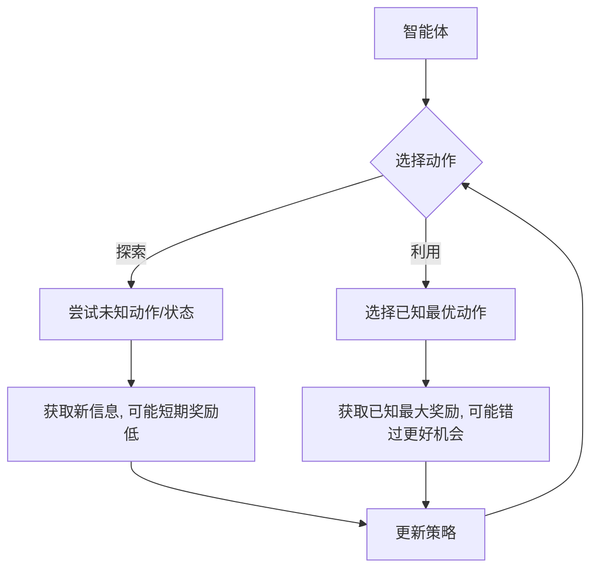

---
{"aliases":["Exploration-Exploitation Dilemma"],"dg-publish":true,"dg-path":"人工智能/机器学习/探索-利用困境.md","tags":["ML","RL"],"permalink":"/人工智能/机器学习/探索-利用困境/","dgPassFrontmatter":true,"noteIcon":"","created":"2025-08-28T21:53:13.000+08:00","updated":"2025-09-16T16:23:38.000+08:00"}
---

(terminology::**Exploration-Exploitation Dilemma**)
> 探索-利用困境是[[强化学习\|强化学习]]中一个基础且核心的问题。它指的是智能体在学习过程中，需要在**探索 (Exploration)** 未知动作或状态（以发现更好的策略）和**利用 (Exploitation)** 已知最优动作（以最大化当前奖励）之间做出权衡。这是一个持续存在的挑战，因为智能体无法同时最大化两者。

### 困境的本质

-   **探索 (Exploration)**: 尝试新的、未知的动作或访问未曾到过的状态。目的是为了获取更多关于环境的信息，发现潜在的更高奖励路径。
    - *风险*: 可能选择次优动作，导致短期奖励较低。
-   **利用 (Exploitation)**: 选择当前已知能够带来最高奖励的动作。目的是为了最大化当前的累积奖励。
    - *风险*: 可能陷入局部最优，错过全局最优解，因为智能体没有充分探索所有可能性。

这个困境的本质在于，智能体在任何给定时间步都必须做出一个选择：是继续尝试已知最好的选项以获取当前最大收益，还是牺牲短期收益去探索未知，以期在未来获得更大的回报。

### 解决策略

为了有效地解决探索-利用困境，研究者们提出了多种策略，旨在在学习过程中动态地平衡探索和利用。

#### 1. $\epsilon$-贪婪策略 ($\epsilon$-Greedy)

这是最简单也最常用的策略之一。

-   **原理**: 在每个时间步，智能体以一个很小的概率 $\epsilon$ 进行**随机探索**（从所有可能动作中随机选择一个），以 $1 - \epsilon$ 的概率进行**贪婪利用**（选择当前已知价值最高的动作）。
-   **公式**: 
    $$ A_t = \begin{cases} \text{随机动作} & \text{概率为 } \epsilon \\ \arg\max_a Q(S_t, a) & \text{概率为 } 1 - \epsilon \end{cases} $$
-   **特点**: 简单易实现。通常，$\epsilon$ 会随着训练的进行而逐渐减小，使得智能体在早期更多地探索，在后期更多地利用。
-   **优缺点**: 
    - *优点*: 简单有效，保证了所有动作都有被探索的机会。
    - *缺点*: 随机探索效率不高，可能探索到非常差的动作；对所有非贪婪动作一视同仁。

#### 2. UCB (Upper Confidence Bound)

UCB策略基于“乐观面对不确定性”的原则。

-   **原理**: 智能体不仅考虑动作的当前估计价值，还考虑其**不确定性**。它倾向于选择那些估计价值高且被探索次数少的动作。
-   **公式**: 
    $$ A_t = \arg\max_a \left[ Q(S_t, a) + c \sqrt{\frac{\ln t}{N_t(a)}} \right] $$
    其中 $Q(S_t, a)$ 是动作 $a$ 的估计价值，$t$ 是总时间步数，$N_t(a)$ 是动作 $a$ 被选择的次数，$c$ 是一个探索参数。
-   **特点**: 能够更有效地平衡探索和利用，优先探索那些有潜力但尚未被充分探索的动作。

#### 3. 汤普森采样 (Thompson Sampling)

汤普森采样是一种基于贝叶斯思想的探索策略。

-   **原理**: 假设每个动作的真实价值服从一个概率分布。在每个时间步，智能体从这些价值分布中**采样**一个价值，然后选择采样价值最高的动作。随着探索的进行，这些价值分布会逐渐收敛到真实价值。
-   **特点**: 能够自然地平衡探索和利用，对不确定性高的动作给予更多的探索机会。在实践中通常表现良好。

#### 4. 基于好奇心 (Curiosity-driven Exploration)

-   **原理**: 智能体被设计成对“新奇”或“不确定”的状态和动作感兴趣，即使这些探索不会立即带来外部奖励。它通过内部奖励机制来鼓励探索。
-   **特点**: 适用于稀疏奖励环境，即外部奖励很少或很难获得的环境。

### 总结

探索-利用困境是强化学习的核心挑战之一。没有一种策略能够完美解决所有情况下的困境，选择合适的探索策略通常需要根据具体的任务、环境特性和奖励稀疏性来决定。

---

> [[强化学习\|强化学习]]
