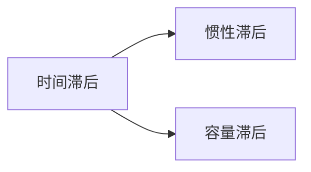

---
{"dg-publish":true,"dg-path":"A2- 控制理论/0. 基础知识/时间常数.md","permalink":"/A2- 控制理论/0. 基础知识/时间常数/","dgPassFrontmatter":true,"noteIcon":"","created":"2024-05-21T15:20:28.000+08:00","updated":"2025-06-30T16:31:48.000+08:00"}
---

(terminology::**Time Constant**  ) $\tau$

> 由系统本身决定，**反映系统的惯性**

反映动态过程的时间滞后作用，时间常数越小，惯性越小，系统响应过程越快

惯性滞后：传热、电机
容量滞后：容量的过渡，比如水箱液位

