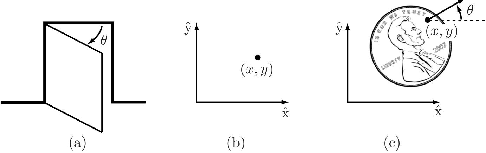

---
{"dg-publish":true,"dg-path":"机器人/构型空间.md","permalink":"/机器人/构型空间/","dgPassFrontmatter":true,"noteIcon":"","created":"2026-01-28T12:47:13.003+08:00","updated":"2026-01-28T12:47:13.003+08:00"}
---

> 关于机器人可以提出的最基本问题也许是，它在哪里？

答案由机器人的**构型**给出：对机器人所有点位置的规范。

由于机器人的连杆是刚性的且具有已知形状，因此只需要很少的数字来表示其构型。例如，
- **门**的构型可以用单个数字表示，即绕其铰链的角度 $\theta$。
- **平面上的点**的构型可以用两个坐标 $(x,y)$ 描述。
- **平放在桌子上正面朝上的硬币**的构型可以用三个坐标描述：两个坐标 $(x,y)$ 指定硬币上特定点的位置，一个坐标 $(\theta)$ 指定硬币的方向。

图2.1：(a) 门的构型由角度 $\theta$ 描述。(b) 平面中点的构型由坐标 $(x, y)$ 描述。(c) 桌子上硬币的构型由 $(x, y,\theta)$ 描述，其中 $\theta$ 定义亚伯拉罕·林肯朝向的方向。

上述坐标都取**连续实数范围**内的值。机器人的**自由度** (dof) 数量是表示其构型所需的**实值**坐标的**最小数量**。

在上面的例子中，门有一个自由度。平放在桌子上正面朝上的硬币有三个自由度。即使硬币可以正面朝上或反面朝上，其构型空间仍然只有三个自由度；第四个变量，表示硬币的哪一面朝上，取离散集合{正面, 反面}中的值，而不是像其他三个坐标那样取连续实值范围内的值。

> [!important] 定义2.1.
> 机器人的构型是**对机器人每一点位置的完整规范**。表示构型所需的实值坐标的**最小数量** $n$ 是机器人的**自由度 (dof)** 数量。
>
> 包含机器人所有可能构型的 $n$ 维空间称为**构型空间 (C-空间)**。机器人的构型由其C空间中的一个点表示。

本章我们研究一般机器人的C空间和自由度。

由于我们的机器人由刚性连杆构成，
- 我们首先研究**单个刚体**的自由度，
- 然后**一般多连杆机器人**的自由度。
- 接下来我们研究**C空间的形状（或拓扑）和几何**及其数学表示。
- 本章最后讨论**机器人末端执行器的C空间**，其**任务空间**。

在下一章中，我们将更详细地研究单个刚体C空间的数学表示。

### 基本章节
[[刚体的自由度\|刚体的自由度]]
[[机器人的自由度\|机器人的自由度]]
[[构型空间的拓扑与表示\|构型空间的拓扑与表示]]
[[构型与速度约束\|构型与速度约束]]
[[任务空间与工作空间\|任务空间与工作空间]]

### 总结
- 机器人机械地由通过各种类型关节连接的连杆构成。连杆通常建模为刚体。诸如夹爪等末端执行器可以附着在机器人的某个连杆上。执行器向关节传递力和力矩，从而引起机器人的运动。

- 最广泛使用的单自由度关节是旋转关节，它允许绕关节轴旋转，以及移动关节，它允许沿关节轴方向平移。一些常见的两自由度关节包括圆柱关节，它通过串联连接旋转和移动关节构成，以及万向节，它通过正交连接两个旋转关节构成。球关节，也称为球窝关节，是一个三自由度关节，其功能类似于人类肩关节。

- 刚体的构型是对其所有点位置的规范。对于在平面中运动的刚体，需要三个独立参数来指定构型。对于在三维空间中运动的刚体，需要六个独立参数来指定构型。

- 机器人的构型是对其所有连杆构型的规范。机器人的构型空间是所有可能机器人构型的集合。C空间的维度是机器人的自由度数量。

- 机器人的自由度数量可以使用Grübler公式计算，

$$\text{dof} = m (N - 1 - J) + \sum_{i = 1}^{J}f_{i},$$

其中 $m = 3$ 适用于平面机构，$m = 6$ 适用于空间机构，$N$ 是连杆数量（包括地面连杆），$J$ 是关节数量，$f_{i}$ 是关节 $i$ 的自由度数量。

- 机器人的C空间可以显式参数化或隐式表示。对于具有 $n$ 个自由度的机器人，显式参数化使用 $n$ 个坐标，这是最少必要的。隐式表示涉及 $m$ 个坐标且 $m \geq n$，这 $m$ 个坐标受到 $m - n$ 个约束方程的限制。使用隐式参数化，机器人的C空间可以被视为嵌入在更高维度 $m$ 空间中的维度 $n$ 的曲面。

- 结构包含一个或多个闭环的 $n$ 自由度机器人的C空间可以使用 $k$ 个形式为 $g (\theta) = 0$ 的闭环约束方程隐式表示，其中 $\theta \in \mathbb{R}^{m}$ 且 $g: \mathbb{R}^{m} \to \mathbb{R}^{k}$。这种约束方程称为完整约束。假设 $\theta$ 随时间 $t$ 变化，完整约束 $g (\theta (t)) = 0$ 可以对 $t$ 求导得到

$$\frac{\partial g}{\partial\theta} (\theta)\dot{\theta} = 0,$$

其中 $\partial g (\theta) / \partial \theta$ 是一个 $k\times m$ 矩阵。

- 机器人的运动也可能受到形式为

$$A (\theta)\dot{\theta} = 0,$$

的速度约束，其中 $A (\theta)$ 是一个 $k\times m$ 矩阵，不能表示为某个函数 $g (\theta)$ 的微分。换句话说，不存在任何 $g (\theta), g:\mathbb{R}^{m}\rightarrow \mathbb{R}^{k}$，使得

$$A (\theta) = \frac{\partial g}{\partial\theta} (\theta).$$

这种约束称为非完整约束，或不可积约束。这些约束减少了系统可行速度的维度，但不减少可达C空间的维度。非完整约束出现在受动量守恒或无滚动滑动约束的机器人系统中。

- 机器人的任务空间是可以自然表达机器人任务的空间。机器人的工作空间是对机器人末端执行器可以到达的构型的规范。

### 2.7 注释和参考文献

在运动学文献中，由通过关节连接的连杆组成的结构也称为机构或连杆机构。自由度的数量
