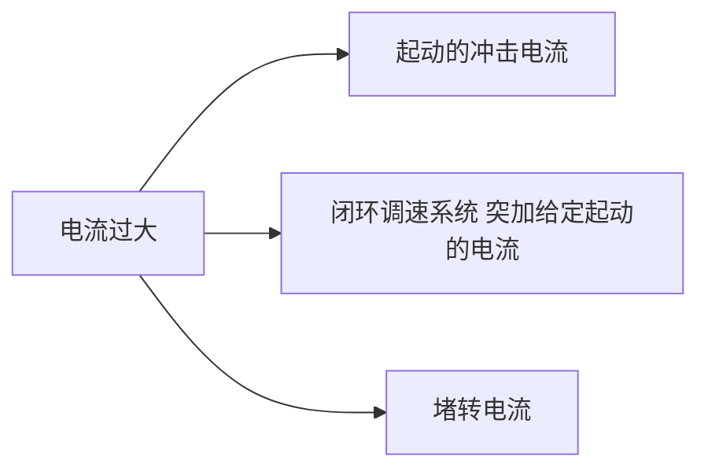

---
{"dg-publish":true,"dg-path":"A3- 电机及电力拖动/直流电机的电流截止负反馈.md","permalink":"/A3- 电机及电力拖动/直流电机的电流截止负反馈/","dgPassFrontmatter":true,"noteIcon":"","created":"2024-05-08T22:17:35.000+08:00","updated":"2025-08-28T21:53:13.634+08:00"}
---

电流截止[[反馈\|负反馈]] /限流保护

### 提出的背景
电机最怕电流过大和发热 (会损耗设备)

#### 起动的冲击电流
全电压起动时，如果没有限流措施，会产生很大的冲击电流，
- 对电机换向不利
- 对过载能力低的电力电子器件来说，不能允许

#### 闭环调速系统突加给定起动的冲击电流

$$\begin{align}
\Delta U_{n}=U_{n}^{*} \quad  \quad K_{p}K_{s}U_{n}^{*}
\end{align}$$

#### 堵转电流
闭环系统的[[直流电机的闭环调速系统\|静特性]]很硬，如果没有限流环节，继续下去，电流将远远超过允许值；机械特性越硬，堵转电流越大，损害越大

### 基本原理
为了解决反馈闭环调速系统的起动和堵转时电流过大的问题，系统中必须有自动**限制**==电枢电流==的环节
如果仅采用电流负反馈，静特性很抖，仅对启动有利，对稳态运行不利
>同时采用转速和电流负反馈

### 电流负反馈

与转速[[直流电机的开环调速\|闭环控制调速系统]]特性方程相比，多了一项由电流反馈引起的转速降落
$$\begin{align}
n=\dfrac{K_{p}K_{s}U_{n}^{*}}{C_{e}(1+K)}- \dfrac{RI_{d}}{C_{e}(1+K)}- \dfrac{K_{p}K_{s}R_{s}I_{d}}{C_{e}(1+K)}
\end{align}$$

### 电流截止负反馈
限流作用只需在起动和堵转时起作用，正常运行时应让电流自由地随着负载增减
- 当电流大到一定程度时才接入电流负反馈以限制电流，
- 而电流正常时仅有转速负反馈起作用控制转速
这种方法叫做==**电流截止负反馈**==，简称截流反馈

比较电压或[[二极管\|稳压管]]  创造条件判断语句
$$\begin{align}
if & \quad I_{d}R_{s}\geq U_{com} \\
 & \quad \dfrac{I_{d}R_{s}-U_{com}}{R_{0}}+ \dfrac{U_{n}}{R_{0}}- \dfrac{U_{n}^{*}}{R_{0}}=- \dfrac{U_{c}}{R_{1}} \\
else   & \\
 & \quad \dfrac{U_{n}}{R_{0}}- \dfrac{U_{n}^{*}}{R_{0}}=- \dfrac{U_{c}}{R_{1}}
\end{align}$$
- $I_{d}$ 电枢电流
- $R$  电枢回路总电阻
- $U_{com}$ 为比较电压，也可替换为稳压管的电压 $U_{br}$

### 静特性方程
也称：**下垂特性**或**挖土机特性**

1. 当 $I_{d}\leq I_{dcr}$ 时，电流负反馈被截止，与[[直流电机的闭环调速系统\|转速负反馈]]静特性方程一致：
$$\begin{align}
n=\dfrac{K_{p}K_{s}U_{n}^{*}}{C_{e}(1+K)}- \dfrac{RI_{d}}{C_{e}(1+K)}
\end{align}$$
 $K=K_{p}K_{s} \dfrac{1}{C_{e}}\alpha$     开环传递函数

2. 当 $I_{d}\geq I_{dcr}$ 时，引入了电流负反馈：
$$\begin{align}
n &=\dfrac{K_{p}K_{s}U_{n}^{*}}{C_{e}(1+K)}- \dfrac{RI_{d}}{C_{e}(1+K)} - \dfrac{(I_{d}R_{s}-U_{com})K_{p}K_{s}}{C_{e}(1+K)}\\
 &= \dfrac{K_{p}K_{s}(U_{n}^{*}+U_{com})}{C_{e}(1+K)}- \dfrac{(R+K_{p}K_{s}R_{s})I_{d}}{C_{e}(1+K)}
\end{align}$$

当转速 $n=0$ 堵转时，堵转电流：$I_{dbl}$
$$\begin{align}
I_{dbl}&= \dfrac{K_{P}K_{s}(U_{n}^{*}+U_{com})}{R+K_{p}K_{s}R_{s}} \approx \dfrac{U_{n}^{*}+U_{com}}{R_{s}}
\end{align}$$

**参数设计**：
- $I_{N}$   为电机的额定电流
- $I_{dcr}$   $I_{dcr}\geq (1.1\sim 1.2)I_{N}$  截止电流，稳态性能上看，希望稳态运行范围足够大
- $I_{dbl}$   $I_{d bl}= (1.5\sim 2)I_{N}$  堵转电流，小于电机允许的最大电流 

