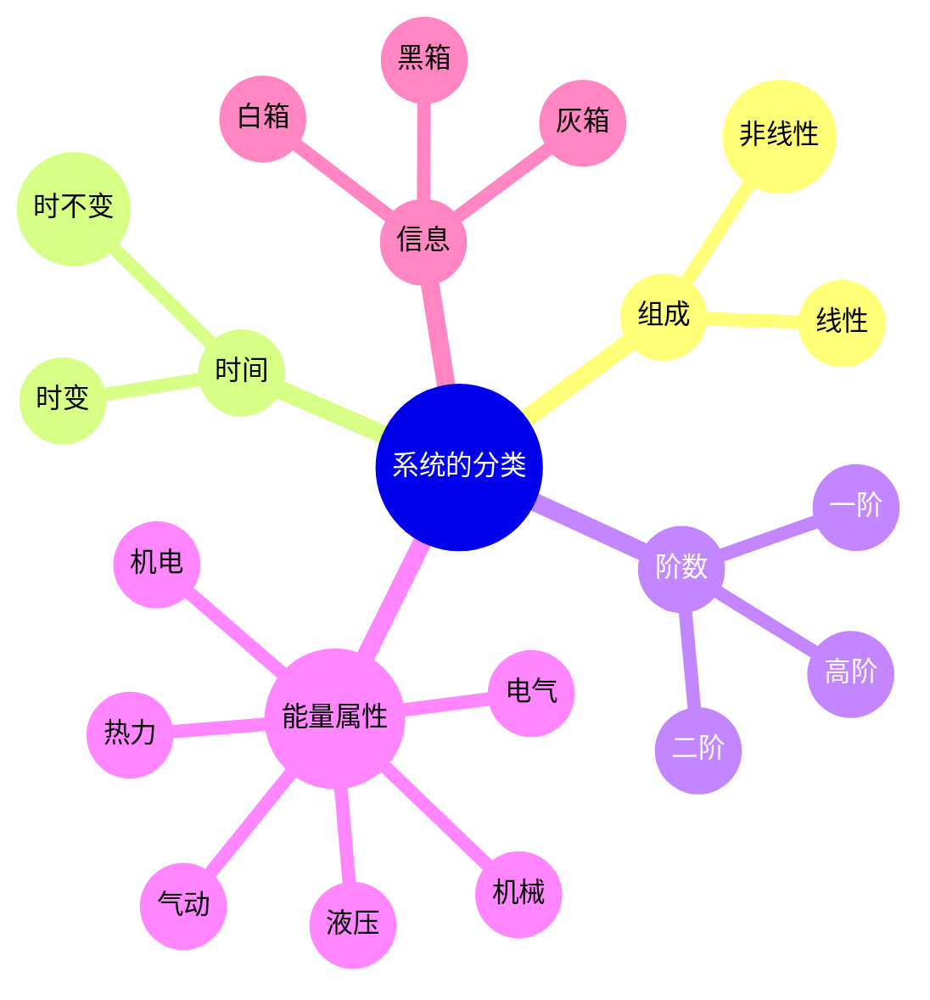

---
{"tags":["Transform","System","Mindset"],"dg-path":"A2- 控制理论/0. 基础知识/系统.md","dg-publish":true,"permalink":"/A2- 控制理论/0. 基础知识/系统/","dgPassFrontmatter":true,"noteIcon":"","created":"2024-09-02T09:43:03.000+08:00","updated":"2025-09-29T18:54:34.000+08:00"}
---

(terminology::**System**)  
本质上是对象在给定初始条件下，输入到输出的一个变换
> “由一些**相互关联、相互作用、相互影响**的组织部分构成并具有某些功能的**整体**”

### 一、系统的数学描述
假定研究的系统有多个输入和输出

**系统的外部变量**
- 环境对系统的**输入**：$\mathbf{u}=\begin{bmatrix}{u}_{1} , {u}_{2} , \cdots ,  {u}_{p}\end{bmatrix}^{T}$
- 环境对系统的**输出**： $\mathbf{y}=\begin{bmatrix}{y}_{1} , {y}_{2} , \cdots ,  {y}_{q}\end{bmatrix}^{T}$

**系统的内部变量**：
描述系统内部每个时刻所处**状态**的变量 $\mathbf{x}=\begin{bmatrix}{x}_{1} , {x}_{2} , \cdots ,  {x}_{n}\end{bmatrix}^{T}$

#### 1. 外部描述
[[传递函数\|传递函数]]描述，也称输入-输出描述：将系统看作“黑箱”，只是反映系统外部变量（输入-输入）的因果关系

#### 2. 内部描述
[[状态空间\|状态空间]]描述，通常由两个方程表示
- **状态方程**：微分方程或差分方程的形式，表征输入变量和内部变量的因果关系
- **输出方程**：代数方程的形式，表征系统内部变量、输入变量、输出变量之间的转换关系

### 二、系统的分类

理论学习中，一般从[[线性时不变系统\|线性时不变系统]]的简单情况入手

### 三、系统工程

系统 **System**：相互联系、相互作用、相互依赖、相互制约的若干部分构成的具有特定功能的整体 

要素 **Element**：构成系统的每个基本单元 

环境 **Environment**：一个系统的环境是与该系统有关、但不属于该系统的所有对象的集合。

独立变量（independent variable）：彼此独立的变量。模型中的所有变量并不一定是互相独立的，但是从模型中总可以选出一组互相独立的变量。

相关变量（dependent variable）：其值可由独立变量确定的量。

目标函数：实际问题最优准则的数量描述。目标函数值直接用于评价一个方案的优劣程度

约束条件：定量地描述系统中诸因素之间及系统与环境之间相互联系、相互制约的关系。

 复杂系统 (terminology::**Complex System**)： 具有多个相互作用的组成部分的系统，这些组成部分的相互作用产生出新的模式、结构或行为。这些模式、结构或行为不能仅通过观察单个组成部分来预测。通常表现出[[非线性\|非线性]]、[[自组织\|自组织]]、适应性、反馈循环和[[涌现\|涌现]]特性。

### 系统的哲学

