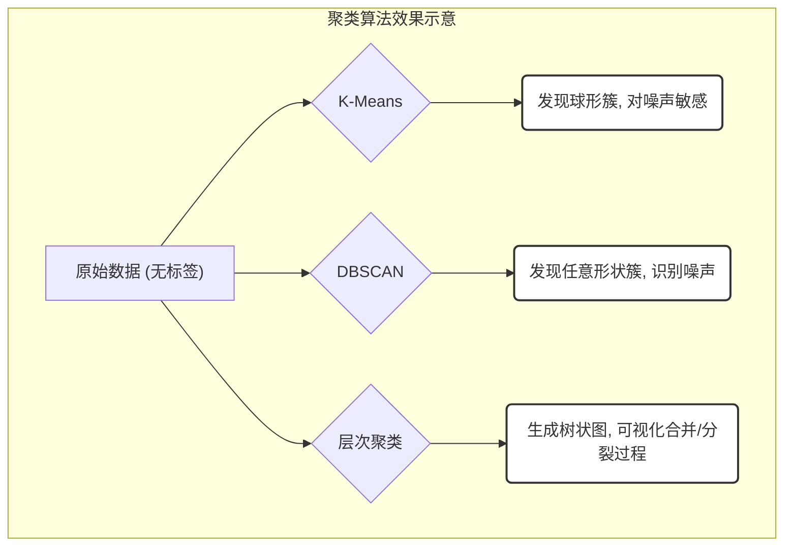

---
{"aliases":["Clustering"],"dg-publish":true,"dg-path":"人工智能/机器学习/聚类.md","permalink":"/人工智能/机器学习/聚类/","dgPassFrontmatter":true,"noteIcon":"","created":"2024-10-15T16:56:30.000+08:00","updated":"2025-08-28T21:53:13.764+08:00"}
---

(terminology::**Clustering**)
> 聚类是[[机器学习\|机器学习]]中一种重要的**无监督学习**任务。其目标是根据数据样本之间的**相似性**或**距离**，将数据集中的样本划分为若干个**簇 (Clusters)**，使得同一簇内的样本相似度高，而不同簇之间的样本相似度低。

聚类算法的性能高度依赖于如何定义样本之间的“相似性”或“距离”。[[距离度量\|距离度量]]
### 聚类与分类的对比

-   **聚类 (Clustering)**: **无监督学习**。数据没有预先定义的标签。算法的任务是发现数据中固有的结构，将相似的样本自动分组。
-   **分类 (Classification)**: **有监督学习**。数据有预先定义的类别标签。算法的任务是学习一个映射函数，将新样本分配到已知的类别中。

### 一、基于划分的聚类 (Partitioning-based Clustering)
这类算法将数据划分为预先指定数量的簇，每个簇代表一个数据子集。

-   **K-Means**
- **原理**: 迭代地将数据点分配到最近的簇中心，然后重新计算簇中心，直到收敛。
- **目标函数**: 最小化所有数据点到其所属簇中心的平方距离之和（簇内平方和）。
$$ J = \sum_{j=1}^K \sum_{x_i \in C_j} \|x_i - \mu_j\|^2 $$

其中 $K$ 是簇的数量，$C_j$ 是第 $j$ 个簇，$\mu_j$ 是第 $j$ 个簇的中心。
- **算法步骤**:
1.  **初始化**: 随机选择 $K$ 个数据点作为初始簇中心。
2.  **分配**: 将每个数据点分配到距离其最近的簇中心。
3.  **更新**: 重新计算每个簇的中心（通常是簇内所有点的均值）。
4.  **迭代**: 重复步骤2和3，直到簇中心不再变化或达到最大迭代次数。
- **优缺点**: 
- *优点*: 简单、高效，适用于大规模数据集。
- *缺点*: 需要预先指定 $K$ 值；对初始中心敏感；容易陷入局部最优；对噪声和异常值敏感；只能发现球形簇。

-   **K-Medoids (PAM)**: K-Means的变体，使用簇内实际数据点作为中心（medoid），对异常值更鲁棒。
具有一个迭代过程，数据集被分组成若干个预定义的不重叠的聚类或子组，数据点分配给簇，以便簇的质心和数据点之间的平方距离之和最小，在这个位置，簇的质心是簇中数据点的算术平均值

算法流程：
1. 选择 K 个点作为初始质心。 （簇的质心必须小于训练数据点的数目）
2. 将每个点指派到最近的质心，形成 K 个簇。（遍历所有数据点，计算所有质心与数据点之间的距离，簇将根据与质心的最小距离而形成） 
3. 对于上一步聚类的结果，进行平均计算，得出该簇的新的聚类中心。 （迭代地将质心移动到一个新位置。取一个簇的数据点，计算它们的平均值，然后将该簇的质心移动到这个新位置。对所有其他簇重复相同的步骤。）
4. 重复上述两步/直到迭代结束：质心不发生变化。（直到质心停止移动，即它们不再改变自己的位置，收敛。）

肘部法则选择 K 值：肘点之前代价函数的值会迅速下降，肘点之后代价函数的值会就下降得非常慢。一般选择肘点。（比较多次运行 K-均值的结果，选择代价函数最小的结果）

- 优点：原理比较简单，实现也是很容易，收敛速度快；聚类效果较优；可解释度比较强；要调参的参数仅仅是簇数 K
- 缺点：需要预先指定簇的数量；无法处理异常值和噪声数据；不适用于非线性数据集；高度重叠的数据，那么它就不能被区分；随机选择质心结果不理想；欧几里德距离可以不平等的权重因素，限制了能处理的数据变量的类型；

### 二、基于密度的聚类 (Density-based Clustering)

这类算法根据数据点的密度来发现任意形状的簇，并能识别噪声点。
-   **DBSCAN (Density-Based Spatial Clustering of Applications with Noise)**
    - **原理**: 基于两个参数：$\epsilon$（邻域半径）和 $MinPts$（最小点数）。它将数据点分为三类：
        - **核心点 (Core Point)**: 在其 $\epsilon$ 邻域内至少有 $MinPts$ 个点。
        - **边界点 (Border Point)**: 在其 $\epsilon$ 邻域内点的数量少于 $MinPts$，但它位于某个核心点的 $\epsilon$ 邻域内。
        - **噪声点 (Noise Point)**: 既不是核心点也不是边界点。
    - **优缺点**: 
        - *优点*: 能发现任意形状的簇；能有效识别噪声点；无需预先指定簇的数量。
        - *缺点*: 参数选择困难；对密度不均匀的数据集效果不佳；不适用于高维数据。

Density-Based Spatial Clustering of Applications with Noise 
如果 S 中任两点的连线内的点都在集合 S 内，那么集合 S 称为凸集。反之，为非凸集

基于密度的聚类算法：将簇定义为密度相连的点的最大集合，**能够把具有足够高密度的区域划分为簇，并可在噪声的空间数据库中发现任意形状的聚类**。

使用两个超参数：扫描半径 (eps) 和最小包含点数 (minPts) 来获得簇的数量：
1. 扫描半径 eps  : 用于定位点/检查任何点附近密度的距离度量，即扫描半径。
2. 最小包含点数 minpts ：聚集在一起的最小点数（阈值），该区域被认为是稠密的
密度定义为：空间中任意一点的密度是以该点为圆心，以扫描半径构成的圆区域内包含的点数目

将数据点分为三类
1. 核心点：在半径 Eps 内含有超过 MinPts 数目的点。 
2. 边界点：在半径 Eps 内点的数量小于 MinPts, 但是落在核心点的邻域内的点。
3. 噪音点：既不是核心点也不是边界点的点。

算法流程：
1. 将所有点标记为核心点、边界点或噪声点；（对每个点计算其扫描半径 Eps 的点的集合，如果集合内个数大于 MinPts，称为核心点；查看剩余点是否在核点的邻域内，若在，则为边界点，否则为噪声点。）
2. 如果选择的点是核心点，则找出所有从该点出发的密度可达对象形成簇； （将距离不超过 Eps 的点相互连接，构成一个簇）
3. 如果该点是非核心点，将其指派到一个与之关联的核心点的簇中； 
4. 重复以上步骤，直到所点都被处理过

### 三、基于层次的聚类 (Hierarchical-based Clustering)

这类算法通过构建一个嵌套的簇结构（树状图或谱系图）来组织数据。
-   **凝聚式聚类 (Agglomerative Clustering)**: **自底向上**。开始时每个数据点都是一个簇，然后逐步合并最相似的簇，直到所有点合并成一个大簇或达到停止条件。
-   **分裂式聚类 (Divisive Clustering)**: **自顶向下**。开始时所有数据点都在一个簇中，然后逐步分裂最大的簇，直到每个点都是一个簇或达到停止条件。

层次聚类假设簇之间存在层次结构，将样本聚到层次化的簇中，属于硬聚类。（硬聚类：一个样本只能属于一个簇，或簇的交集为空集；软聚类：一个样本可以属于多个簇，或簇的交集不为空集）
#### 3.1 分裂聚类（自上而下）
开始将所有样本分到一个簇；之后将已有类中相距最远的样本分到两个新的簇；重复此操作直到满足停止条件；得到层次化的类别
#### 3.2 聚合聚类（自下而上）
开始将每个样本各自分到一个簇；之后将相距最近的两簇合并，建立一个新的簇；重复此操作直到满足停止条件；得到层次化的类别

### 四、基于模型的聚类 (Model-based Clustering)

这类算法假设数据是由某种概率分布（如高斯分布）生成的，并尝试找到最能解释数据生成过程的参数。

-   **高斯混合模型 (Gaussian Mixture Model, GMM)**: 假设数据是由多个高斯分布的混合生成的。它使用期望最大化（EM）算法来估计每个高斯分量的参数（均值、协方差、权重）。

### 聚类评估指标

由于聚类是无监督的，评估其效果比分类更复杂。

-   **内部评估指标 (Internal Evaluation)**: 不依赖真实标签，仅根据聚类结果本身来评估。
    - **轮廓系数 (Silhouette Coefficient)**: 衡量一个点与其自身簇的相似度以及与其他簇的相异度。值范围 $[-1, 1]$，越高越好。
    - **Davies-Bouldin Index**: 衡量簇内距离与簇间距离的比率，越低越好。

-   **外部评估指标 (External Evaluation)**: 需要真实标签来评估聚类结果与真实标签的匹配程度。
    - **调整兰德指数 (Adjusted Rand Index, ARI)**: 衡量两个聚类结果（一个是你算法的，一个是真实标签的）之间的一致性，范围 $[-1, 1]$，越高越好。
    - **同质性 (Homogeneity)**: 每个簇只包含单一类别的样本。
    - **完整性 (Completeness)**: 相同类别的样本都被分到同一个簇中。

- 均一性：$p$ 类似于精确率，一个簇中只包含一个类别的样本，则满足均一性。也可以认为是正确率 (每个聚簇中正确分类的样本数占该聚簇总样本数的比例和)

- 完整性：$r$ 类似于召回率，同类别样本被归类到相同簇中，则满足完整性;(每个聚簇中正确分类的样本数占该类型的总样本数比例的和)

- V-measure：均一性和完整性的加权平均（ 𝛽 默认为 1）

- 轮廓系数：越接近 1 表示样本 $i$ 聚类越合理；越接近-1，表示样本 $i$ 应该分类到另外的簇中；近似为 0 ，表示样本 $i$ 应该在边界上。簇内不相似度: 计算样本𝑖到同簇其它样本的平均距离为𝑎(𝑖)，应尽可能小。簇间不相似度: 计算样本𝑖到其它簇𝐶𝑗的所有样本的平均距离𝑏𝑖𝑗，应尽可能大。

- 调整兰德系数 Adjusted Rnd Index： ARI 取值范围为 $[-1,1]$，值越大意味着聚类结果与真实情况越吻合，衡量的是两个数据分布的吻合程度

### 聚类效果示例 (Mermaid)

### 使用场景
医疗：使用聚类算法来发现疾病；市场细分：了解用户群，然后对每个客户进行归类；金融业：观察到可能的金融欺诈行为；搜索引擎：聚类的相似结果；社交网络：给朋友进行分组

市场细分、文档聚类、图像分割、图像压缩、聚类分析、特征学习或者词典学习、确定犯罪易发地区、保险欺诈检测、公共交通数据分析、IT 资产集群、客户细分、识别癌症数据、搜索引擎应用、医疗应用、药物活性预测
